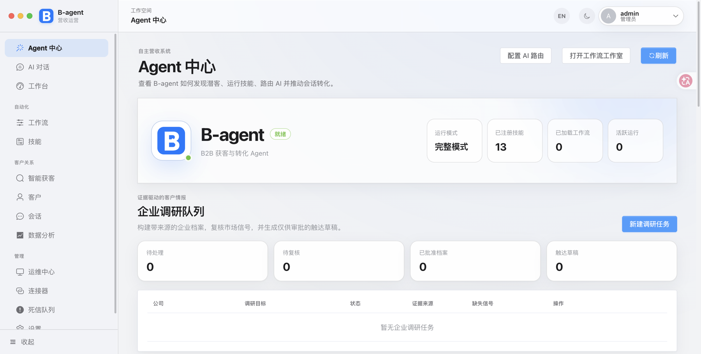
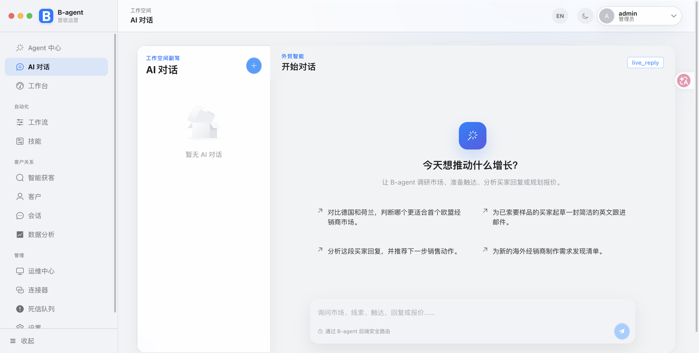
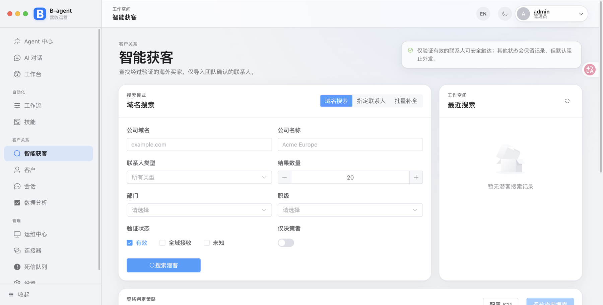
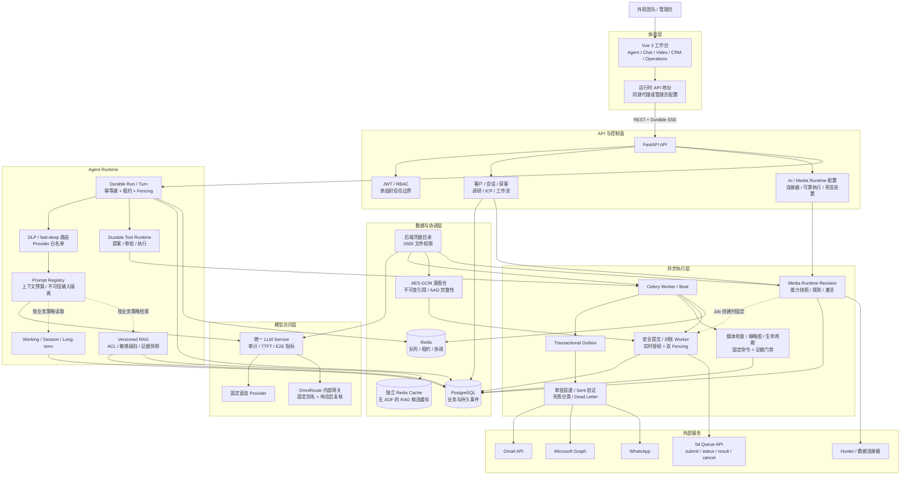
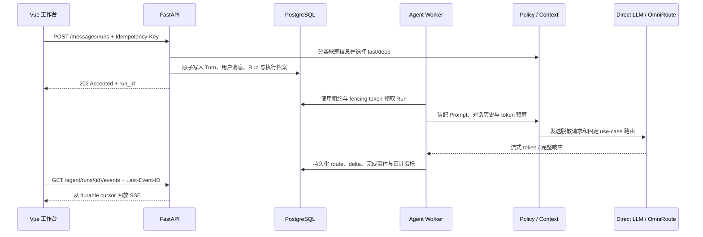
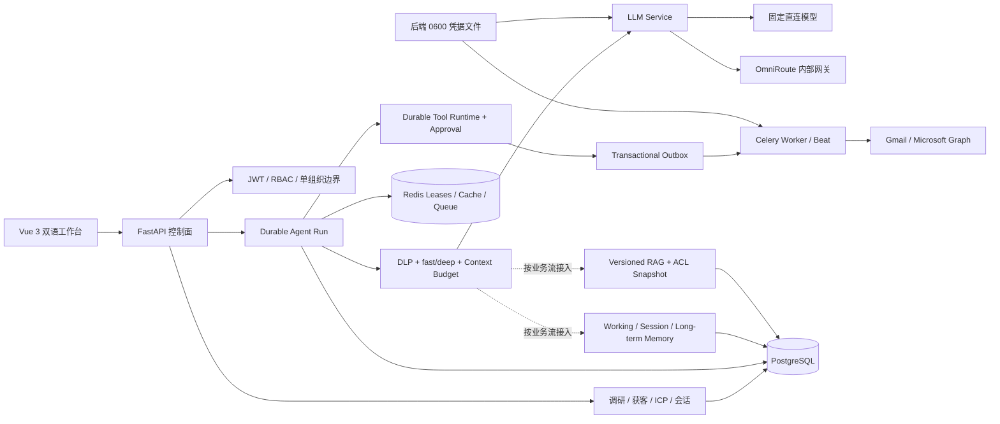

# B-agent

> 面向外贸企业的 AI 获客、调研、沟通与安全执行平台。

B-agent 把企业调研、海外潜客发现、ICP 评分、AI 对话、知识检索、人工审批、可靠投递和异常处置整合进同一个中英文工作台。它不是一个只会生成文案的聊天机器人，而是一套带身份边界、持久记忆、可恢复任务、证据链和运营控制面的 Agent 工程基线。

模型既可以走固定直连供应商，也可以通过内网中的 [OmniRoute](https://github.com/diegosouzapw/OmniRoute) 统一路由。浏览器永远只访问 B-agent API，不持有 OmniRoute、Hunter、Gmail 或 Microsoft Graph 的服务端凭据。

> **项目状态**：可运行、可测试、可继续产品化的单组织工程基线。它还不是开箱即用的开放式多租户 SaaS；正式上线前仍需按目标环境完成密钥托管、备份恢复、容量、合规与灾备验收。

## 产品界面

当前前端采用 ChatGPT 式中性 AI 工作台语言：浅色与深色主题共享同一套语义令牌，侧栏提供快速新建对话入口，业务页面使用克制的边框、留白和扁平层级。下方截图重点展示业务信息架构；界面样式以当前分支运行结果为准。

### Agent 中心



统一查看 Agent 运行模式、已注册 Skill、企业调研队列、触达草稿、审批投递以及近期可恢复运行。

### AI 对话



AI 对话通过 B-agent 后端提交 detached run，并使用持久事件游标恢复输出；刷新页面不会把连接中断等同于任务失败。

### 智能获客



支持域名搜索、指定联系人、批量补全、联系人验证、ICP 评分和人工确认；只有满足验证策略的联系人才能进入后续触达链路。

## 已实现能力

- **Agent 中心**：展示真实运行时、13 个业务 Skill、业务流水线、企业调研和执行状态。
- **企业调研**：创建带版本和证据引用的企业调研任务，补充市场信号并进行人工复核。
- **智能获客**：通过 Hunter 进行域名搜索、联系人查找和验证，支持可续跑的批量富化任务。
- **ICP 评分**：保存评分依据、缺失信号和过期状态，由业务人员确认后进入触达链路。
- **AI 对话**：保存会话和消息，以 `202 Accepted` 创建可脱离浏览器连接的运行，并通过 durable SSE、`Last-Event-ID` 和 `stream.reset` 恢复输出。
- **fast/deep 路由**：短、低风险请求使用受限 fast 档案；被当前规则识别的敏感信息、业务证据关键词、工具动作、长输入和长会话自动 deep。路由异常或未知版本默认 deep。
- **上下文与 Prompt**：不可变 Prompt 版本、严格变量契约、token 预算、可信度分区和 prompt injection 边界。
- **三层记忆底座**：working、session、long-term 持久记忆，包含准入策略、版本修正、逻辑失效 epoch 和异步清理任务。
- **企业 RAG 底座**：知识文档版本、组织命名空间、ACL 后置复核、敏感级别过滤、证据快照、安全缓存和独立知识检索 API。
- **并发与恢复**：全局、组织、用户、Provider 和 Tool 五级原子并发租约；Agent Run、Tool Run 与 LLM Invocation 使用租约和 fencing token 防止旧 Worker 回写。
- **AI 路由控制**：支持直连供应商或 OmniRoute；管理员可在设置页热更新固定模型别名、供应商白名单和超时参数。
- **人工审批投递**：调研、文案和发送分阶段审批，发送前重新校验联系人、ICP、草稿版本、邮箱状态和额度。
- **可靠执行**：事务 Outbox、幂等键、Worker 租约、失败分类、死信队列和双管理员异常处置。
- **邮箱连接**：Gmail 与 Microsoft OAuth，使用 PKCE 和一次性 state；令牌只保存在后端权限为 `0600` 的凭据文件中。
- **投递验证**：Gmail 校验 `SENT` 标签；Microsoft 使用 Immutable ID 在 Sent Items 中验证同一封邮件。
- **管理工作台**：ChatGPT 风格的中性响应式界面，支持中文/英文、深浅主题、运行时后端地址和 Vite HMR。
- **安全媒体资产面**：S3 隔离上传、ClamAV/FFprobe 自动检查、证据驱动晋级、敏感级别受控下载、异步安全缩略图、资产血缘、软删除和延迟对象清理。
- **视频规划与 Persona**：不可变 Persona/Storyboard 版本、独立审批、固定项目快照、RAG 证据白名单、编译时 ACL 回查、注入隔离和安全 GenerationIntent 回执。
- **媒体 Provider Runtime**：fal 能力白名单、不可变运行时 revision、逐版本 `0600` 密钥、健康探测与显式激活；队列适配器支持 submit/status/result/cancel，拒绝重定向、未知模型、超限响应和非批准媒体域名。
- **持久媒体生成任务**：Generation Job/Attempt/Event、月度微美元预算预留与 append-only 账本、提交与对账双 fencing、运行时版本固定、终态单调转换，以及禁止自动重发的 `submission_unknown` 协调边界；provider 完成后必须先获得隔离摄取回执才能结算成功。
- **安全媒体提交 Worker**：AES-GCM 加密不可变 GenerationIntent，Celery 仅扫描 Job ID；Worker 逐条领取后从实时用户、Persona、Storyboard、扫描、权利、同意及其证据重新授权，使用任务固定 runtime 提交，并在网络调用前后重新检查租约时间。
- **媒体 Job API**：认证用户可用只含幂等键与 Storyboard version 的请求创建单 Shot Job；服务端编译 Prompt、固定 runtime/model、写入加密意图仓并预留管理员配置的预算上限。详情与 `after_sequence` 事件游标按组织/所有者隔离并过滤内部请求 ID 和证据引用。
- **Provider 结果隔离摄取**：对 fal 输出重新执行允许域和 DNS 校验，并核对实际 socket peer；拒绝重定向、私网地址、未知 MIME、超限和截断响应，使用 `0600` 临时文件计算 SHA-256 后幂等写入 S3 quarantine，生成资产保持待扫描/版权/同意复核状态。
- **媒体对账 Worker**：Celery Beat 按配置唤醒 submitted Job；Worker 逐个即时领取、递增 fencing，严格重建任务固定的 runtime revision，安全读取逐版本密钥，查询 fal 状态并把完成结果摄取到隔离区。读取失败只退避重试，不重发生成请求。
- **提交不确定态人工协调**：`submission_unknown` 只能由两名不同超级管理员基于白名单证据引用确认；确认已提交时绑定全局唯一 provider request ID 并进入安全对账，确认未提交时终止任务并仅释放预留预算，两个路径都不会自动重发。
- **Video Studio**：中英文创建 Persona、项目和单 Shot 分镜，查看版本与证据，执行管理员审批；所有请求自动使用设置页可热切换的后端地址。

### 当前能力边界

| 状态 | 范围 |
|---|---|
| 已贯通主链路 | AI Chat detached run、durable SSE、fast/deep、DLP 脱敏、并发租约、LLM 审计、企业调研、获客、ICP、审批投递、Outbox、死信处置和视频规划审批 |
| 已实现工程底座 | 三层持久记忆、版本化知识库、RAG ACL、安全缓存、durable Tool Runtime、Prompt/上下文预算、媒体资产与合规门禁、Persona/项目/Storyboard 快照、媒体 Provider Runtime、加密意图仓、安全提交/对账 Worker、持久 Generation Job/Attempt/Event 与原子预算账本 |
| 后续产品化重点 | 认证回调 inbox、可信成本回执解析、I2V/Reference 服务端素材解析、Job SSE/前端状态时间线、人工协调 UI、预算管理 UI、数据库字段级加密、Provider/S3 压测、开放多租户前的隔离改造 |

当前通用 AI Chat 主链路默认装配 System Prompt 与会话历史。记忆与 RAG 已具备持久化服务、API、迁移和测试，但仍需按调研、报价、跟进等业务流明确接入策略，README 不把“底座存在”等同于“所有对话已自动使用”。

## 项目架构图



### 架构分层与职责

| 分层 | 核心职责 | 关键实现 |
|---|---|---|
| 体验层 | 双语业务工作台、深浅主题、流式对话和运行时 API 切换 | Vue 3、TypeScript、Vite、Element Plus、Pinia |
| API 控制面 | 身份认证、权限、输入校验、业务 API 与管理员控制面 | FastAPI、Pydantic、JWT、RBAC |
| Agent Runtime | Run/Turn 状态机、Prompt、上下文、DLP、路由、记忆、RAG 和工具编排 | 持久事件、幂等键、租约、fencing token |
| 模型访问层 | 统一模型契约、供应商选择、请求审计、真实模型与延迟记录 | Direct Provider、OmniRoute、固定 use-case 别名 |
| 异步执行层 | 可恢复任务、定时任务、Outbox、投递和死信处理 | Celery Worker、Celery Beat、事务 Outbox |
| 数据与协调层 | 业务主数据、Agent 事件、队列、并发协调和安全缓存 | PostgreSQL、Redis、独立 Redis Cache |
| 外部连接层 | 获客数据、邮箱 OAuth、邮件与消息发送 | Hunter、Gmail API、Microsoft Graph、WhatsApp |

### 核心设计原则

1. **浏览器零供应商密钥**：前端只持有 B-agent 登录令牌和可公开的运行状态，不接触模型、Hunter 或邮箱服务端密钥。
2. **所有外部副作用可追踪**：调研、草稿、审批、Tool Run、Outbox 和供应商确认都使用持久记录串联。
3. **执行可以恢复，但不能越权恢复**：租约过期后任务可重新领取，旧 Worker 的 fencing token 不能提交结果。
4. **路由默认收紧**：未知路由版本、策略异常、敏感数据或工具动作进入 deep 或 fail-closed，不自动放宽。
5. **记忆和 RAG 不是隐式全开**：长期记忆需要可信来源和准入，RAG 结果需要版本、ACL、组织和敏感级别复核。
6. **不可逆动作保留人工控制**：外发、审批和死信结论均有明确的人机边界。

## Agent Runtime 设计

| 关注点 | 当前实现 |
|---|---|
| System Prompt | Prompt 模板不可变、带 SHA-256 内容哈希；只有经过 evaluated 的版本才能激活 |
| 上下文管理 | 按模型窗口预留输出与安全余量，对历史、知识和当前输入做 token 预算装配 |
| 不可信输入 | 客户消息、网页、邮件、检索文档和工具结果始终作为 untrusted context，不得覆盖系统指令 |
| 敏感信息 | 当前规则识别 API key、邮箱和电话；命中后按敏感级别路由或 fail-closed，并在模型调用前占位符脱敏，返回时仅恢复本轮允许的占位符 |
| 三层记忆底座 | working、session、long-term；长期记忆只接受显式批准的可信来源，restricted 内容不得进入长期记忆 |
| RAG 服务 | 结果必须匹配组织、文档版本、ACL 版本、索引版本和敏感级别；缓存命中后再次验证授权元数据 |
| 工具调用 | 工具提案、审批、执行和结果均持久化；外发或不可逆动作必须经过人工批准 |
| 并发治理 | Redis Lua 一次性获取全部作用域租约；协调服务不可用时拒绝新工作，不以内存计数降级 |
| 可恢复执行 | Run、Turn、Tool 和 LLM Invocation 均带幂等与 fencing；Worker 崩溃后可重新领取，不接受过期 Worker 的提交 |
| 响应速度 | fast/deep 执行档案、有限历史、输出预算、RAG 安全缓存、真正的 Provider TTFT 与端到端延迟指标 |
| 可观测性 | `route.selected`、`run.started`、`message.delta`、`run.completed` 等有序事件，加上 Provider、模型、TTFT、E2E 和 backpressure 指标 |

### 一次 AI 对话的执行链路



## 系统链路



浏览器不会接收 OmniRoute、Hunter 或邮箱供应商凭据。外部邮件只有在供应商 Sent 副本验证成功后才会被记录为已发送；无法确认的结果进入人工处置链路，不会自动重试造成重复触达。

当前 OmniRoute 集成固定在提交 `e0ce95c592c00f100f5141371dbda976d678ddee`。B-agent 禁止 `auto/*` 模型别名，并在网关响应后再次校验实际 Provider 是否属于管理员白名单，避免 PII 或企业数据被 fail-open 到未批准供应商。

## 前端工作台与 API 对接

| 页面 | 路由 | 主要后端接口 | 业务用途 |
|---|---|---|---|
| Agent 中心 | `/agent` | `/api/v1/agent` | 运行时总览、企业调研、证据复核、草稿审批和投递控制 |
| AI 对话 | `/ai-chat` | `/api/v1/ai/chat`、`/api/v1/agent/runs/*/events` | 创建 detached run，使用 durable SSE 恢复消息 |
| 经营总览 | `/dashboard` | `/api/v1/stats` | 客户、会话、转化和执行指标 |
| 工作流与 Skill | `/workflows`、`/skills` | `/api/v1/workflows`、`/api/v1/skills` | 编排业务流程并查看已注册能力 |
| 智能获客 | `/prospecting` | `/api/v1/prospecting` | 域名搜索、联系人查找、批量富化、ICP 评分与人工复核 |
| 客户与会话 | `/customers`、`/conversations` | `/api/v1/customers`、`/api/v1/conversations` | 客户档案、沟通记录和详情追踪 |
| 数据分析 | `/analytics` | `/api/v1/stats` | 渠道、客户和对话分析 |
| 运营控制 | `/operations`、`/operations/dead-letters` | `/api/v1/admin` | 网关健康、可靠执行、死信分析与双管理员处置 |
| 连接器 | `/connectors` | `/api/v1/connectors` | 管理员配置、测试和启停服务端连接器 |
| 设置 | `/settings` | `/api/v1/ai/config`、`/api/v1/admin/media/runtime`、`/api/v1/mailboxes` | AI 路由与媒体 Provider 热配置、模型探测、邮箱 OAuth 和浏览器 API 地址 |

### 前端热加载机制

- **源码热更新**：开发容器使用 Vite HMR 和源码 bind mount，Vue、TypeScript 与 SCSS 修改后不需要重建镜像。
- **后端地址热切换**：默认使用同源 `/api` 代理；管理员可在设置页保存 HTTP(S) Base URL，新的 Axios 和 SSE 请求立即使用该地址。
- **AI 路由热更新**：管理员通过 `GET/PUT /api/v1/ai/config` 读取和更新 Direct/OmniRoute 模式、固定模型别名、Provider 白名单和超时；`POST /api/v1/ai/config/test` 用于连通性探测。
- **媒体运行时热更新**：设置页从服务端能力白名单选择 T2I/I2V/T2V 模型，创建不可变 revision；只有健康探测成功的 revision 才能显式激活，且激活指针只供后续新 Job 固定使用。
- **密钥写入不回显**：前端可提交新的网关 API Key，但读取配置时只得到 `api_key_configured` 布尔值，不会获得密钥本身或服务端文件位置。
- **权限边界不热降级**：浏览器 Base URL 和 AI 路由可热更新，JWT、RBAC、DLP、审批、Provider 白名单和 Tool 安全策略仍由后端强制执行。

## Docker 服务拓扑

| 服务 | 默认启动 | 职责 | 持久化 / 网络边界 |
|---|---|---|---|
| `db` | 是 | PostgreSQL 业务主库与持久 Agent 事件 | `postgres_data`，仅绑定宿主机 `127.0.0.1:5432` |
| `migrate` | 是，一次性 | 唯一 schema owner，执行 `alembic upgrade head` | 完成后退出，API/Worker 等待迁移成功 |
| `redis` | 是 | Celery Broker、结果、租约、并发协调与 OmniRoute Redis DB | AOF 持久化，`redis_data` |
| `redis_cache` | 是 | RAG 候选短时缓存 | 无快照、无 AOF、不发布宿主机端口 |
| `backend` | 是 | FastAPI、认证、业务控制面和 SSE | 访问业务网与 AI 网关网，发布 `8000` |
| `celery_worker` | 是 | Agent Run、Tool Run、Outbox 和异步业务任务 | 与 API 共享数据库、队列和受控凭据目录 |
| `celery_beat` | 是 | 周期调度、租约回收和后台维护 | 独立 Beat schedule volume |
| `frontend` | 是 | Vite 开发工作台与 HMR | 发布 `3000`，浏览器只访问 B-agent API |
| `flower` | 是 | Celery 任务监控 | 发布 `5555`，生产环境应增加访问控制 |
| `omniroute` | 否，`gateway` profile | 固定版本的内部模型网关 | 不发布宿主机端口，单独 Provider egress 网络 |
| `nginx` | 否，`production` profile | 生产入口与反向代理 | 只在生产 profile 启用 |

## 技术栈

| 层级 | 主要技术 |
|---|---|
| 前端 | Vue 3、TypeScript、Vite、Element Plus、Pinia、ECharts |
| API | Python 3.11、FastAPI、Pydantic、SQLAlchemy、Alembic |
| 任务 | Celery、Redis、事务 Outbox |
| 数据 | PostgreSQL；SQLite 用于本地轻量开发与测试 |
| Agent / AI | LangGraph、LangChain、Chroma、OpenAI 兼容接口、OmniRoute |
| 部署 | Docker Compose、Nginx、Flower |

## 目录结构

```text
.
├── backend/
│   ├── alembic/             # 数据库迁移
│   ├── app/
│   │   ├── api/v1/          # Auth、Agent、AI、CRM、Admin 等 FastAPI 路由
│   │   ├── core/            # Agent、Skill 注册表与工作流引擎
│   │   ├── integrations/    # AI、邮件、WhatsApp 与数据集成
│   │   ├── models/          # 数据库与 API 模型
│   │   ├── services/
│   │   │   ├── agent_runtime/ # Prompt、Context、Turn 与 Runtime
│   │   │   ├── llm/         # 模型契约、Factory、审计与运行时池
│   │   │   └── ...          # 记忆、RAG、工具、调研、投递和可靠执行
│   │   ├── skills/          # 可插拔业务 Skill
│   │   └── tasks/           # Celery Worker 与调度任务
│   ├── scripts/             # 管理员、知识库、基准和负载测试脚本
│   └── tests/               # API、服务、安全、并发和持久化测试
├── frontend/
│   ├── src/
│   │   ├── api/             # 类型化 API Client 与运行时 Base URL
│   │   ├── components/      # 工作流编辑器等复用组件
│   │   ├── i18n/            # 中英文文案与语言切换
│   │   ├── layouts/         # ChatGPT 风格工作台外壳
│   │   ├── stores/          # Auth 与 Theme 状态
│   │   ├── styles/          # 全局语义令牌和 Element Plus 主题
│   │   └── views/           # Agent、Chat、CRM、Operations 等页面
│   └── tests/               # 页面契约、安全边界与类型检查测试
├── docs/
│   ├── adr/                 # 架构决策记录
│   ├── brand/               # README 产品截图与品牌资产
│   └── runbooks/            # OmniRoute 与可靠执行运维手册
├── plans/                   # 架构与实施计划
├── docker-compose.yml
├── docker-compose.gateway-production.yml
├── THIRD_PARTY_NOTICES.md
└── .env.example
```

## 快速启动

### Docker Compose

1. 创建本地配置并检查需要启用的集成：

```bash
cp .env.example .env
```

当前 `docker-compose.yml` 是本机开发基线，其中数据库口令和 `SECRET_KEY` 仍是显式的开发示例值。根目录 `.env` 只会替换 Compose 文件中通过 `${...}` 引用的变量；生产部署必须通过 Compose override 或密钥管理系统覆盖所有示例凭据。

2. 启动数据库迁移、API、Worker、前端和监控服务：

```bash
docker compose config
docker compose up --build
```

`migrate` 是一次性 schema owner，会在应用启动前执行 `alembic upgrade head`。应用进程不会自行调用 `create_all`。

3. 使用明确的强密码创建管理员账号：

```bash
docker compose exec backend python scripts/create_admin.py \
  --username admin \
  --email admin@example.com \
  --password 'replace-with-a-strong-password'
```

4. 打开服务：

- 前端：<http://localhost:3000>
- 后端健康检查：<http://localhost:8000/health>
- OpenAPI：<http://localhost:8000/docs>
- Flower：<http://localhost:5555>

前端容器运行 Vite development server，源码通过 bind mount 挂载，修改 Vue、TypeScript 或 SCSS 后会通过 HMR 更新页面。

### 启用 OmniRoute

OmniRoute 默认不启动，也不向宿主机发布端口。使用固定版本的内部网关配置：

```bash
docker compose --profile gateway up --build
```

在 `.env` 中把 `LLM_BACKEND` 设置为 `omniroute`，并配置非空的 `OMNIROUTE_ALLOWED_PROVIDERS` 以及各业务用途的固定模型或组合别名。系统会拒绝 `auto/*` 动态路由，避免请求被 fail-open 到未批准的供应商。

完整部署、升级和回滚步骤见 [OmniRoute Runbook](docs/runbooks/omniroute-deployment.md)。

## 本地开发

### 后端

```bash
python3.11 -m venv .venv
source .venv/bin/activate
pip install -r backend/requirements.txt
cp .env.example backend/.env
cd backend
alembic upgrade head
uvicorn app.main:app --reload --port 8000
```

如需运行异步任务，在另一个已激活虚拟环境的终端中执行：

```bash
cd backend
celery -A app.tasks.celery_worker worker --loglevel=info
```

### 前端

```bash
cd frontend
npm ci
npm run dev
```

开发服务器默认把 `/api` 和 `/health` 代理到 `VITE_API_PROXY_TARGET`。登录后也可以在“设置”页面保存浏览器专用的后端 Base URL，该值会立即应用，无需重新构建前端。

## 开发命令

<!-- AUTO-GENERATED: frontend-scripts -->
| 命令 | 说明 |
|---|---|
| `npm run dev` | 启动 Vite 开发服务器和 HMR |
| `npm run build` | 运行 Vue/TypeScript 类型检查并构建生产资源 |
| `npm test` | 运行前端 Node 测试 |
| `npm run preview` | 本地预览生产构建 |
| `npm run lint` | 自动修复可修复的 ESLint 问题 |
| `npm run lint:check` | 只检查 ESLint，不修改文件 |
| `npm run format` | 使用 Prettier 格式化 `frontend/src` |
<!-- /AUTO-GENERATED: frontend-scripts -->

后端常用验证命令：

```bash
cd backend
pytest -q
alembic current
```

## 关键环境变量

完整清单和示例值以 [.env.example](.env.example) 为准。

<!-- AUTO-GENERATED: environment-summary -->
| 分类 | 变量 | 必需条件 | 用途 |
|---|---|---|---|
| 部署身份 | `DEPLOYMENT_ENVIRONMENT`、`DEPLOYMENT_ID` | 所有环境 | 健康检查和负载门禁使用的可信部署身份；每个部署 ID 必须唯一 |
| 应用 | `SECRET_KEY` | 所有非临时环境 | JWT 签名密钥，必须替换示例值 |
| 数据 | `DATABASE_URL` | 是 | SQLAlchemy 数据库连接串 |
| 任务 | `REDIS_URL`、`CELERY_BROKER_URL`、`CELERY_RESULT_BACKEND` | 使用 Worker 时 | 缓存、队列和任务结果 |
| Agent 并发 | `AGENT_CONCURRENCY_*` | 启用 detached Agent Worker 时 | 全局、组织、用户、Provider、Tool 的并发上限与租约时间 |
| Agent 路由 | `AGENT_FAST_PATH_*` | 可选 | fast path 开关、输入/历史阈值和输出 token 上限；关闭后新任务全部 deep |
| RAG 缓存 | `REDIS_CACHE_URL`、`AGENT_RETRIEVAL_CACHE_*` | 启用知识缓存时 | 仅缓存 public/internal 候选，并在命中后重新验证 ACL 与版本；Compose 使用独立非持久化 Redis |
| AI | `AI_PROVIDER` 及对应供应商 API Key | 直连模式 | 选择并授权直连模型供应商 |
| AI 网关 | `LLM_BACKEND`、`OMNIROUTE_BASE_URL` | 使用 OmniRoute 时 | 选择内部 LLM 路由后端 |
| AI 策略 | `OMNIROUTE_ALLOWED_PROVIDERS`、`OMNIROUTE_MODEL_*` | OmniRoute 模式 | 固定供应商白名单和业务模型别名 |
| AI 密钥 | `OMNIROUTE_API_KEY` 或 `OMNIROUTE_API_KEY_FILE` | 网关启用鉴权时 | 推荐生产环境使用挂载文件 |
| 连接器 | `CONNECTOR_SECRET_DIR` | 使用 Hunter 等连接器时 | 后端连接器凭据目录 |
| 媒体密钥 | `MEDIA_RUNTIME_SECRET_DIR` | 配置媒体 Provider 时 | 每个不可变 runtime revision 的后端凭据目录；对账 Worker 拒绝符号链接、非普通文件和组/其他用户可读文件 |
| 媒体提交 | `MEDIA_SUBMIT_*`、`MEDIA_INTENT_VAULT_*`、`MEDIA_POLICY_*`、`MEDIA_T2V_RESERVATION_CEILING_MICROUSD` | 启用媒体外部提交时 | 控制批量、租约、轮询、短期策略签名、AES-GCM 意图仓和 T2V 预算预留上限；预留上限不是实际供应商价格，生产路径必须是后端绝对私有路径 |
| 媒体对账 | `MEDIA_RESULT_*`、`MEDIA_RECONCILE_*` | 启用媒体外部提交时 | 限制结果下载大小/超时、单轮任务量、租约、轮询和退避；租约最少 300 秒并长于任务硬超时 |
| 邮箱 | `GMAIL_CLIENT_ID`、`GMAIL_CLIENT_SECRET` | 连接 Gmail 时 | Google OAuth 客户端 |
| 邮箱 | `OUTLOOK_CLIENT_ID`、`OUTLOOK_CLIENT_SECRET`、`OUTLOOK_TENANT_ID` | 连接 Microsoft 时 | Microsoft OAuth 客户端与租户 |
| 邮箱 | `GMAIL_REDIRECT_URI`、`OUTLOOK_REDIRECT_URI`、`FRONTEND_BASE_URL` | 使用邮箱 OAuth 时 | 服务端回调和完成后的前端地址 |
| 邮箱 | `MAILBOX_SECRET_DIR` | 使用邮箱 OAuth 时 | 后端 OAuth 令牌目录 |
| 前端 | `VITE_API_BASE_URL`、`VITE_API_PROXY_TARGET` | 按部署方式 | 浏览器 API 地址与开发代理 |
| HMR | `VITE_HMR_HOST`、`VITE_HMR_CLIENT_PORT`、`VITE_USE_POLLING` | 跨机器或容器开发时 | Vite 热更新连接 |
| 安全 | `CORS_ORIGINS` | 跨域部署时 | 允许的浏览器来源 |
<!-- /AUTO-GENERATED: environment-summary -->

## Gmail / Microsoft OAuth

在供应商控制台登记与 `.env` 完全一致的服务端回调地址：

```text
http://localhost:8000/api/v1/mailboxes/oauth/callback/gmail
http://localhost:8000/api/v1/mailboxes/oauth/callback/outlook
```

配置客户端 ID 和 Secret、重启后端，然后在“设置 → 已连接账号”中发起授权。OAuth Client Secret 不支持从浏览器热加载，这是刻意的安全边界；前端只读取供应商是否已配置以及授权 URL。

本地 Python 运行时可把这些值写入 `backend/.env`。Docker Compose 部署必须把 OAuth 客户端变量同时注入 `backend` 和 `celery_worker` 容器，并让两个服务共享 `MAILBOX_SECRET_DIR`；只写入宿主机根目录 `.env`、但不在 Compose 中映射变量，不会把它们自动传入容器。

数据库迁移 `0013_secure_mailbox_oauth` 会清除旧 Gmail/Outlook 账号中嵌入的令牌，并把账号标记为“需要重新连接”。系统不会把旧明文令牌静默复制到新的凭据目录。

## 主要 API

| 模块 | 路径前缀 | 说明 |
|---|---|---|
| 认证 | `/api/v1/auth` | 登录、刷新、当前用户 |
| Agent | `/api/v1/agent` | 运行时、知识检索、可恢复 Run/事件、调研、证据、草稿、审批和投递 |
| AI | `/api/v1/ai` | 热加载配置、探测、模型发现和 AI 对话 |
| 获客 | `/api/v1/prospecting` | 搜索、导入、批量富化、ICP 评分与复核 |
| 邮箱 | `/api/v1/mailboxes` | OAuth 供应商、授权回调和账号状态 |
| 连接器 | `/api/v1/connectors` | 管理员连接器目录、测试和启停 |
| 运维 | `/api/v1/admin` | 网关状态、可靠执行、死信与双人审批 |
| 媒体运行时 | `/api/v1/admin/media/runtime` | 管理员查看能力目录、创建 revision、探测并对新任务激活 |
| 媒体 Job 创建 | `/api/v1/video/projects/{project_id}/shots/{shot_id}/generation-jobs` | 只接收幂等键与 Storyboard version；服务端派生组织、Prompt、模型、敏感级别和预算预留 |
| 媒体 Job 状态 | `/api/v1/video/generation-jobs/{job_id}` | 所有者或同组织超级管理员读取安全字段白名单 |
| 媒体 Job 事件 | `/api/v1/video/generation-jobs/{job_id}/events?after_sequence=` | 增量事件游标；过滤 provider request ID、Prompt、vault 与内部证据字段 |
| 媒体异常协调 | `/api/v1/admin/media/jobs/{job_id}/submission-unknown/resolution-approvals` | 两名不同超级管理员基于受限证据引用确认未知提交是否真实发生 |

接口字段和当前响应模型以运行中的 <http://localhost:8000/docs> 为准。

## 测试与质量门禁

```bash
cd backend
pytest -q

cd ../frontend
npm test
npm run lint:check
npm run build
```

最近的完整工程验证基线（2026-08-13，`b-agent-enterprise-platform`）：后端 `608 passed, 2 skipped`；前端最近基线 `47 passed`；`docker compose config --quiet` 通过。加密意图仓、现场授权器、提交 Worker、Job 创建服务和 Job 访问服务的独立覆盖率分别为 83%、88%、96%、91% 和 100%；两个跳过项需要 PostgreSQL 测试库执行行锁并发验证。这里的数量是版本验证记录，不替代 GitHub Actions、真实 Provider/S3 并发压测或目标环境验收。

### Agent 性能与发布门禁

确定性的本地基准用于发现框架开销回归：

```bash
cd backend
PYTHONPATH=. python scripts/benchmark_agent_runtime.py \
  --scenario all \
  --samples 50 \
  --output ../artifacts/agent-benchmark.json
```

预生产发布候选还应运行真实 detached API 负载门禁。它会走完整的创建会话、`202` 入队、durable SSE、首 token、完成和清理链路，并按错误率、p95 TTFT 和 p95 E2E 返回 CI 可用的退出码：

```bash
cd backend
export B_AGENT_LOAD_TOKEN='<short-lived-staging-token>'
PYTHONPATH=. python scripts/load_test_agent_chat.py \
  --base-url https://staging.example.com \
  --target-environment staging \
  --expected-deployment-id staging-primary \
  --requests 100 \
  --concurrency 8 \
  --max-error-rate 0.01 \
  --max-p95-ttft-ms 3000 \
  --max-p95-e2e-ms 15000 \
  --output ../artifacts/agent-load.json
```

负载令牌只从环境变量读取。脚本会先使用无认证请求验证服务端 `environment` 与唯一 `deployment_id`，成功后才构造 Bearer 客户端；远程目标必须使用 HTTPS，生产目标还需要 `--confirm-production-load`。

## 安全边界

- OmniRoute 使用固定供应商白名单和固定模型别名；不允许 `auto/*` 动态路由。
- fast path 只减少历史与输出预算，不放宽 DLP、RAG ACL、Provider 白名单、Prompt 或审批规则；无法验证的执行档案默认 deep。
- 供应商密钥与邮箱令牌只存放在后端，API 响应不会返回密钥或文件引用。
- 被当前分类器识别为 Restricted 的数据不会进入外部模型或长期记忆；邮箱、电话和 API key 等已覆盖字段会在模型边界前按策略拦截或脱敏。未命中的商业机密仍需调用方提供敏感级别，不能把规则分类器当作完整 DLP 产品。
- RAG 候选即使来自缓存，也必须重新通过组织、文档版本、ACL 版本、索引版本和敏感级别校验。
- Redis 并发协调不可用时拒绝新 Agent 工作，不使用不可靠的本地计数继续执行。
- Compose 的知识检索缓存使用无 AOF、无宿主机端口的独立 Redis；逻辑 TTL 不代表主存储删除，生产环境仍需制定缓存内存、快照和备份边界。
- Gmail/Microsoft 连接使用 PKCE、哈希 state、短时会话和一次性回调。
- 发件动作由事务 Outbox 驱动，无法确认是否发送的结果不会自动重试。
- 调研、文案和发送保留人工审批点；死信结论需要两名不同管理员批准。
- 当前部署模型是单组织信任边界，不应在未完成租户隔离审计前作为开放式多租户 SaaS 运行。
- 媒体下载只对已晋级且扫描、版权、同意证据完整的资产签发最长 300 秒凭据；隔离区、软删除和越权资产不会获得签名。
- 缩略图参数完全由服务端固定，媒体二进制不进入 API/Celery payload；派生资产继承敏感级别并保存血缘。对象清理默认关闭，启用后仍需真实超级管理员维护身份与保留期。
- fal API Key 按 runtime revision 写入后端 `0600` 文件，数据库与 API 只保存配置和 `api_key_configured`；对账 Worker 使用 `O_NOFOLLOW` 和打开后的文件元数据复核阻断符号链接替换。Provider 返回的控制 URL 不被信任，队列 URL 始终由固定 origin 与已批准模型 ID 构造。
- 对账 Worker 不读取“当前激活”指针，而只使用 Job 提交时固定的 revision、能力快照 hash、模式与模型别名；逐个即时领取避免大文件下载耗尽批次中后续任务的租约。
- 提交 Worker 的 Celery 任务没有业务参数；完整 Prompt 只存在 AES-GCM 加密意图仓，密钥与密文必须是后端私有权限。每次 effect 前会重查活跃用户、批准快照、扫描哈希、权利/同意有效期和同意证据资产，并重新签发短期策略决策。
- 当前完整 provider arguments 只支持 `text_to_video`。`image_to_video` 与 `reference_to_video` 在服务端素材 URL 解析和供应商参数白名单完成前会以 `media_intent_mismatch` 在 effect 前终止并释放预算，不会偷偷退化成文生视频。
- 当前成本结算器的 basis 是 `reserved_estimate_ceiling`：它使用任务预留估算上限，不代表 fal 实际账单。可信 Provider 成本回执及差额核销完成前，界面和报表不得展示为“实际成本”。
- `submission_unknown` 不提供直接重试操作；协调结论需要两名不同超级管理员，证据引用仅允许 `provider-audit/`、`provider-support/` 或 `billing-audit/`，API 响应与 Job Event 不回显证据路径。
- `MEDIA_SUBMIT_ENABLED` 仍默认关闭；安全提交/对账 Worker、固定运行时、实时策略复核、实际 peer 校验、S3 结果隔离和 `submission_unknown` 人工协调已落地，但生产开放仍要等待认证回调、可信成本回执、I2V/Reference 参数解析和故障注入验收。
- 不要提交 `.env`、OAuth 凭据、导出客户数据或 `data/secrets` 内容。

## 相关文档

- [B-agent × OmniRoute 二次改造实施蓝图](plans/b-agent-omniroute-integration-blueprint.md)
- [Agent Runtime 优化蓝图](plans/agent-runtime-optimization-blueprint.md)
- [视频生成 Persona 与媒体生产链路蓝图](plans/video-generation-persona-blueprint.md)
- [外贸 Agent API 蓝图](plans/foreign-trade-agent-api-blueprint.md)
- [OmniRoute 生产部署与回滚 Runbook](docs/runbooks/omniroute-deployment.md)
- [可靠执行与 Outbox 运维 Runbook](docs/runbooks/reliable-execution.md)
- [共享网关架构 ADR](docs/adr/0001-omniroute-shared-gateway.md)
- [单组织信任边界 ADR](docs/adr/0002-single-organization-trust-boundary.md)
- [项目代码落实方案](项目代码落实.md)

## 许可证

许可证和商业分发方式尚待项目所有者确认。在许可证明确前，请勿将本仓库视为已授予公开再分发权。
