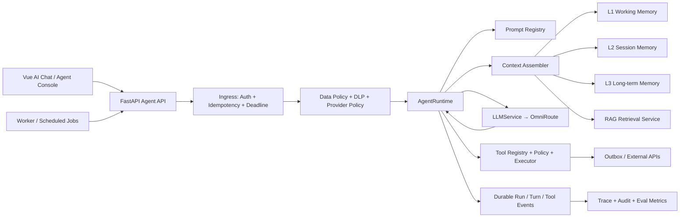
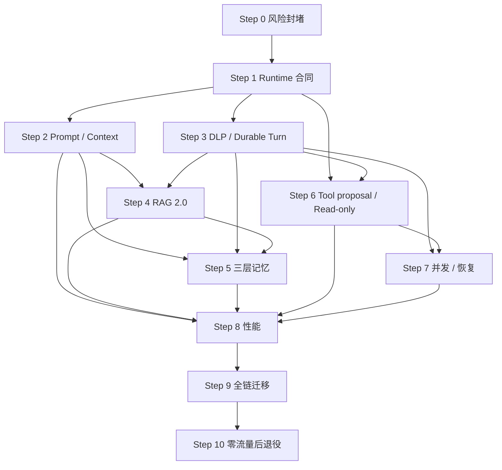

# B-agent 生产级 Agent Runtime 优化蓝图

> 状态：Reviewed — 5 Critical + 4 High + 1 Medium findings incorporated  
> 日期：2026-08-09  
> 范围：System Prompt、上下文管理、RAG、三层记忆、并发、敏感信息、工具调用、响应速度、可观测性与评测  
> 实施原则：先封风险、再统一入口、再增强能力；每一步可独立发布、灰度和回滚。

## 1. 执行摘要

B-agent 当前已经有 OmniRoute 网关、AI Chat、证据化企业调研、Skill/Workflow、LLM 调用审计表和人工审批门禁，但还没有形成统一的 Agent Runtime。代码中至少存在三条相对独立的智能链：

1. `AIChatService`：固定 System Prompt + 最近 30 条消息 + LLM；
2. `AgentResearchService`：证据白名单 + 结构化草稿，正确性最好；
3. 旧 `AgentOrchestrator/Skill/Workflow`：自由字典上下文、旧 RAG、独立 Prompt 和进程内状态。

因此，本计划不建议继续在每条链路上分别叠加 Prompt、Memory 和 Tool，而是新增一个统一的 `AgentRuntime.run(AgentRequest)`，逐步把三条链迁入同一套安全、上下文、检索、工具、审计和并发控制面。

### 1.1 首要决策

- **立即 fail-closed**：删除旧 AI Reply 在 RAG 失败时伪造价格、MOQ、付款、交期和来源的 mock fallback；没有证据时必须回答“不知道/需要人工确认”。
- **统一 Runtime，不大爆炸重写**：保留现有业务 Service 和审批门禁，在其下方引入 provider-neutral 的 Agent Runtime；用 feature flag 逐用例迁移。
- **Prompt 分层且版本化**：不可变安全基线、用例角色、组织策略、任务合同分层组装；RAG、客户资料和工具结果永远作为不可信上下文，不能拼进 System Prompt。
- **上下文按 token 和权威性管理**：停止仅按“最近 N 条”截断；引入 token budget、摘要 checkpoint、来源优先级、纠错覆盖和输出预留。
- **三层记忆显式分离**：L1 执行工作记忆、L2 会话/情节记忆、L3 长期语义/组织记忆；RAG 索引是派生检索层，不是记忆真相源。
- **工具执行由代码裁决**：模型只能提出结构化 ToolCall；权限、风险、审批、幂等、超时、重试和副作用状态由 Tool Executor 决定。
- **并发有边界**：同一会话采用有序 turn sequence；只并发独立、只读、可取消的查询；写操作和不可逆操作串行且走 outbox。
- **敏感数据先分类再路由**：按数据级别限制 provider、工具、日志和记忆准入；外部模型前做最小化/脱敏，必要时可控回填。
- **响应速度靠快慢双路径**：复用持久 HTTP client、异步/Worker 化阻塞 RAG、并行只读上下文获取、前缀/检索/摘要缓存、真实流式，不靠降低安全门槛。

### 1.2 完成定义

计划完成后，每次 Agent 运行都能回答以下问题：

- 谁、在什么组织、会话和 use case 下发起？
- 使用了哪个 Prompt 版本、策略版本和上下文快照？
- 检索了哪些有权限的证据，为什么选中，引用到哪里？
- 读取或写入了哪些记忆，来源、有效期和纠错关系是什么？
- 模型提出了什么工具调用，代码为什么允许、拒绝或要求审批？
- 使用了哪个 provider/model，耗时、token、成本、重试和错误是什么？
- 并发请求如何排序、取消、限流和恢复？
- 原始敏感数据是否被发送到外部模型、工具或日志？

## 2. 当前代码审计结论

### 2.1 风险分级

| 等级 | 发现 | 代码证据 | 影响 | 处置 |
| --- | --- | --- | --- | --- |
| Critical | RAG 失败后返回伪造的价格、MOQ、付款、物流和交期，并附虚构来源；无上下文时还允许用“企业产品/服务的一般知识”回答 | `backend/app/skills/skill_ai_reply.py:393-435, 467-485` | 可直接生成错误商业承诺并发给客户 | Step 0 立即删除，禁止 silent fallback |
| Critical | RAG 使用调用方可传的 collection name，默认全局 `default`，没有组织/用户/ACL 过滤，且暴露 `clear` | `backend/app/skills/skill_rag.py:53-56, 116-160, 208-217` | 跨项目知识污染、误删和潜在数据泄露 | Step 0 禁用写/删入口；Step 4 重建 |
| High | 三条智能链有不同 Prompt、上下文和审计行为，没有单一策略执行点 | `services/ai_chat.py`、`services/agent_research.py`、`core/agent.py`、`skills/*` | 安全规则漂移，修一条漏两条 | Step 1 建统一 Runtime contract |
| High | AI Chat 仅截取最近 30 条消息，没有 token 预算、摘要、相关性、纠错或上下文版本 | `backend/app/services/ai_chat.py` | 长对话丢关键事实、成本膨胀、提示截断 | Step 2 Context Assembler |
| High | 同一会话可并发生成，两个请求可能读取相同历史后乱序写入；消息没有 turn 状态和幂等键 | `AIChatSession/AIChatMessage` 与 `AIChatService` | 串话、重复响应、顺序错误 | Step 3 durable turns + fencing |
| High | 客户字典、RAG 文本和错误字符串可原样进入 Prompt/响应；没有 DLP、敏感级别和 provider 路由策略 | `skill_ai_reply.py`、`skill_rag.py`、`core/context.py` | PII、合同、账号或内部信息外泄 | Step 3 Data Policy/DLP |
| High | Skill 对所有异常统一重试，未区分只读/副作用/未知结果 | `backend/app/core/skill_base.py:227-250` | 重复发信、重复写 CRM、重复创建事件 | Step 6 Tool Executor |
| High | Workflow checkpoint、execution 和 callback 默认进程内；多 Worker/重启后状态不可靠 | `backend/app/core/workflow_engine.py:269-302` | 运行丢失、重复执行、不可恢复 | Step 7 durable execution |
| Medium | `InvocationAuditService` 和审计表已存在，但没有成为所有实际 LLM 调用的强制入口 | `backend/app/services/llm/audit.py` | Dashboard 不是运行时完整事实 | Step 1 中央接线 |
| Medium | AI Chat 每轮创建并关闭 backend/client；旧 RAG 在 async 方法中执行同步 embedding/Chroma | `services/ai_chat.py`、`skills/skill_rag.py` | TTFT 和 p95 延迟增加、阻塞事件循环 | Step 8 性能优化 |
| Medium | Backend 不支持 stream 时，`LLMService` 静默退化为一次性“大块流式” | `backend/app/services/llm/service.py` | 前端误判为实时流，取消和超时体验差 | Step 1 明确能力合同 |

### 2.2 可复用资产

不应推倒重来，以下能力应升级后复用：

- OmniRoute 固定 use-case 路由、provider allowlist、请求 ID、SSE 和流式后不可重试约束；
- `LLMRequest/LLMResponse/LLMUsage/GatewayError` provider-neutral 合同；
- `LLMInvocation/LLMAttempt` 的无原始 Prompt 审计设计；
- `AgentResearchService` 的结构化输出、证据 ID 白名单和人工审批；
- 邮箱/外发链路已有的审批、幂等和 transactional outbox；
- PostgreSQL 作为业务事实源、Redis 作为短期协调层的既有部署基础。

## 3. 目标架构



### 3.1 核心入口与身份边界

外部 API DTO 与内部执行对象必须分离。浏览器/调用方只能提交业务输入，不能声明组织、用户、敏感级别、provider 或工具策略：

```python
class AgentIngressRequest(BaseModel):
    idempotency_key: str
    session_id: UUID | None
    use_case: AgentUseCase
    locale: str
    input: AgentInput
    requested_sensitivity_floor: Sensitivity | None = None
    stream: bool = True
```

API 层从 JWT/服务身份、会话和数据库派生不可伪造的 `ExecutionPrincipal`，再创建内部对象：

```python
class ExecutionPrincipal(BaseModel):
    org_id: UUID
    user_id: int
    roles: frozenset[str]
    entitlements_hash: str
    authn_context: str

class AgentRequest(BaseModel):
    request_id: UUID
    idempotency_key: str
    principal: ExecutionPrincipal
    session_id: UUID | None
    turn_id: UUID
    use_case: AgentUseCase
    locale: str
    input: AgentInput
    sensitivity: Sensitivity
    deadline_at: datetime
    stream: bool = True

class AgentRuntime(Protocol):
    async def run(self, request: AgentRequest) -> AsyncIterator[AgentEvent]: ...
```

最终敏感等级取 `max(服务端 DLP 分类、业务对象固有等级、关联文档等级、客户端请求的更严格下限)`；客户端不能降级。身份库、策略库、KMS/placeholder vault 或 DLP 不可用时拒绝运行，禁止回落到默认组织、空角色或 PUBLIC。

`AgentEvent` 是后端、Worker 和前端共享的稳定事件协议：

- `run.started`
- `context.ready`
- `message.delta`
- `tool.proposed`
- `tool.awaiting_approval`
- `tool.started`
- `tool.succeeded`
- `tool.failed`
- `run.completed`
- `run.failed`
- `run.cancelled`

每个事件必须包含 `run_id`、`turn_id`、`sequence`、`occurred_at` 和 `trace_id`。前端热加载配置只调整允许暴露的策略参数；秘密、系统安全规则和 provider token 永远不下发浏览器。

### 3.2 Runtime 阶段

1. **Ingress**：鉴权、组织归属、输入大小、幂等键、deadline、会话 turn sequence；
2. **Data Policy**：敏感级别识别、数据最小化、脱敏映射、provider/tool allowlist；
3. **Context Planning**：按 use case/model 计算 token budget 和所需上下文源；
4. **Context Fetch**：并行读取 L2 摘要、L3 事实、RAG 证据和必要业务数据；
5. **Context Assembly**：按安全等级、权威性、相关性、时效性和 token 预算组装不可变快照；
6. **LLM/Tool Loop**：结构化输出或工具提议，受 max steps/time/token/cost 限制；
7. **Tool Enforcement**：授权、审批、幂等、超时、结果净化和持久状态；
8. **Finalize**：结构化校验、引用校验、敏感信息回填策略、流式结束；
9. **Persist**：完成 turn、审计、记忆候选和评测抽样；任何失败都留下可恢复状态。

多租户 SaaS 上线前另设强制 Gate 0：组织模型、所有业务表 `org_id`、复合外键、Repository 强制 principal 参数、PostgreSQL RLS、独立密钥/索引命名空间和跨租户测试。未通过 Gate 0 时，本计划只允许单组织/单信任域部署。

## 4. System Prompt 与上下文管理

### 4.1 Prompt 四层模型

Prompt 不能由业务代码中的 f-string 临时拼接。引入 `PromptRegistry`，每次运行固定一个不可变版本：

| 层 | 内容 | 可变性 | 信任等级 |
| --- | --- | --- | --- |
| P0 安全基线 | 不泄密、不伪造、工具权限、外发审批、引用要求 | 代码/审核发布 | 最高 |
| P1 用例角色 | 调研、草稿、销售副驾、分类等职责和输出合同 | 版本化配置 | 高 |
| P2 组织策略 | 品牌语气、禁用承诺、市场/渠道规则 | 管理员审批、版本化 | 高 |
| P3 当前任务 | 目标、语言、格式、允许工具、完成条件 | 每次运行 | 中 |

以下内容必须放在独立的 `user` 或 `tool` 消息中并明确标记为 **UNTRUSTED DATA**，不得进入 System Prompt：

- 客户消息和客户资料；
- RAG 文档片段；
- 网站、邮箱、第三方 API 和工具返回；
- 历史对话中的指令；
- 用户上传文件内容。

### 4.2 Prompt 版本对象

```python
class PromptTemplateVersion(BaseModel):
    prompt_key: str
    version: int
    content: str
    content_hash: str
    use_cases: set[AgentUseCase]
    required_variables: set[str]
    output_schema: dict | None
    status: Literal["draft", "evaluating", "active", "retired"]
    approved_by: int | None
    activated_at: datetime | None
```

规则：

- active 版本不可原地修改，只能创建新版本；
- 发布前跑 golden eval、注入测试和结构化输出测试；
- 运行记录 `prompt_key/version/hash`，不在普通日志保存完整敏感上下文；
- Prompt 变量必须经 schema 校验，禁止任意 `dict → k=v` 注入；
- 配置热更新通过版本切换，不允许修改正在运行的 context snapshot。

### 4.3 Token-aware Context Assembler

每个 model/use case 设置 `ContextBudgetPolicy`，默认预算可从下表开始，并用真实流量校准：

| 区域 | 默认上限 | 选择规则 |
| --- | ---: | --- |
| P0-P3 Prompt | 10% | 必须完整；超过则配置发布失败 |
| L2 会话摘要/承诺 | 12% | 纠错 > 决策 > 未完成事项 > 普通摘要 |
| 最近原始对话 | 23% | token-aware，保留当前主题和最近纠错 |
| RAG/L3 证据 | 25% | 权威性、ACL、相关性、有效期、去重 |
| 工具定义/结果 | 15% | 仅发送本轮允许工具，结果截断和净化 |
| 输出与安全余量 | 15% | 永远预留，禁止被输入吃掉 |

具体比例不是硬编码产品规则；模型上下文长度变化时由策略版本调整。Assembler 输出：

```python
class ContextSnapshot(BaseModel):
    snapshot_id: UUID
    prompt_version: str
    policy_version: str
    tokenizer: str
    input_token_budget: int
    reserved_output_tokens: int
    sections: list[ContextSection]
    dropped: list[DroppedContext]
    content_hash: str
```

`content_hash` 只能校验一致性，不能单独支撑重现。必须同时持久化 immutable `ContextManifest`：每个 message/summary/memory/document/chunk 的 ID 与版本、最终排序、token 数、丢弃原因和 taint/provenance。版本链还要记录 tokenizer 包版本、query rewrite 的 Prompt/model/output hash、embedding model、reranker、index build、DLP policy、tool schema/implementation digest、route alias、resolved provider/model 与生成参数。

重现定义分两级：

- **Exact replay**：只在合规批准、加密、短保留期的 forensic snapshot 存在时允许；访问单独审计；
- **Structural replay**：删除或过期后只重建结构、版本和 hash，不承诺恢复已删除正文。

Context manifest 本身同样受访问控制、retention、legal hold 和删除传播约束。计划中的“可重现”默认指 structural replay，除非明确满足 exact replay 条件。

排序采用：`安全/授权 → 来源权威性 → 用户纠错 → 任务相关性 → 时效性 → 多样性`。同一事实冲突时不静默择一：权威系统优先，仍冲突则向用户或人工询问。

### 4.4 压缩与摘要

- 每 8-12 个有效 turn 或达到 token 阈值时异步生成 L2 checkpoint，不阻塞当前首 token；
- 摘要采用结构化 schema：目标、已确认事实、用户纠错、决策、承诺、未完成事项、引用 message IDs；
- 新摘要只能覆盖到明确的 `covered_through_message_id`，不能重复压缩；
- 原始消息仍是审计事实源，摘要是派生数据；用户删除会话时摘要和派生向量一并删除；
- 用户明确纠错必须创建 correction relation，优先级高于旧摘要和旧长期记忆。

## 5. 三层记忆设计

### 5.1 L1：Working Memory（单次运行）

用途：当前计划、工具中间结果、已完成步骤、剩余预算、临时实体映射。

- 作用域：`run_id`；
- 存储：运行中内存 + Redis TTL checkpoint，必要状态同时落 PostgreSQL event；
- TTL：默认 30-120 分钟；
- 限制：只允许 schema 字段、大小上限、敏感标签；不保存模型隐式推理链；
- 生命周期：run 完成后删除或只保留审计摘要；有价值信息进入 `memory_candidates`，不能自动升到 L3。

### 5.2 L2：Session/Episodic Memory（会话/任务）

用途：跨 turn 保留已确认目标、偏好、承诺、决策、未完成事项和关键实体。

- 作用域：`org_id + user_id + session_id`；
- 存储：PostgreSQL `session_summaries`、`session_facts`；
- 写入：每次 turn 后提取候选，确定性校验后写入；高敏感字段默认不写；
- TTL：按业务/合规策略，默认 90 天；
- 冲突：用户纠错生成新版本并使旧值 superseded，不直接覆盖审计历史；
- 读取：与当前任务相关才注入，不整包加载。

### 5.3 L3：Long-term Semantic/Organizational Memory（长期）

用途：组织批准的产品事实、政策、品牌偏好、销售 playbook，以及用户明确要求记住的稳定偏好。

- 作用域：组织级、用户级分别隔离；组织事实必须有审批；
- 真相源：PostgreSQL/文档主库，向量索引只是派生检索索引；
- 每条记忆必须有 `source_ref`、provenance、confidence、sensitivity、有效期和版本；
- 价格、库存、交期、付款条款不从模型对话自动学习，只能来自 ERP/PIM/审批文档；
- 模型输出、未验证网页和工具错误不得直接进入 L3；
- 删除/更正先更新真相源，再异步删除或重建索引。

### 5.4 建议表结构

```text
agent_runs
  id, org_id, user_id, session_id, turn_id, use_case, status,
  prompt_version, policy_version, context_snapshot_hash,
  sensitivity, deadline_at, started_at, completed_at, error_kind

agent_turns
  id, session_id, sequence, idempotency_key, status,
  user_message_id, assistant_message_id, version, created_at

session_summaries
  id, session_id, version, covered_through_message_id,
  summary_json, source_hash, sensitivity, created_at

memory_items
  id, org_id, user_id?, session_id?, tier, kind, content_json,
  source_type, source_ref, confidence, sensitivity,
  valid_from, valid_until, version, status, correction_of, created_at

memory_candidates
  id, run_id, proposed_item_json, admission_reason,
  status, reviewed_by, expires_at, created_at

memory_namespaces
  org_id, user_id?, session_id?, memory_epoch, updated_at

memory_purge_jobs
  id, namespace, tombstone_version, targets_json, status,
  attempts, completed_at, deletion_proof_json
```

### 5.5 记忆准入规则

仅以下内容可进入 L2/L3：用户明确陈述、权威业务系统事实、审批文档、代码可验证的工具结果。以下内容拒绝准入：模型猜测、CoT、情绪判断、第三方不可信指令、过期价格、凭据、银行卡/身份材料、未经同意的联系人敏感信息。

核心指标：`memory_precision ≥ 99%`、错误长期记忆率 `< 0.5%`、用户纠错覆盖成功率 `100%`、跨组织记忆命中 `0`。

### 5.6 更正、删除与一致性屏障

更正/删除不能等待向量索引异步物理清理后才生效：

1. PostgreSQL 事务先写 tombstone/新 active version，并原子递增对应 `memory_epoch`；
2. 所有 memory/RAG/context cache 读取在注入模型前再次查询 active version/tombstone；metadata 缺失或 epoch 落后即丢弃；
3. 覆盖相关 message sequence 的摘要立即标记 stale，失效 summary/retrieval/context cache 后异步重建；
4. 活跃 run 记录读取时的 epoch，在 Finalize、memory promotion 和任何 write tool 入队前重新校验；epoch 改变则废弃输出或重新组装上下文；
5. durable purge outbox 跟踪 PostgreSQL 派生表、Redis、vector、BM25、placeholder vault、摘要和 cache，提供传播 SLA、重试和 deletion proof；
6. legal hold 与删除冲突时只保留法律允许的最小审计/tombstone，已删除正文不得继续进入模型上下文；
7. 异步物理删除期间通过 query-time tombstone/post-filter 保证立即逻辑失效，不能把“最终一致”暴露成旧事实可读窗口。

## 6. RAG 2.0

### 6.1 摄取链路


要求：

- `org_id`、ACL、语言、产品、地区、document version、valid_from/until 是强制 metadata；
- 每个组织/信任域使用独立 index namespace；vector、BM25 row 和 Evidence 都强制携带 `org_id/document_version/acl_policy_version`，不能只依赖可选 metadata；
- 使用 token/标题/表格结构感知的 chunk，不再固定字符 1000/200；
- 文档 content hash 去重，更新生成新版本，旧版本 retired；
- 上传、解析、embedding 在 Worker 执行，API 只创建任务和返回状态；
- 文档中可能的 Prompt Injection 标记为不可信内容，不能改变 Agent 指令或工具权限；
- `clear collection` 不作为模型工具，删除必须走管理员 API + 审计 + 二次确认。

### 6.2 查询链路

1. 权限过滤：先固定 `org_id/user ACL/sensitivity/validity`，不可由模型指定；ACL 服务不可用即拒绝；
2. query normalization；只有复杂问题才调用小模型 query rewrite；
3. BM25 + vector hybrid recall；
4. metadata filter + 去重 + MMR；
5. reranker 选择有限片段；取回后逐条向权威 ACL/active document 表二次授权，metadata 缺失、版本失效或权限撤销一律丢弃；
6. 相关性阈值，不足时返回 `INSUFFICIENT_EVIDENCE`；
7. 给每个片段稳定 `evidence_id`、source URL/document ID、version、page/section；
8. 结构化输出中的引用 ID 必须是本次 approved evidence 子集。

`RetrievalResult` 不返回裸 dict：

```python
class Evidence(BaseModel):
    evidence_id: str
    org_id: UUID
    document_id: UUID
    document_version: int
    acl_policy_version: str
    index_version: str
    chunk_id: str
    content: str
    source_ref: str
    authority: EvidenceAuthority
    sensitivity: Sensitivity
    valid_at: datetime
    score: float
```

`RetrievalResult` 同时记录 `principal_id/entitlements_hash/authorized_at` 和 retrieval snapshot ID；引用 subset validator 必须绑定该 snapshot，不能把其他检索批次的合法 evidence ID 混入本次回答。

### 6.3 失败行为

- 无证据：明确告知缺少依据，询问补充信息或创建人工任务；
- embedding/provider 故障：返回可恢复错误，不能用 mock 企业政策代替；
- 权限不明：拒绝检索；
- 证据冲突：展示冲突并请求权威确认；
- 引用丢失：结构化校验失败，不允许进入自动外发。

检索 cache key 至少包含 `org_id + principal_id + entitlements_hash + acl_policy_version + sensitivity + query_hash + index_version`；权限/文档/敏感策略变更要主动失效。旧全局 collection 只能导入 quarantine，逐文档确认 owner、ACL、敏感等级和版本后重建；无法归属的内容不迁移。回滚只能切回上一个 ACL-compliant 索引，永久禁止回切 legacy global collection。

## 7. 敏感信息与安全边界

### 7.1 数据级别

| 级别 | 例子 | 默认模型/工具策略 |
| --- | --- | --- |
| PUBLIC | 已公开产品目录、官网文案 | 批准 provider 可用 |
| INTERNAL | 销售 playbook、内部流程 | 仅企业批准 provider，禁止公共日志 |
| CONFIDENTIAL | 客户联系信息、报价、合同、未发布产品 | 最小化/脱敏后调用；严格工具 allowlist |
| RESTRICTED | 凭据、支付信息、身份材料、法务调查数据 | 默认禁止进入外部模型和长期记忆 |

### 7.2 DLP Gateway

在 Context Assembler 和 Tool Executor 前后都执行：

- 检测 email、手机号、地址、客户编号、银行/税号、API key、OAuth token、合同金额等；
- 生成运行级 placeholder，例如 `[[CUSTOMER_EMAIL_1]]`，映射仅保存在加密短期存储；
- provider 不需要的数据一律移除，不因“模型可能有帮助”扩大输入；
- 回填只发生在最终授权响应字段，不回填到日志、memory 或第三方工具结果；
- Prompt/上下文日志只记 hash、类别、token 数和命中数量，不记原值；
- 导出、删除、保留期和 legal hold 覆盖原始数据及摘要、索引、cache、审计响应副本。

### 7.3 Provider 路由策略

`Sensitivity × UseCase × Region → allowed route aliases`。配置缺失、别名解析失败或候选池为空必须 fail-closed；禁止退回 OmniRoute `auto/*` 或扩大 provider 候选。对 CONFIDENTIAL/RESTRICTED 的请求要在进入网关前再次验证 resolved policy snapshot。

### 7.4 Prompt Injection 防线

- 信任边界靠消息角色、来源 metadata 和代码策略实现，不靠一句“忽略恶意指令”；
- RAG/网页/邮件中的“调用工具、泄露 System Prompt、改变角色”等文本只当数据；
- 工具列表由代码按当前身份和 use case 下发，文档内容不能增加工具；
- 输出做 secrets/PII 扫描；涉及价格、合同、付款、独家和外发继续保留人工审批；
- System Prompt 和 Tool Spec 不向用户返回，错误统一为安全错误码。

## 8. 工具调用架构

### 8.1 Typed Tool Contract

```python
class ToolSpec(BaseModel):
    name: str
    version: str
    description: str
    input_schema: dict
    output_schema: dict
    risk: Literal["read", "write", "irreversible"]
    required_permissions: set[str]
    timeout_ms: int
    max_result_bytes: int
    idempotency: Literal["none", "supported", "required"]
    concurrency_key_template: str | None
    sensitive_input: set[str]
    sensitive_output: set[str]

class ModelToolProposal(BaseModel):
    name: str
    arguments: dict

class ToolCall(BaseModel):
    tool_call_id: UUID
    run_id: UUID
    turn_id: UUID
    generation_epoch: int
    name: str
    tool_version: str
    arguments: dict
    argument_provenance: dict[str, list[ContextReference]]
```

模型只生成 `ModelToolProposal`；`tool_call_id/run_id/turn_id/generation_epoch/tool_version/provenance` 全部由 Runtime/Registry 服务端生成、解析或盖章，不能接受模型回传的身份字段。

### 8.2 执行规则

- 模型只提出 `ToolCall`，不能直接调用 Python function、数据库或外部 API；
- Tool Registry 只下发本次身份、use case 和敏感级别允许的工具；
- JSON Schema 校验后再做业务授权，不能把 schema 校验当权限；
- 模型不得生成业务幂等键；Tool Executor 根据组织、业务动作、目标资源和 workflow action ID 生成并持久化 outbox/idempotency key；
- read 工具可在 deadline/并发预算内并行；write 默认串行；irreversible 强制人工审批；
- 外部副作用使用业务幂等键和 transactional outbox；网络超时后的 `unknown` 先对账，不盲目重试；
- Tool result 是不可信数据：大小限制、DLP、HTML/脚本清理、错误归一化；
- Agent loop 设置 `max_steps`、`max_tool_calls`、`max_tokens`、`max_cost` 和 `deadline`；
- 不向模型返回 stack trace、凭据、内部 URL 或任意 `str(exception)`；
- 保留现有调研、草稿、外发、CRM 写入的业务门禁，Runtime 不能绕过业务 Service。

`ContextSection`、Tool proposal 和每个关键参数必须携带 provenance/taint，区分当前认证用户请求、权威系统、RAG、网页/邮件和其他工具结果。write/irreversible 的动作、目标与关键参数必须锚定到当前认证用户的明确意图或已批准 workflow；只由 RAG、网页、邮件或工具返回诱导出的副作用默认拒绝或强制人工审批。Tool Policy 必须校验“调用目的是否匹配原始用户意图”，不能只校验工具名、schema 和角色。

### 8.3 工具状态

`proposed → awaiting_approval → queued → running → succeeded | failed | unknown | cancelled`

每次状态变更持久化为 `tool_events`。审批 envelope 必须绑定：org、发起人、审批人、`tool_call_id/run_id/turn_id/generation_epoch`、principal entitlements hash、approval nonce、tool name、tool implementation digest、policy version、标准化参数 hash、目标资源 ID/version/ETag、风险等级、purpose、到期时间和 outbox key。执行时对这些字段做完整 CAS，并重新校验身份/权限、policy、审批有效期、fencing token 和目标资源版本；任何变化使审批失效。审批权与执行权分离，高风险操作支持 four-eyes。参数变化后旧审批失效。工具补偿是显式业务动作，不实现通用“自动 rollback”幻想。

`unknown` 必须通过 provider external operation ID 对账；确认未执行前不得生成新幂等键重试。

## 9. 并发、幂等与恢复

### 9.1 会话内并发

- 每个 session 维护单调递增 `turn_sequence`、optimistic `version` 和 `generation_epoch/fencing_token`；创建新 turn 或 `cancel_previous` 时先在 PostgreSQL 原子递增 fence，再发送取消信号；
- 同一会话默认仅一个 active generation；使用 PostgreSQL partial unique index 或 session CAS 保证，Redis lock 不承担正确性；新请求策略可配置为 `queue` 或 `cancel_previous`；
- 数据库通过唯一约束 `(session_id, sequence)`、`idempotency_key` 防重复；每次 finalize、message commit、memory promotion 和 tool queue 前重新校验 fence，旧 Worker 即使继续运行也不能提交；
- LLM、RAG 和 Tool 网络调用期间不持有数据库 transaction；
- stream 网络断开只发送 advisory cancellation signal，不直接把 durable run 标为 cancelled；只有显式 cancel API 或 deadline 能改变 durable 取消状态；
- assistant 流式片段可不逐 token 落库，但 run/turn 状态必须先持久化；完成时原子提交最终消息和状态。
- 等待审批的 run 进入 durable `suspended` 并释放 lease；恢复时重新取得 lease、检查 fence，并重新校验策略、审批和资源版本。

### 9.2 系统并发预算

分层限制：

- global run concurrency；
- per-org / per-user active runs；
- per-provider 请求和 token rate；
- per-tool concurrency；
- per-resource concurrency key，例如 `mailbox:{id}`、`crm-contact:{id}`。

Redis semaphore/token bucket 用于分布式协调，PostgreSQL 唯一约束和状态机负责最终正确性。限流时返回明确 `retry_after`，不要无限排队。

### 9.3 允许并行的工作

可以并行：客户主档只读、L2 摘要、L3 事实、RAG 检索、汇率/产品目录只读查询。禁止并行：同一对象写入、外发、审批状态变化、记忆 promotion、存在依赖的工具链。默认 fan-out 上限 3，收到足够证据或 deadline 临近时取消剩余任务。

### 9.4 Deadline 与重试

- 入口定义绝对 `deadline_at`，各阶段领取剩余预算；
- 重试只针对明确可重试且幂等的读操作；指数退避带 jitter，受 deadline 约束；
- 流式已经向用户输出后，不能透明换模型重放整段；
- write/irreversible 工具不使用 BaseSkill 通用重试；
- Worker crash 后从 durable event/state 恢复，不依赖进程内 `_executions`。

取消状态至少为 `cancel_requested → cancelled_before_effect | partially_completed | cancellation_failed`。存在已发生或 `unknown` 副作用时不得发送简单的 `run.cancelled`。

事件 sequence 必须由数据库或 durable stream 原子分配，不能使用 Worker 本地计数。`GET /runs/{id}/events` 接受 `Last-Event-ID`：要么从带 TTL 的持久事件日志重放 delta，要么发送 `stream.reset + final_snapshot`；不能假装无损续传。

## 10. 响应速度与容量目标

### 10.1 SLI/SLO（先测基线，再作为发布门）

| 路径/指标 | 计算边界 | MVP 目标 | 稳态目标 |
| --- | --- | ---: | ---: |
| Fast Chat TTFT p50 / p95 | ingress accepted → 首个用户可见 delta，另报 queue/context/provider 分段 | < 1.5s / 3.0s | < 1.0s / 2.0s |
| Fast Chat E2E p95 | accepted → durable final，无 RAG/工具 | < 10s | < 7s |
| RAG answer E2E p95 | accepted → durable final，固定文档规模和 warm/cold 标签 | < 15s | < 10s |
| Read-tool active compute p95 | 不含排队/人工等待，只含授权、执行、模型回合 | < 20s | < 15s |
| Write-tool active compute p95 | 不含人工审批等待；审批前后分段 | 基线后确定 | 基线后确定 |
| Approval age p95 | awaiting_approval → approve/reject/expire 的 wall-clock | 业务 SLA | 业务 SLA |
| RAG retrieve warm p95 | query accepted → post-ACL Evidence set | < 800ms | < 500ms |
| Context assembly p95 | 已取得数据 → immutable manifest，不含远程 fetch | < 250ms | < 150ms |
| Cancel API ack p95 | cancel request → durable `cancel_requested` | < 500ms | < 250ms |
| Upstream close / lease release p95 | cancel_requested 后分别测量 | < 2s / 2s | < 1s / 1s |
| Agent 成功运行率 | 策略拒绝、过载拒绝、用户取消分开计数，不能隐藏 | ≥ 99.0% | ≥ 99.5% |

每项 SLO 都要固定：统计窗口、最低样本量、数据规模、cold/warm、provider 分布、p50/p95/p99 和 error budget。策略拒绝、过载拒绝、取消、approval timeout、部分完成和副作用收敛分别设 SLI；人工审批任务不承诺 15 秒 wall-clock 完成。

### 10.2 优化顺序

1. **持久 client**：应用生命周期内复用 OmniRoute HTTP client、连接池、TLS/DNS；禁止每 turn 建/关；
2. **真实流式能力协商**：backend 不支持 stream 时显式返回 capability/error，不伪装 SSE；
3. **事件循环隔离**：同步 Chroma/embedding 放 Worker 或 `to_thread`，逐步迁到正式检索服务；
4. **快慢双路径**：普通问答 fast path；只有需要证据/工具/深度调研时进入 deep path；
5. **并行只读 fetch**：L2/L3/RAG/业务主档受控 fan-out；
6. **缓存**：embedding（content hash）、检索（org+ACL+query+index version）、Prompt prefix、token 计数、摘要 checkpoint；
7. **小模型分工**：分类、query rewrite、摘要用已评估的小模型；核心回复仍按质量路由；
8. **上下文瘦身**：只下发本轮工具 schema、相关记忆和最高价值证据；
9. **异步后处理**：摘要/记忆候选/eval 抽样不阻塞 `run.completed`；
10. **容量保护**：队列长度、provider token bucket、熔断、负载降级和 `Retry-After`。

不允许的“优化”：跳过 DLP/ACL、降低引用门禁、把所有错误吞掉、无证据用常识补齐、在流式后透明重试。

## 11. 可观测性、评测与运维

### 11.1 Trace

每个 run 建一条 trace，至少包含 spans：

`ingress → dlp → memory.read → rag.retrieve → context.assemble → llm → tool.* → validate → memory.candidate → persist`

记录：耗时、token、预算利用率、命中/丢弃上下文数量、检索分数、工具状态、provider/model、成本、cache hit、取消和错误码。禁止记录原始 PII、secret、完整 Prompt 和不必要的文档正文。

现有 `LLMInvocation/LLMAttempt` 扩展并接入 `LLMService`，成为 100% LLM 请求的中央审计；不能依赖业务开发者手工调用 `InvocationAuditService`。

### 11.2 离线评测集

建立 `backend/evals/agent_runtime/`，至少覆盖：

- 外贸产品、MOQ、价格、交期、付款和 Incoterm 的有证据/无证据场景；
- RAG 文档 Prompt Injection；
- 客户要求泄露 System Prompt/其他客户数据；
- 会话长上下文、摘要后纠错、旧记忆过期；
- 两个并发 turn、重复 idempotency key、stream 断开；
- 只读工具并行、写工具审批、未知结果对账、禁止工具；
- PII 脱敏和 provider route 拒绝；
- 中英双语和外贸常用语言；
- OmniRoute 429/5xx/timeout 和流式中断。

### 11.3 质量门槛

- 价格/付款/合同/物流严重幻觉：0；
- 无证据却给企业事实的比例：0；
- 引用 precision ≥ 98%，citation coverage ≥ 95%；
- Tool 参数 schema 通过率 ≥ 99%，未授权工具执行 0；
- 高风险副作用无审批执行 0，重复外发 0；
- 跨组织 RAG/Memory 泄露 0；
- Prompt Injection 工具越权成功率 0；
- 记忆 precision ≥ 99%，纠错覆盖率 100%；
- LLM invocation 归因和审计覆盖率 100%。

### 11.4 发布方式

- 新旧 Runtime 双写审计、shadow-read，上线初期不双写外部副作用；
- 按 use case feature flag 迁移：分类 → 调研草稿 → AI Chat → 销售副驾 → 工具型 Agent；
- 1% → 10% → 50% → 100% canary，按质量、安全、p95 和成本自动暂停；
- Prompt/策略/检索索引版本独立回滚；数据库迁移遵循 expand → migrate → contract；
- 每次发布保留 kill switch：禁用工具、禁用长期记忆写、强制只读模式、回退旧 Runtime。

## 12. 分阶段实施计划

共 11 个 Step；除 Step 0 外，每个 Step 建议一个主 PR，过大时只按 migration/runtime/frontend-test 切成小 PR，不跨阶段混做。

**Gate 0（多租户前置）：** 当前蓝图仍按单组织/单信任域安全落地。如果要以多租户 SaaS 上线，必须先完成全表组织归属、复合外键、Repository principal、PostgreSQL RLS、每租户密钥/索引命名空间和跨租户渗透测试；未通过时禁止打开多租户流量。

| Step | 建议分支 | PR 主题 | 执行模型 |
| --- | --- | --- | --- |
| 0 | `codex/agent-safety-baseline` | 紧急风险封堵与评测基线 | strongest：涉及客户承诺和隔离边界 |
| 1 | `codex/agent-runtime-contracts` | Runtime 合同与中央审计 | strongest：核心接口和迁移边界 |
| 2 | `codex/prompt-context-runtime` | Prompt Registry 与 Context Assembler | strongest：指令层级和 token 正确性 |
| 3 | `codex/agent-data-policy-turns` | DLP、数据路由和 Durable Turn | strongest：安全与并发正确性 |
| 4 | `codex/rag-v2` | 隔离 RAG 摄取与检索 | strongest：ACL、引用和索引迁移 |
| 5 | `codex/three-tier-memory` | 三层记忆与准入 | strongest：长期数据一致性 |
| 6 | `codex/tool-runtime` | Tool proposal、只读执行与审批合同 | strongest：外部副作用边界 |
| 7 | `codex/agent-distributed-execution` | 并发预算与恢复 | strongest：分布式正确性 |
| 8 | `codex/agent-latency` | 缓存、流式和延迟优化 | default 实现 + performance/security review |
| 9 | `codex/agent-runtime-migration` | 全链迁移和评测门禁 | strongest：跨链切流 |
| 10 | `codex/agent-runtime-cleanup` | 零流量验证与旧代码退役 | strongest：兼容性删除 |

每个 PR 都从最新目标分支创建，禁止叠在未合并的共享工作树上；CI 至少运行 `backend` 全量 pytest、`frontend` lint/build、全新数据库 migration upgrade 和对应 eval。生产 migration 不以 downgrade 作为回滚手段；采用 expand → checkpointed backfill → shadow compare → switch → 至少延后一周期 contract，并为每个回滚点记录兼容 schema、索引版本、cache namespace 和 adapter。

### Step 0 — 紧急安全封堵与基线量化（P0，2-3 天）

**依赖：** 无  
**目的：** 在建设新 Runtime 前停止当前可造成商业误导和数据串读的行为。

**上下文简报：** 旧 `AIReplySkill` 在 RAG 异常或无结果时会注入硬编码企业政策，旧 `RagSkill` 又允许调用方选择/删除 collection。本 Step 不引入新架构，只改变危险的 fallback 和权限默认值；现有审批型外发链路保持不变。

**变更范围：**

- `backend/app/skills/skill_ai_reply.py`
- `backend/app/skills/skill_rag.py`
- `backend/app/core/agent.py`
- `backend/tests/`
- 新增 `backend/evals/agent_runtime/`

**任务：**

1. 删除所有 mock KB fallback 和“用一般企业知识补齐”指令；无证据返回 typed `INSUFFICIENT_EVIDENCE`；
2. 关闭旧 RAG 的公开 `add/clear` Agent action，查询必须使用 server-resolved scope；
3. 所有 exception 响应改为稳定错误码，stack trace 只进入净化日志；
4. 建立当前 TTFT/E2E/token/RAG latency 基线；
5. 添加 Critical regression tests：无知识不生成价格/付款/交期，错误不泄露内部信息，collection 不接受路径/跨 scope；
6. 为旧链路增加 kill switch，必要时禁用自动 AI Reply、只生成人工待审草稿。

**验收：** 关键幻觉用例和跨 scope 用例全部失败关闭；现有业务能返回“缺少证据”而不是 500 或虚构答案。

**验证命令：**

```bash
cd backend
PYTHONPATH=. pytest -q tests/test_agent_api.py tests/test_agent_delivery.py tests/test_agent_runtime_safety.py
PYTHONPATH=. pytest -q
```

**回滚：** 只允许回滚到“人工草稿模式”，禁止恢复 mock fallback。

---

### Step 1 — 统一 Agent Runtime 合同与中央审计（P0，4-6 天）

**依赖：** Step 0  
**目的：** 建唯一控制面，先 adapter 迁移，不改变业务表现。

**上下文简报：** 当前 `LLMService` 是轻量 provider-neutral 包装，但请求缺少租户、deadline、敏感级别、Prompt/上下文版本和工具字段；`InvocationAuditService` 已有表与测试，却不是所有调用的强制路径。本 Step 只固化入口、事件和审计合同，不实施记忆或工具策略。

**新增建议：**

- `backend/app/services/agent_runtime/contracts.py`
- `backend/app/services/agent_runtime/runtime.py`
- `backend/app/services/agent_runtime/events.py`
- `backend/app/services/agent_runtime/adapters/`
- `backend/app/services/llm/instrumented.py`

**合同变更：**

- 扩展内部 `LLMRequest`：ExecutionPrincipal、session/turn、prompt/policy/context version、server-derived sensitivity、deadline、tool specs、tool choice、trace；外部 DTO 不含身份/策略字段；
- 扩展 stream：显式 capability、typed tool deltas、sequence、finish/error；
- 统一 `AgentRequest/AgentEvent/AgentResult`；
- `LLMService` 强制创建/完成 `LLMInvocation`，业务层不能绕过；
- `DirectProviderAdapter` 只作为受控回滚，禁止新代码直接 import legacy provider。

**测试：** contract、stream capability、审计成功/失败/取消、request ID、无 raw prompt、adapter parity。

**验收：** AI Chat 和 Agent Research 可先通过 adapter 调新入口；100% 新入口 LLM 请求产生 audit；未迁移旧链路有清单和告警。

**验证命令：**

```bash
cd backend
PYTHONPATH=. pytest -q tests/test_llm_contracts.py tests/test_llm_service.py tests/test_reliable_execution.py tests/test_agent_runtime_contracts.py
PYTHONPATH=. pytest -q
```

**回滚：** feature flag 按 use case 切回旧 Service；数据库只做兼容性新增。

---

### Step 2 — Prompt Registry 与 Context Assembler（P0，5-7 天）

**依赖：** Step 1  
**目的：** 消除散落 f-string Prompt 和按消息条数截断。

**上下文简报：** AI Chat 当前使用模块常量和最近 30 条消息，其他 Skill 各自拼接 Prompt。新 Registry 必须支持不可变版本和发布状态；Assembler 必须以模型 tokenizer 和输出预留为边界，并将所有外部内容作为不可信消息。不能在本 Step 引入自动长期记忆。

**新增建议：**

- `backend/app/services/agent_runtime/prompts.py`
- `backend/app/services/agent_runtime/context.py`
- `backend/app/services/agent_runtime/token_budget.py`
- `backend/app/models/prompt_models.py` 或现有 models 中新增表

**任务：**

1. 把 AI Chat、Agent Research、AI Reply、Message Generator Prompt 迁入版本 Registry；
2. 实现四层 Prompt 和变量 schema；
3. 实现 model-aware tokenizer、预算分配、输出 reserve、相关性和权威性排序；
4. 生成不可变 `ContextSnapshot` 和 hash；
5. 不可信上下文强制独立消息封装；
6. 建 Prompt 发布 API：draft/evaluate/activate/retire，前端只展示非秘密元数据；
7. 加 snapshot/golden/注入测试。

**验收：** 运行记录可重现 Prompt/策略/上下文版本；超预算可解释地丢弃低价值内容；System Prompt 中不存在 raw RAG 或 customer JSON。

**验证命令：**

```bash
cd backend
PYTHONPATH=. pytest -q tests/test_prompt_registry.py tests/test_context_assembler.py tests/test_ai_api.py tests/test_agent_research.py
PYTHONPATH=. pytest -q
```

**回滚：** active prompt version 指针回切；Runtime adapter 仍支持旧模板但打 deprecated 告警。

---

### Step 3 — 敏感信息策略、Durable Turn 与会话并发（P0，6-8 天）

**依赖：** Step 1；可与 Step 2 并行开发，合并时以其合同为准  
**目的：** 先解决 PII/秘密外发和同会话乱序。

**上下文简报：** `AIChatMessage` 目前只有 role/content/provider/usage，没有 turn、状态或幂等字段；两个并发请求可基于同一历史生成。敏感数据也没有集中分类。本 Step 建立数据策略和会话正确性，依赖 Runtime 合同，但可以与 Prompt 实现并行开发。

**新增建议：**

- `backend/app/services/data_policy/`
- `backend/app/services/agent_runtime/turns.py`
- Alembic：`agent_runs`、`agent_turns`、chat message turn/status/version 字段

**任务：**

1. 分离 `AgentIngressRequest` 与 `ExecutionPrincipal/AgentRequest`；所有身份与数据固有标签服务端派生；
2. 实现四级敏感分类、DLP detector、placeholder vault 和输出扫描；
3. 建 sensitivity/use-case/provider/tool 路由矩阵，缺失或依赖不可用即拒绝；
4. 创建 turn state machine、唯一 sequence/idempotency、active-run partial unique/CAS 和 generation fence；
5. 支持 queue/cancel_previous，默认 queue；所有提交点校验 fence；
6. stream 断线、显式取消、deadline、事件重连、超时和 crash recovery 测试；
7. 明确断线只 advisory；实现 cancel_requested/partial/failed 状态和 durable event sequence；
8. retention/delete 覆盖 raw chat、run、placeholder、cache、context manifest 和派生数据；
9. 管理台展示策略版本、拒绝原因和脱敏计数，不显示敏感值。

**验收：** 两个并发 turn 不乱序/不重复；CONFIDENTIAL 不会路由到未批准 provider；RESTRICTED 默认不进入模型；删除请求清理派生数据。

**验证命令：**

```bash
cd backend
alembic upgrade head
PYTHONPATH=. pytest -q tests/test_agent_turns.py tests/test_agent_data_policy.py tests/test_ai_api.py
PYTHONPATH=. pytest -q
```

**回滚：** 可关闭自动脱敏回填但不能关闭 provider allowlist；新表兼容保留。

---

### Step 4 — RAG 2.0 摄取、隔离、混合检索与引用（P0，7-10 天）

**依赖：** Step 2 + Step 3  
**目的：** 用可信证据服务替换 `RagSkill`。

**上下文简报：** 旧 RAG 是本地 Chroma + 同步 embedding + 字符切块，无 org/ACL/版本/有效期。新实现必须以业务文档表为真相源，以索引为可重建派生物；所有权限过滤由服务端身份确定，模型和浏览器都不能选择物理 collection。

**新增建议：**

- `backend/app/services/knowledge/ingestion.py`
- `backend/app/services/knowledge/retrieval.py`
- `backend/app/services/knowledge/contracts.py`
- `backend/app/workers/knowledge.py`
- 文档、chunk、index version、ACL 表和 migration

**任务：**

1. 建版本化文档摄取和 Worker 状态机；
2. 独立 org/trust-domain index namespace，org/ACL/sensitivity/validity 强制 pre-filter + 权威表 post-filter；
3. 结构化 chunk、hash 去重、embedding cache；
4. hybrid retrieval、rerank、MMR、threshold；
5. stable evidence ID、引用 schema 和 subset validator；
6. injection corpus、ACL 撤销、缺 metadata 和跨组织隔离测试；
7. 旧 collection 只进 quarantine，确认 owner/ACL/敏感等级后重建；无法归属的内容丢弃；
8. 删除 `RagSkill.clear`，旧 Skill 变为新 Service adapter。

**验收：** 无授权 chunk 命中率 0；无证据 fail-closed；引用可追到文档版本/页/段；warm p95 达到 MVP 目标。

**验证命令：**

```bash
cd backend
alembic upgrade head
PYTHONPATH=. pytest -q tests/test_knowledge_ingestion.py tests/test_knowledge_retrieval.py tests/test_rag_isolation.py tests/test_agent_research.py
PYTHONPATH=. pytest -q
```

**回滚：** 索引 alias 只允许回切上一个 ACL-compliant 索引；禁止回退到 legacy 全局/default collection。

---

### Step 5 — 三层记忆与准入流水线（P1，7-10 天）

**依赖：** Step 2 + Step 3 + Step 4 的 provenance 合同  
**目的：** 支持长会话和组织知识，同时避免错误记忆污染。

**上下文简报：** 当前只有最近消息和自由字典 `ExecutionContext`，没有真正的记忆层。L1、L2、L3 必须有不同作用域、生命周期和写入规则；RAG 是 L3/知识的检索派生层，不得成为事实主库。所有 promotion 先写 candidate，再由确定性规则或人工批准。

**新增建议：**

- `backend/app/services/memory/working.py`
- `backend/app/services/memory/session.py`
- `backend/app/services/memory/long_term.py`
- `backend/app/services/memory/admission.py`
- `memory_items`、`memory_candidates`、`session_summaries` migrations

**任务：**

1. L1 Redis TTL checkpoint，限制大小和字段；
2. L2 结构化 summary、covered-through checkpoint、纠错关系；
3. L3 来源/审批/有效期/版本；
4. memory candidate 提取、确定性 validator 和敏感字段拒绝；
5. 价格/库存/付款/合同只接受权威 connector；
6. 用户查看、纠正、忘记和管理员审批 API；
7. 实现 tombstone、memory_epoch、query-time post-filter、摘要 stale 和 cache 立即失效；
8. durable purge outbox 覆盖所有派生存储，记录 SLA 和 deletion proof；
9. Finalize、promotion 和 write tool 前校验 memory epoch；
10. memory precision、stale/correction/delete/legal-hold/cross-org eval。

**验收：** 长对话压缩后关键承诺/纠错保留；模型猜测不会进入 L3；用户忘记操作清理所有层；跨组织读取为 0。

**验证命令：**

```bash
cd backend
alembic upgrade head
PYTHONPATH=. pytest -q tests/test_working_memory.py tests/test_session_memory.py tests/test_long_term_memory.py tests/test_memory_admission.py
PYTHONPATH=. pytest -q
```

**回滚：** `memory_read_enabled` 和 `memory_write_enabled` 独立开关；先停写、保留审计，再停读。

---

### Step 6 — Tool Registry、只读执行和审批合同（P1，7-10 天）

**依赖：** Step 1 + Step 3；可与 Step 4/5 并行开发  
**目的：** 从“Skill 任意 execute”升级为受控的模型原生工具提议；生产只开放 read/draft，副作用工具保持 disabled。

**上下文简报：** 现有 Skill 能直接执行代码且 BaseSkill 对所有异常通用重试；这不适合邮件、CRM、日历等外部副作用。本 Step 复用现有业务 Service、审批和 outbox，只在其上方增加模型提议与代码裁决层，不让 Tool Executor 绕过领域规则。

**新增建议：**

- `backend/app/services/tools/contracts.py`
- `backend/app/services/tools/registry.py`
- `backend/app/services/tools/policy.py`
- `backend/app/services/tools/executor.py`
- `tool_calls`、`tool_events`、`tool_approvals` migrations

**任务：**

1. ToolSpec/Call/Result 和 LLM tool-call stream 合同；
2. 先包装只读客户/RAG/产品工具，再包装 draft；
3. 定义外发、CRM 写、日历写的 Service/outbox/审批 envelope，但本 Step 不开放生产执行；
4. 实现 provenance/taint、原始用户意图绑定、权限、risk、schema、timeout、result size、DLP；
5. Executor 生成幂等键；实现 approval TOCTOU 重校验、unknown/external-operation reconciliation 合同；
6. max loop/tool/token/cost/deadline；
7. 移除 BaseSkill 对副作用的通用重试；
8. 前端展示工具时间线、参数摘要、审批和失败恢复。

**验收：** read/draft 工具可用；write/irreversible feature flag 在生产强制关闭；未授权和间接 Prompt Injection 工具调用为 0；工具错误不泄露内部信息。

**验证命令：**

```bash
cd backend
alembic upgrade head
PYTHONPATH=. pytest -q tests/test_tool_registry.py tests/test_tool_policy.py tests/test_tool_executor.py tests/test_agent_delivery.py tests/test_outbox_dispatcher.py
PYTHONPATH=. pytest -q
```

**回滚：** 全局 tool kill switch 和 per-tool disable；Agent 退化为只生成建议。

---

### Step 7 — 分布式执行、并发预算与恢复（P1，6-9 天）

**依赖：** Step 3 + Step 6  
**目的：** 支持多 Worker、安全 fan-out、取消和 crash recovery。

**上下文简报：** `WorkflowEngine` 默认使用内存 SQLite checkpoint、进程内 execution/callback；这在多 Worker 和重启时不可靠。本 Step 将正确性状态落 PostgreSQL、短期协调放 Redis，只并发无依赖的只读任务，外部副作用继续依赖 outbox/对账。

**任务：**

1. Redis global/org/user/provider/tool semaphore 和 token bucket；
2. durable run/tool state 与 heartbeat/lease；
3. 只读 TaskGroup fan-out，上限 3，deadline/cancellation propagation；
4. write/irreversible 串行和 resource concurrency key；
5. 替换 `WorkflowEngine._executions`、memory SQLite checkpoint 和 process-local callback；
6. chaos tests：Worker kill、Redis 短暂不可用、provider 429、stream 断线；
7. suspended approval resume、fence 重验、outbox reconciliation 和 unknown tool 对账；
8. queue depth、lease age、stuck run 和 unknown tool 告警；
9. chaos gate 通过后才对 write/irreversible 工具做最小 canary，未通过保持 disabled。

**验收：** Worker 重启/等待审批恢复后不丢 run、不重复副作用；旧 fence 不能提交；并发上限生效；deadline 到达后资源快速释放；通过后才允许副作用工具 canary。

**验证命令：**

```bash
docker compose up -d db redis
cd backend
PYTHONPATH=. pytest -q tests/test_agent_concurrency.py tests/test_agent_recovery.py tests/test_outbox_worker.py tests/test_dead_letter_resolution_postgres.py
PYTHONPATH=. pytest -q
```

**回滚：** 关闭并行 fan-out，保留 durable 串行执行；不能回滚到 process-local 正确性。

---

### Step 8 — 延迟、缓存和真实流式优化（P1，5-8 天）

**依赖：** Step 2、4、5、6、7 提供稳定测量点  
**目的：** 在正确性不退化的前提下达到 SLO。

**上下文简报：** 性能工作必须基于 Step 1 的 trace 和 Step 0 的 baseline。当前主要可证实问题是 per-turn client churn、同步 RAG 阻塞 async、伪 stream fallback 和无受控并行。本 Step 不改变安全、权限和引用语义，任何优化都需质量等价证明。

**任务：**

1. 应用生命周期复用 OmniRoute client/连接池；
2. 删除伪 stream fallback，建立 capability negotiation；
3. embedding/RAG 阻塞操作 Worker/to_thread 化；
4. fast/deep path router，记录路由原因；
5. 受控并行 L2/L3/RAG/business fetch；
6. prompt prefix/token/embedding/retrieval/summary cache；检索 key 强制含 principal/entitlements/ACL policy/sensitivity/index version；
7. Server-Sent Event heartbeat、backpressure、`Last-Event-ID` 与 `stream.reset + final_snapshot`；
8. k6/Locust 场景压测，覆盖短问答、长会话、RAG、工具和并发用户。

**验收：** 达到 MVP SLO；cache 不跨 org/ACL；质量 eval 无显著回退；内存/连接数稳定。

**验证命令：**

```bash
cd backend
PYTHONPATH=. pytest -q tests/test_llm_service.py tests/test_agent_streaming.py tests/test_agent_cache_isolation.py
PYTHONPATH=. pytest -q
# 使用仓库新增的固定负载脚本；CI 比较 baseline.json 与 candidate.json
python scripts/benchmark_agent_runtime.py --scenario all --output candidate.json
```

**回滚：** 每类 cache/parallel/fast path 独立 flag；持久 client 作为默认保留。

---

### Step 9 — 全链迁移与评测门禁（P1，7-10 天）

**依赖：** Step 0-8  
**目的：** 让统一 Runtime 成为唯一生产 Agent 入口。

**上下文简报：** 此时 Prompt、Context、DLP、Turn、RAG、Memory、Tools、执行恢复和性能合同都应稳定。迁移按 use case 分批，先只读/结构化任务，最后才是通过 Step 7 chaos gate 的审批型副作用。本 Step 只切流和进入兼容观察期，不删除旧代码。

**迁移顺序：**

1. `lead_classification`；
2. `AgentResearch` 结构化草稿；
3. AI Chat；
4. AI Reply/销售副驾；
5. Message Generator；
6. 只读工具；
7. 审批型副作用工具。

**任务：**

1. shadow + canary 逐 use case 切流；
2. 质量、安全、延迟、成本自动门禁；
3. 禁止业务代码直接调用 provider/OmniRoute/legacy factory；CI 用 import/architecture test 强制；
4. 对旧入口打流量/调用告警，进入只读兼容窗口；禁止任何新功能依赖旧入口；
5. 更新 README、运维手册、数据保留和事故响应；
6. 完成 kill switch 演练、Prompt 回滚、ACL-compliant 索引回滚、provider outage 和工具对账演练；
7. 记录每个回滚点兼容的 DB schema、索引、cache namespace、Prompt/policy 版本和 adapter。

**验收：** 生产 Agent 请求统一入口覆盖率 100%；LLM/tool/run 审计覆盖率 100%；旧入口开始连续零流量计时，尚不删除。

**验证命令：**

```bash
cd backend
PYTHONPATH=. pytest -q
PYTHONPATH=. pytest -q evals/agent_runtime
cd ../frontend
npm run lint:check
npm run build
cd ..
docker compose config
```

**回滚：** use-case 级回切 adapter；副作用永不双发；旧入口保留只读兼容窗口。

---

### Step 10 — 零流量验证、Contract Cleanup 与旧代码退役（P2，3-5 天）

**依赖：** Step 9 完成后至少两个生产发布周期零流量  
**目的：** 在有证据证明不再依赖旧链后，独立删除兼容代码和 contract 字段。

**上下文简报：** 删除动作与迁移切流分离，避免同一 PR 同时改行为和撤回回滚路径。只有 metrics、import/architecture scan、作业队列和审计均证明旧入口零流量，才允许执行本 Step。

**任务：**

1. 固化两个发布周期的零流量/零队列/零 adapter 调用证据；
2. 删除进程内 conversation/execution、旧 direct-provider、散落 Prompt 和 legacy RAG adapter；
3. 执行 expand/migrate/switch 之后的 contract migration，只删除已无读写的字段/表/索引；
4. 清理旧 cache namespace、Prompt/index adapter，但保留合规审计和删除证明；
5. CI architecture test 禁止 legacy import/route/config 复活；
6. 更新 README、ADR、运维和数据字典。

**验收：** legacy route/import/config/queue consumer 为 0；全量测试和 eval 通过；contract migration 在全新数据库和生产快照副本演练通过。

**验证命令：**

```bash
cd backend
alembic upgrade head
PYTHONPATH=. pytest -q tests/test_runtime_contract.py tests/test_repository_hygiene.py
PYTHONPATH=. pytest -q
cd ../frontend
npm run lint:check
npm run build
```

**回滚：** cleanup 前创建可部署的旧 adapter 版本和数据库快照；如果 contract migration 已执行，使用向前修复 migration 恢复兼容字段，禁止生产数据库直接 downgrade。

## 13. 依赖与并行实施图



可并行窗口：

- Step 2 与 Step 3 可并行；
- Step 4 与 Step 6 可并行；
- Step 5 可在 RAG provenance 合同稳定后与 Step 6 后半段并行；
- 前端工具时间线/记忆管理可在各后端合同冻结后独立开发；
- Step 8 必须在关键路径可观测后做，否则只能得到不可验证的“感觉更快”。

建议团队配置：1 名 Agent Runtime/LLM 工程师、1 名 RAG/数据工程师、1 名后端平台工程师、1 名前端工程师、兼职安全/QA。单人串行约 11-15 周；4 人在不压缩安全门槛的情况下约 7-9 周；Step 10 还必须等待两个发布周期的真实零流量窗口。

### 13.1 计划变更协议

- **拆分 Step**：保留原 Step 编号并增加 `A/B`，在计划变更记录中说明接口边界；下游依赖指向实际提供合同的一步；
- **插入 Step**：只有阻断安全、迁移或可观测性前置条件时才插入，更新 Mermaid 依赖图、并行窗口和总工期；
- **跳过 Step**：必须证明目标能力已由现有代码满足，并附测试/运行证据；不能因工期跳过 Step 0、3 的安全门或 Step 9 的迁移门；
- **重排 Step**：只允许在没有数据/接口依赖且没有共享 migration 冲突时重排；
- **放弃能力**：先关闭读写 feature flag，保留数据导出/删除路径和审计，再移除代码；
- 每次修改在文件顶部状态后增加日期、负责人、原因和受影响 Step 的变更记录；Critical 风险修订必须重新做对抗性审查。

### 13.2 禁止的实施反模式

- Big-bang 替换三条链路，无法逐 use case 回滚；
- 把 RAG 文档、客户 JSON 或工具输出继续拼进 System Prompt；
- 用向量数据库同时充当事实主库、权限系统和删除真相源；
- 让模型自行决定 memory promotion、provider、物理 collection 或工具权限；
- 用 Redis lock 代替数据库唯一约束和持久状态机；
- 对未知结果的副作用自动重试；
- 为降低延迟跳过 DLP、ACL、引用和审批；
- 在 cache key 中遗漏 org、ACL、sensitivity、Prompt/索引版本；
- 只记录总耗时，不记录 TTFT、检索、上下文、模型和工具分段；
- 未完成 backfill/双读验证就删除旧字段、旧索引或旧入口。

## 14. API 与前端配置面

建议新增后端 API：

```text
POST   /api/v1/agent/runs
GET    /api/v1/agent/runs/{id}
GET    /api/v1/agent/runs/{id}/events
POST   /api/v1/agent/runs/{id}/cancel

GET    /api/v1/agent/sessions/{id}/memory
POST   /api/v1/agent/memory/{id}/correct
DELETE /api/v1/agent/memory/{id}
GET    /api/v1/admin/agent/memory-candidates
POST   /api/v1/admin/agent/memory-candidates/{id}/approve

GET    /api/v1/admin/agent/prompts
POST   /api/v1/admin/agent/prompts/{key}/versions
POST   /api/v1/admin/agent/prompts/{key}/versions/{version}/evaluate
POST   /api/v1/admin/agent/prompts/{key}/versions/{version}/activate

GET    /api/v1/admin/agent/tools
PATCH  /api/v1/admin/agent/tools/{name}/policy
POST   /api/v1/agent/tool-calls/{id}/approve
POST   /api/v1/agent/tool-calls/{id}/reject

GET    /api/v1/admin/agent/runtime-config
PUT    /api/v1/admin/agent/runtime-config
GET    /api/v1/admin/agent/metrics
```

“前端热加载”只允许下列配置，并要求版本、ETag/If-Match、审计和 schema：

- use-case 的 Prompt active version；
- context budget、max steps、max tools、timeout；
- tool enable/disable 和审批级别；
- queue/cancel_previous；
- memory read/write 和 TTL；
- feature flag、canary 百分比；
- 允许公开的 route alias 名称。

禁止前端读取/修改：System 安全基线全文（非超级管理员）、provider secret、placeholder 映射、raw trace、跨用户 memory、OmniRoute token、任意 provider 候选扩容。

## 15. 首个 Sprint 的可执行清单

第一周不要同时做 RAG、Memory 和 Tools。建议只交付：

1. 删除 mock 企业政策 fallback；
2. 旧 RAG 禁止全局 collection 和 clear；
3. 建 20-30 条 Critical golden cases；
4. 增加 `AgentRequest/AgentEvent/AgentRun` 合同和 migration；
5. 把 `InvocationAuditService` 接到 `LLMService`；
6. AI Chat 通过 adapter 进入 Runtime，保留现有 UI；
7. 记录 baseline TTFT/E2E/token/error；
8. 加 architecture test，禁止新增 direct provider 调用。

Sprint 退出时，系统能力不会“更聪明”，但会停止最危险的错误行为，并第一次拥有统一、可追踪、可继续演进的 Agent 入口。这是后续 Prompt、RAG、三层记忆、工具与并发优化能够可靠落地的前提。

## 16. 需要产品/合规确认但不阻塞 Step 0-1 的决策

- 是否继续限定单组织部署；若进入多租户 SaaS，`org_id/RLS/KMS/索引隔离` 必须提升为 Gate 0；
- 哪些 provider 可处理 CONFIDENTIAL，数据驻留和 retention 条款是什么；
- 对话、摘要和长期记忆的默认保留期；
- 哪些字段允许进入用户级长期记忆；
- 哪些工具属于 write/irreversible，审批角色和 SLA；
- 价格、MOQ、交期、付款、合同等权威源分别是 ERP、PIM、CRM 还是审批文档；
- 关键语言和市场对应的质量评测集优先级。

## 17. 最终验收清单

- [ ] 生产 Agent 请求 100% 通过统一 Runtime；
- [ ] 无证据不生成企业事实，关键商业幻觉为 0；
- [ ] Prompt、policy、context、RAG、memory、tool 均有版本和来源；
- [ ] L1/L2/L3 生命周期、准入、纠错、删除和隔离测试通过；
- [ ] RAG/Memory 跨组织泄露为 0；
- [ ] 高风险工具必须审批，重复副作用为 0；
- [ ] 同会话并发不乱序，Worker crash 可恢复；
- [ ] 敏感信息按级别路由、脱敏、留存和删除；
- [ ] TTFT/E2E/RAG/cancellation 达到 SLO；
- [ ] 100% LLM/tool/run 有无原始敏感内容的审计记录；
- [ ] Prompt Injection、provider outage、stream 中断、索引回滚和 kill switch 演练通过；
- [ ] README、运维手册、事故响应和数据保留文档同步更新。

## 18. 对抗性审查记录

2026-08-09 完成两轮架构复核，首轮发现 5 Critical、4 High、1 Medium；复核后所有 Critical 已在计划合同层关闭。关键修订包括：

- 外部 `AgentIngressRequest` 与服务端 `ExecutionPrincipal` 分离，敏感级别只能升不能降；
- RAG 独立 namespace、pre/post 双授权、Evidence 强类型和 retrieval snapshot 绑定；
- memory tombstone/epoch、读取屏障、活跃 run 重验和 durable purge proof；
- `ModelToolProposal` 与服务端 `ToolCall` 分离，完整 approval envelope + CAS 防 TOCTOU；
- provenance/taint 和原始用户意图约束，防恶意知识诱导已授权写工具；
- generation fence、durable suspended、断线 advisory、取消部分完成状态和事件重连语义；
- ContextManifest 与 exact/structural replay 边界；
- write 工具在分布式恢复/chaos gate 前保持 disabled，迁移与旧代码删除拆成独立 Step；
- SLO 按 fast chat、RAG、read/write tool、approval 和 cancel 分路径定义。

实施中只要上述安全合同发生实质变化，必须重新进行对抗性审查，不能用普通 code review 代替。
