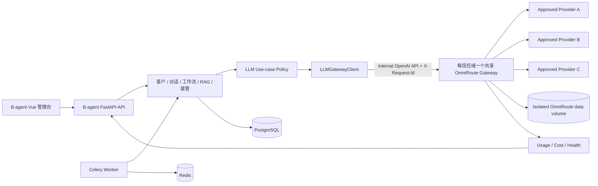
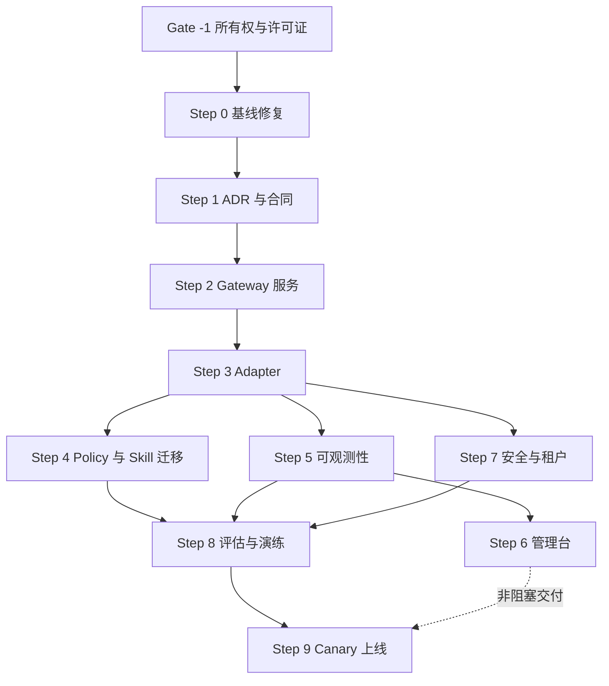

# B-agent × OmniRoute 二次改造实施蓝图

> 状态：Draft for architecture review
> 日期：2026-08-09
> 目标：将 OmniRoute 作为 B-agent 的内部 AI Gateway，引入多模型路由、容灾、配额、成本和审计能力，同时保留 B-agent 的外贸销售业务域、工作流、渠道和人工接管能力。

## 1. 执行摘要

### 1.1 核心决策

采用“服务边界集成”，不做源码级合并：

- B-agent 是业务系统和唯一业务数据源，负责用户、组织、客户、线索、对话、工作流、RAG 知识库、邮件/WhatsApp 触达、人工接管和业务报表。
- OmniRoute 是内部 LLM Gateway，负责模型供应商连接、OpenAI 兼容接口、模型选择、账号池、故障切换、限额、成本、使用量、流式协议和模型调用安全。
- B-agent API 进程和 AI Worker 只能通过统一的 `LLMService → LLMGatewayClient` 调用 OmniRoute；浏览器和 Skill 不得直接依赖 Gateway Adapter。
- 第一阶段保留 B-agent 当前的直连模型实现作为 feature-flag 回滚路径；稳定两个发布周期后再考虑删除。
- OmniRoute 使用固定版本和镜像 digest，不跟随 `latest` 自动升级。

### 1.2 为什么这样集成

直接合并两个代码库会引入两套用户系统、两套控制台、两套 Skill、两套 Memory、两套数据库和两套发布节奏。通过 OpenAI-compatible `/v1/*` 边界集成，可以最大限度复用 OmniRoute 的成熟能力，同时把任何上游架构变化隔离在网关后面。

### 1.3 默认租户假设

本蓝图正式限定为“单组织/单信任域部署”。OmniRoute v3 当前是单租户模型，API key 不是完整的数据和供应商配置隔离边界。

- 单组织私有部署：一个 B-agent 对应一个 OmniRoute 实例。
- 多租户 SaaS 不属于本计划完成定义；未来需单独建设 B-agent tenancy foundation，包括全表 `org_id`、行级授权、租户任务绑定和 `GatewayRegistry(org_id → endpoint/secret)`。
- 未来每个租户或信任域应使用独立 OmniRoute 实例/数据卷，不能仅依靠不同 API key 共用一个 OmniRoute 实例。

## 2. 调研快照

### 2.1 B-agent 当前状态

- Python/FastAPI + Vue 3 的外贸 B2B 获客和销售自动化原型。
- 已有客户、对话、工作流、认证、统计、管理 API 和 13 个 Skill 类。
- AI 调用主要集中在 `backend/app/integrations/ai_provider.py`，由话术生成、AI 回复和意图识别调用。
- 业务优势是外贸销售域、渠道触达、工作流编排和人工接管。
- 当前基础质量不足：前端无法构建、README 有冲突标记、前后端存在接口漂移、Celery 配置不完整、无自动化测试、无数据库迁移。
- 仓库没有许可证；如果要分发或商业化，需先明确 B-agent 的许可证和第三方声明策略。

### 2.2 OmniRoute 当前状态

- Next.js/TypeScript 的本地优先 AI Gateway，提供 OpenAI-compatible `/v1/*` 接口。
- 当前活跃版本线为 `release/v3.8.50`，MIT License。
- 强项包括多供应商协议转换、模型/账号 fallback、自动路由、配额、成本、熔断、调用日志、API key、guardrails、流式响应和运维质量门。
- v3 是单租户本地 Gateway；上游当前 Roadmap 描述了 v3.9 LTS 和模块化 v4 方向，但这只作为观察项，不作为本项目实施依赖或兼容性承诺。
- 对本项目真正必要的是 Gateway 核心，不是 OmniRoute 的 CLI、IDE Agent、MITM、MCP/A2A、Skill、Memory 或完整 Dashboard。

## 3. 取长补短矩阵

| 能力域 | B-agent 现状 | OmniRoute 可补强 | 目标归属 |
| --- | --- | --- | --- |
| 客户/线索/CRM | 已有业务模型和页面 | 非其职责 | B-agent |
| 邮件/WhatsApp 触达 | 已有集成骨架 | 非其职责 | B-agent |
| 销售工作流 | 已有 Skill + Workflow Engine | 有另一套 Agent/Skill 体系 | B-agent，暂不引入 OmniRoute Skill |
| AI 模型接入 | 直连通义、Qwen、OpenAI | 统一 OpenAI API、多供应商 | OmniRoute |
| 模型路由 | 静态单供应商 | 成本、质量、延迟、配额和健康度路由 | OmniRoute |
| 容灾 | 实现较弱 | 账号 fallback、模型 fallback、熔断、冷却 | OmniRoute |
| 成本/配额 | 基本没有 | 调用量、成本、配额和延迟统计 | OmniRoute 提供，B-agent 展示业务视图 |
| RAG 知识库 | 已有 Chroma/LangChain 骨架 | 也有 Memory/RAG | B-agent 保留业务知识库；OmniRoute 仅做推理 |
| 人工接管 | 已有销售对话接管模型 | 非销售业务能力 | B-agent |
| 安全 | 基础 JWT | Gateway key、guardrails、审计、出站保护 | 双方分层负责 |
| 管理后台 | 外贸销售后台 | Gateway 运维后台 | 面向销售使用 B-agent；仅管理员访问 OmniRoute |

## 4. 明确不做的事情

- 不把 OmniRoute 仓库复制到 B-agent 的 `backend/` 或 `frontend/`。
- 不在第一阶段重写 B-agent 为 TypeScript/Next.js。
- 不同时使用两套 Skill 编排系统。
- 不把 OmniRoute Memory 当作客户、对话或 RAG 的主数据源。
- 不把 OmniRoute Dashboard iframe 嵌进普通销售后台。
- 不在生产环境启用未经批准的免费/keyless provider 处理客户数据。
- 不在没有 golden-set 评估前启用 prompt compression、自动质量路由或模型自由探索。
- 不使用 `latest` 镜像标签部署生产环境。

## 5. 目标架构



### 5.1 调用边界

`Skill → LLMService → LLMUseCasePolicy → LLMGatewayClient → OmniRoute /v1/chat/completions`

禁止以下调用：

- `Skill → OmniRoute`
- `Vue → OmniRoute`
- `Skill → OpenAI/Tongyi/Qwen SDK`
- `B-agent → OmniRoute SQLite`

### 5.2 Use-case 路由建议

生产路由必须使用显式、持久化、经过审批的 combo/模型别名，且生产 OmniRoute 实例只配置批准的 provider connection。动态 `auto/*` 会从已连接 provider 构建候选池，部分排除逻辑为 fail-open，因此只能用于无敏感数据的开发和评估环境。

| B-agent 用例 | 初始路由 | 输出约束 | 说明 |
| --- | --- | --- | --- |
| 线索分类/意图识别 | `b-agent-intent-fast-v1` | JSON Schema | 低成本、低延迟、强结构化 |
| 批量个性化开发信 | `b-agent-outreach-cheap-v1` | 模板字段 + 长度限制 | 成本优先，只含批准 provider |
| 客户即时回复 | `b-agent-reply-reliable-v1` | 语气、禁用承诺、引用证据 | 稳定性优先 |
| 高意向客户/谈判建议 | `b-agent-negotiation-quality-v1` | 人工确认后发送 | 质量优先，禁止全自动外发 |
| RAG 摘要和检索查询改写 | `b-agent-rag-cheap-v1` | JSON/短文本 | 不让 OmniRoute Memory 接管知识库 |
| 数据清洗标签 | `b-agent-classify-fast-v1` | 枚举 Schema | 规则优先，LLM 只处理不确定项 |

以上只是待创建的内部别名；实际 provider/model 白名单必须通过配置和评估确定，并在启动时通过 `/v1/models` 和管理面 contract test 验证。别名、combo 或候选配置缺失时必须 fail-closed，不得扩大候选池。

## 6. 非功能目标与验收门槛

以下指标为首版建议值，可在实施前由产品和运维确认：

- Gateway 增量开销：在受控 mock upstream、至少 1,000 次请求下，backend container 到 Gateway 的额外 p95 小于 150 ms。
- 在线销售回复可用性：按 30 天滚动窗口统计，从 B-agent 接受任务到获得合法模型结果的成功率不低于 99.5%；人工取消和上游明确内容拒绝单列，不掩盖基础设施错误。
- fallback 演练：主 provider 429/5xx/超时后，同一请求自动切换且不重复外发消息。
- 结构化任务解析率：至少 500 条脱敏 golden cases 上通过 Pydantic/JSON Schema 校验的比例不低于 99%，且价格、合同和承诺类严重错误为 0。
- AI 调用归因率：100% 可关联到 use case、workflow execution 和内部 request ID。
- 成本可见性：至少按日期、use case、模型/供应商汇总；禁止只展示总 token。
- 安全：OmniRoute 端口不对公网暴露，provider secret 不进入 B-agent 数据库或前端。
- 回滚：5 分钟内可通过配置切换到旧直连实现；无需回滚数据库。
- 质量：每个阶段必须通过 lint、typecheck、unit、integration 和 smoke gate。

## 7. 分阶段实施计划

### Gate -1 — 所有权与许可证确认

**依赖：** 无，必须在任何开发前完成
**目的：** 确认有权修改和分发两个项目，并确定交付物的许可证义务。

**任务：**

1. 确认 B-agent 代码所有权或取得明确书面授权；公开可读不等于自动获得修改和再分发许可。
2. 确定 B-agent 自身许可证、商业分发方式和版权主体。
3. 添加完整的 OmniRoute MIT 许可证文本和版权声明，而不仅是项目名称。
4. 确定容器镜像、安装包、源码包中第三方 notices 的随附位置。
5. 建立 SBOM 和传递依赖许可证扫描 gate。

**退出条件：** 所有权、项目许可证、第三方许可证和交付方式有书面记录；否则计划停止。

---

### Step 0 — 建立可构建的 B-agent 基线

**依赖：** Gate -1
**建议交付：** PR 1A（仓库/构建）+ PR 1B（运行时/迁移/CI）
**目的：** 集成前先让原系统可重复构建和测试，否则无法判断问题来自 B-agent 还是 OmniRoute。

**上下文：** 当前 B-agent 只有一次初始化提交，前端构建失败，Celery 依赖/Beat scheduler 不一致，README 有冲突，API 与页面调用有漂移。

**任务：**

1. 修复 README 冲突、`nanobot` 无 `.gitmodules` 的悬空 gitlink。
2. 锁定 Node/Python 版本；修正 `vue-tsc`/TypeScript 兼容和 Vue 模板语法错误。
3. 对齐 Dashboard、logout、high-intent、activities 等前后端 API。
4. 修复 Workflow update 中不存在的模型引用和未初始化变量。
5. 恢复 Celery/Redis 依赖；将 Beat scheduler 改为适合 FastAPI 的持久化方案或先禁用 Beat。
6. 添加 Alembic 基线迁移。
7. 建立最小 CI：backend lint/typecheck/test、frontend lint/typecheck/build、Docker compose config。

**验证：**

```bash
cd backend && pytest -q
cd frontend && npm ci && npm run build
docker compose config
docker compose up -d db redis backend frontend
curl -fsS http://localhost:8000/health
```

**退出条件：** 干净环境可启动；至少覆盖登录、创建客户、创建工作流、查看 Skill 的 smoke test。

**回滚：** 仅基础修复，不涉及 OmniRoute；逐个小提交可回滚。

---

### Step 1 — 固化 ADR 和 Gateway 合同

**依赖：** Step 0
**建议交付：** PR 2
**目的：** 在写适配器前冻结边界，避免把 OmniRoute 内部实现泄露进业务层。

**任务：**

1. 添加 ADR：选择共享内部 Gateway service integration，拒绝源码合并和“每个 Pod 一个 sidecar”。
2. 明确部署模式：单组织；若目标是 SaaS，多租户策略必须另开 ADR。
3. 定义 `LLMRequest`、`LLMResponse`、`LLMStreamChunk`、`Usage`、`GatewayError` 类型。
4. 定义错误分类：timeout、rate_limit、auth、content_policy、invalid_response、upstream_unavailable。
5. 定义业务 use case 枚举，而不是让 Skill 直接填写任意 model 名称。
6. 建立 OmniRoute 推理 API contract tests，覆盖 `/health`、`/v1/models`、chat completion、stream 和结构化输出。
7. 将 `/api/monitoring/*`、usage、provider/combos 等管理面接口封装成单独 client 和 contract suite；不能把它们视为与 `/v1/*` 同等稳定的推理合同。

**验证：** contract tests 可针对 mock server 和指定 OmniRoute 版本运行。

**退出条件：** 业务代码只依赖内部接口；没有 OmniRoute 专有 DTO 泄漏到 Skill。

**回滚：** 删除合同层和文档即可，无运行时影响。

---

### Step 2 — 引入固定版本的 OmniRoute 内部服务

**依赖：** Step 1
**建议交付：** PR 3
**目的：** 先打通基础设施和健康检查，不迁移业务流量。

**任务：**

1. 在 Docker Compose 增加 `omniroute` 服务，固定不可变 commit 对应的版本和 image digest，不能只 pin 可移动 release 分支。
2. 定义为“每信任域一个共享内部 Gateway 服务”，仅加入 API/AI Worker 可访问的内部 network，不映射公网端口；管理员临时访问通过 SSH tunnel 或受保护反向代理。
3. 添加独立持久化 volume、资源限制、健康检查和备份策略；OmniRoute v3 使用本地持久状态，不做多副本 active-active，也不让新旧版本同时写同一 volume。
4. 使用 Secret Manager/Compose secret 注入 Gateway key 和 provider credential。
5. 建立独立的生产 Gateway 实例，只配置批准的 provider；通过幂等 provisioning/runbook 创建固定 combos、受模型权限限制的 B-agent API key，并检测配置漂移。
6. B-agent 增加 `OMNIROUTE_BASE_URL`、`OMNIROUTE_API_KEY`、`LLM_BACKEND`、timeout 和 feature flag。
7. 添加启动前 readiness 检查，但 Gateway 不可用时不阻塞 B-agent 的非 AI 功能；批准 combo 缺失时 AI readiness 必须失败。
8. 记录版本、commit、digest、数据 schema、迁移前备份和“恢复到新 volume”的升级/回滚操作手册。

**验证：**

```bash
docker compose up -d omniroute
docker compose exec backend curl -fsS http://omniroute:20128/api/monitoring/health
docker compose exec backend curl -fsS -H "Authorization: Bearer $OMNIROUTE_API_KEY" http://omniroute:20128/v1/models
```

**退出条件：** 只有 B-agent API/AI Worker network 能访问 Gateway；重启后配置和使用量持久化；批准 combo 缺失、候选为空或管理面读取失败时不会退到动态候选池。

**回滚：** 停止 OmniRoute service，不改变任何 B-agent 请求路径。

---

### Step 3 — 实现 Python Gateway Adapter 和双轨回滚

**依赖：** Step 2
**建议交付：** PR 4
**目的：** 用内部接口替换供应商 SDK 分支，但暂不大规模迁移 Skill。

**主要文件：**

- `backend/app/integrations/ai_provider.py`
- 新建 `backend/app/integrations/llm_gateway.py`
- 新建 `backend/app/services/llm_service.py`
- `backend/app/config.py`

**任务：**

1. 用 `httpx.AsyncClient` 实现连接池、超时、流式 SSE、取消传播和响应解析。
2. 为每次调用生成并传播 `X-Request-Id`；日志中不记录完整 prompt 或 secret。
3. 支持 JSON Schema/structured output，并对供应商不兼容情况返回明确错误。
4. 统一 token、cost、provider、model、latency 和 finish reason。
5. 增加 feature flags：global、per-use-case、per-workflow、百分比 canary。
6. 冻结 B-agent 自己的流式协议；Gateway SSE 仅在服务端转换。覆盖 `[DONE]`、多行 `data`、heartbeat/comment、部分 UTF-8、首包/idle/total timeout、流中错误、客户端取消、背压、最大缓冲和最终 usage/finish_reason 归并。
7. 明确重试所有权：OmniRoute 负责 provider/model/account fallback；Adapter 在收到任何响应字节后不得重放；Celery 只按持久任务状态重试，不把未知结果切到 direct 再执行一次。
8. 增加 per-use-case 并发限制和 backpressure，避免批量话术生成压垮单实例 Gateway。
9. 保留受控 `DirectProviderAdapter` 作为 break-glass 路径；密钥只来自 Secret Manager，不进入 B-agent 业务库或前端。
10. 使用 fake OmniRoute server 编写成功、流式、429、5xx、超时、断流、非法 JSON、取消和未知结果测试。

**验证：** adapter contract suite 全部通过；切换 `LLM_BACKEND=direct|omniroute` 不改变 Skill 接口。

**退出条件：** 单次 AI 调用可安全双轨切换；无供应商 SDK 类型泄漏到上层；结构化结果必须在完整流结束后通过 Pydantic/JSON Schema 二次校验，半截 JSON 不能触发业务动作。

**回滚：** 配置切回 `direct`；不需要部署回滚。

---

### Step 4 — 增加业务 Use-case Policy 并迁移 AI Skill

**依赖：** Step 3
**建议交付：** PR 5
**目的：** 让业务表达“我要低成本分类/可靠回复”，而不是绑定 provider/model。

**主要调用点：**

- `skill_message_generator.py`
- `skill_ai_reply.py`
- `skill_rag.py`
- 后续的数据标签/清洗 LLM 分支

**任务：**

1. 新增 `LLMUseCasePolicy`，将 use case 映射到 model alias、temperature、max tokens、timeout、输出 schema 和 fallback 限制。
2. 把 message generator、intent analysis、AI reply 迁移到 `LLMService`。
3. RAG 仍由 B-agent 检索文档，只把最终推理请求发给 Gateway。
4. 建立持久状态链：`llm_invocation → generated_message → approval → outbound_action → delivery_attempt`，不能用 Gateway request ID 代替业务状态。
5. 使用 transactional outbox 和数据库唯一约束 `(channel, business_message_id, action_type)`；分别管理 correlation ID、模型调用幂等键和外发动作幂等键。
6. Celery 定义任务 lease、soft/hard timeout、可重试错误分类、指数退避、DLQ 和 Worker 崩溃恢复语义；“请求已发出但响应丢失”进入人工/对账状态，禁止自动重复外发。
7. 高意向、价格、合同、承诺类输出设置人工确认门。
8. 为每个 use case 建立 golden set，保存输入摘要、期望 schema 和业务判定，不保存不必要的真实 PII。
9. 初期关闭 compression、free provider 和自动探索；评估通过后逐项开启。

**验证：** 三个核心 Skill 在 direct 与 OmniRoute 模式下通过相同的行为合同测试。

**退出条件：** 核心 Skill 不再直接调用 Tongyi/Qwen/OpenAI 类；业务策略可以配置但不能任意注入 model ID。

**回滚：** per-use-case flag 切回 direct；保留新策略层不影响旧实现。

---

### Step 5 — 调用归因、成本和健康度观测

**依赖：** Step 3
**可与 Step 4、Step 7 并行：** 是
**建议交付：** PR 6
**目的：** 把 Gateway 技术指标转成 B-agent 可理解的销售成本和可靠性指标。

**任务：**

1. 新建父表 `llm_invocations`，记录业务 request ID、workflow execution、skill、use case、输入摘要、最终状态和最终输出引用；禁止存完整 secret 或不必要 PII。
2. 新建子表 `llm_attempts`，记录不可变 Gateway log/request ID、attempt 序号、provider、model、token、估算/实付成本、cache、fallback 原因、latency 和 status。
3. 通过响应元数据或带游标的 OmniRoute usage/log API 幂等同步 attempt，不直读 OmniRoute SQLite；技术使用量以 Gateway 为准，业务归因以 B-agent 为准，禁止两边独立累计后相加。
4. 对订阅制、免费或缺少定价的调用标记 `unknown|estimated|actual`，不能把 0 显示成“免费”。
5. 后台任务定期同步 Gateway health、quota 和 circuit breaker 摘要。
6. 增加指标：每个线索 AI 成本、每次有效回复成本、转化客户 AI 成本、fallback 率、p95 延迟、schema failure。
7. 接入结构化日志与 Prometheus/OpenTelemetry；统一 correlation ID。
8. 设置预算阈值和异常告警，但告警系统不直接自动禁用所有销售回复。

**验证：** 任一客户回复可从 B-agent execution 追踪到单个 Gateway request；成本汇总可对账。

**退出条件：** 100% Gateway 调用有 use case 和 request ID；失败调用可定位至业务动作。

**回滚：** 停止同步任务和 UI 展示；不影响调用链。

---

### Step 6 — 改造管理台的 AI Gateway 页面

**依赖：** Step 5
**建议交付：** PR 7
**目的：** B-agent 展示业务相关配置和指标，不复制 OmniRoute 全量 Dashboard。

**任务：**

1. 将当前假的 Tongyi/Qwen/OpenAI API key 配置区替换为 Gateway 状态、版本和连接健康摘要。
2. 增加 use-case policy 页面：路由别名、预算、是否允许自动发送、人工确认规则。
3. 增加 AI 用量/成本/延迟/fallback 图表，可按 use case、工作流和日期筛选。
4. 普通销售用户看不到 provider credential、Gateway key 或底层账号池。
5. 仅系统管理员可通过受保护链接进入 OmniRoute 运维控制台。
6. 增加配置变更审计、确认对话框和只读降级状态。

**验证：** Playwright 覆盖管理员和普通销售两种权限；前端不直接请求 OmniRoute。

**退出条件：** 销售后台能回答“这次回复用了什么、花了多少、是否 fallback”，但不能泄漏供应商密钥。

**回滚：** 菜单 feature flag 隐藏；旧设置页保留一版。

---

### Step 7 — 安全、隐私与租户隔离硬化

**依赖：** Step 3
**可与 Step 4、Step 5 并行：** 是
**建议交付：** PR 8
**目的：** 在真实客户数据进入 Gateway 前关闭最危险的信任边界问题。

**任务：**

1. 形成数据分类：公开线索、联系人 PII、对话内容、价格/合同、账号密钥。
2. 生产使用独立 Gateway 实例和显式固定 combo；provider 建立白名单、地区/数据保留/DPA 审查，禁止默认 `auto/*` 和 free/keyless pool。
3. 启用带模型权限的 API key、内部网络、出站 allowlist、secret rotation 和最小权限；若响应/usage 能返回实际 provider/model，则 B-agent 再做一次 allowlist 校验。
4. 明确 OmniRoute request log、audit log 和 prompt retention 策略；默认不长期保存完整客户对话。
5. 在进入 Gateway 前进行日志脱敏；必要时启用经过评估的 PII guardrail。
6. 防 prompt injection：RAG 文档与客户消息视为不可信数据，system policy 不允许被覆盖。
7. 保持本次单组织边界；未来多租户项目必须执行实例/数据卷隔离，API key 只作为认证，不作为唯一隔离机制。
8. 进行 SSRF、越权、secret leak、恶意 prompt 和审计日志测试。

**验证：** 安全测试套件、容器网络扫描、secret scan、依赖/SBOM 扫描通过。

**退出条件：** combo 缺失、候选为空、配置/数据库读取失败时请求被拒绝；未批准 provider 无法接收生产数据；普通用户无法访问 Gateway 管理接口。

**回滚：** 安全策略可回滚到更严格模式，不允许回滚到公网裸露或无认证模式。

---

### Step 8 — 质量评估、故障演练和性能测试

**依赖：** Step 4、Step 5、Step 7
**建议交付：** PR 9
**目的：** 证明“路由更便宜/更稳”没有以销售质量和合规为代价。

**任务：**

1. 建立脱敏 golden set：意图识别、询价回复、样品请求、投诉、无关消息、多语言、恶意注入。
2. 比较 direct baseline 与多个 OmniRoute policy 的质量、成本、延迟和 schema success。
3. 故障注入：429、401、5xx、timeout、stream 中断、额度耗尽、Gateway 重启、DB volume 只读、候选配置丢失、配置查询失败和空候选池。
4. 验证 fallback 不重复发送、不绕过人工接管；配置异常必须 fail-closed，不能扩大 provider pool。
5. 进行高峰负载测试；检查 FastAPI 连接池、Celery 并发和 OmniRoute queue/资源上限。
6. 形成上线阈值：质量不得低于 baseline，成本/延迟改善达到约定目标，严重安全问题为 0。

**验证：** 自动生成评估报告，并作为 CI/发布 gate 保存。

**退出条件：** 所有第 6 节非功能门槛通过；未通过的 policy 不进入 canary。

**回滚：** 测试阶段无生产流量；失败策略删除或降级。

---

### Step 9 — Canary、正式切流和旧代码退役

**依赖：** Step 5、Step 7、Step 8；Step 6 的完整 UI 不阻塞 canary
**建议交付：** PR 10 + 发布变更
**目的：** 可观察、可停止、可回滚地完成迁移。

**任务：**

1. 先迁移非外发任务：分类、摘要、查询改写。
2. 再迁移需要人工确认的消息生成。
3. 最后迁移实时 AI 回复；按 5% → 25% → 50% → 100% canary。
4. 每阶段至少覆盖 7 天、500 次合格 AI 调用和 50 次人工抽检；比较质量、成本、fallback 和人工接管率，任一严重商务错误、未批准 provider 命中或重复外发立即停止。
5. 触发阈值自动回到 direct 或固定可靠模型，不自动降级到未知免费 provider。
6. 100% 稳定两个发布周期后，移除 provider key 前端配置；保留禁用状态的 break-glass direct adapter，并按季度演练，密钥仅驻留 Secret Manager。
7. 保留 Gateway adapter、policy、contract test、独立数据卷备份恢复和版本升级 runbook。

**验证：** 生产 smoke、回滚演练、备份恢复、告警演练和业务验收全部签字。

**退出条件：** B-agent 不再持有上游 provider secret；所有 AI 生产流量经批准的 Gateway policy。

**回滚：** feature flag 切到 break-glass direct；Gateway 版本回滚必须停止写入、从迁移前一致性备份恢复到新 volume，再启动旧镜像，禁止旧镜像直接挂载已升级 volume。固定 combo 只能处理上游 provider 故障，不能作为 Gateway 进程/网络/SQLite 故障的回滚。

## 8. 依赖关系与并行计划



可并行窗口：

- Step 4、Step 5、Step 7 在 Step 3 完成后可并行，但要避免同时修改 `config.py` 和公共 DTO。
- Step 6 可在 Step 5 API 合同冻结后开始。
- Canary 依赖 Step 5 的指标/告警 API，不依赖 Step 6 的完整图表页面；Step 6 可以在 canary 前后独立完成。
- Step 8 的测试数据准备可以在 Step 4 早期启动，但正式评分必须等待安全和观测链路完成。

## 9. 关键风险与应对

| 风险 | 影响 | 应对 |
| --- | --- | --- |
| OmniRoute v3 单租户 | SaaS 数据/密钥串租户 | 默认单组织；多租户一实例一数据卷 |
| 自动路由导致输出风格漂移 | 销售话术不一致 | use-case 白名单、golden set、结构化输出、人工确认 |
| `auto/*` fail-open 扩大候选池 | PII 发给未批准 provider | 生产独立实例、显式固定 combo、模型权限、B-agent fail-closed |
| prompt compression 改写事实 | 商务承诺错误 | 初期关闭；单独评估后才能启用 |
| free provider 隐私/ToS 不确定 | PII 和合规风险 | 生产禁用，建立批准供应商池 |
| 两层重试产生重复消息 | 客户收到重复开发信 | AI 生成与发送解耦、业务幂等键、仅 Gateway 负责模型 fallback |
| 上游快速升级 | API 或行为破坏 | 固定版本/digest、contract tests、月度人工升级 |
| 上游路线图变化 | 二次集成返工 | v3.9/v4 仅作观察项；只依赖内部 Adapter 和已验证合同 |
| Gateway 单实例/SQLite 成为单点 | 所有 AI 功能中断 | 不做不受支持的 active-active；健康检查、资源隔离、备份恢复、break-glass direct |
| Gateway 数据迁移不可逆 | 旧镜像无法读取新 volume | 迁移前一致性备份、恢复到新 volume、禁止新旧版本共同写入 |
| 调用日志保存 PII | 数据泄露 | 最小化日志、脱敏、retention、访问审计 |
| B-agent 基础质量不足 | 无法分辨集成回归 | Step 0 是强制门，不允许跳过 |

## 10. 反模式清单

- 在每个 Skill 中分别写 OmniRoute URL、key 和 model。
- 让销售人员在工作流 JSON 中输入任意 provider/model。
- 业务数据库直接读取 OmniRoute 的 SQLite 表。
- 前端直连 OmniRoute 或把 Gateway key 写入浏览器。
- B-agent、Celery 和 OmniRoute 各自独立重试同一业务动作。
- 用 API key 假装完成多租户数据隔离。
- 为追求最低成本默认启用全部免费 provider。
- 在生产 PII 流量上直接使用动态 `auto/*`，或在候选读取失败时 fail-open。
- 在没有 request ID 和 use case 归因前做成本报表。
- 把 correlation ID、模型请求幂等键和外发动作幂等键混为一个字段。
- 对结果未知的请求自动切 direct 重放，或让多层组件各自重试。
- 让多个 OmniRoute v3 副本同时写同一个 SQLite volume。
- 同时迁移模型、工作流引擎、RAG 和前端框架。
- 在 canary 前删除旧直连回滚路径。

## 11. 交付节奏与人员假设

以下不是承诺工期，而是用于排期的工程估算：

| 阶段 | 范围 | 参考周期 |
| --- | --- | --- |
| Foundation | Gate -1、Step 0–1 | 1.5–2.5 周 |
| Gateway MVP | Step 2–4 | 2–3 周 |
| Production readiness | Step 5、Step 7、Step 8 | 2–3 周，可部分并行 |
| Product UI + rollout | Step 6、Step 9 | 1.5–2 周 |

- 建议团队：1 名后端/AI、1 名全栈、0.5 名 DevOps/SRE、0.5 名 QA/安全支持，总计约 7–10 周。
- 单名高级全栈独立实施：约 12–16 周，并应减少并行工作。
- Step 0 若暴露更深的原型缺陷，必须重估，不能为了日期跳过基线门。
- Staging MVP 截止点：完成 Step 4；生产 canary 截止点：完成 Step 5、7、8。

## 12. 版本与升级策略

- 首次集成以 2026-08-09 调研到的 `v3.8.50` 为候选基线；最终固定到通过 contract suite 的不可变 commit SHA 和镜像 digest，不能只 pin release 分支名。
- 禁止生产使用 `latest`、`next`、nightly。
- 每月执行：拉取候选版本 → 阅读 changelog/security → contract suite → golden eval → staging soak → 人工批准。
- 上游 Roadmap 中的 v3.9 LTS/v4 仅作定期核验的观察项，不作为交付依赖；任何大版本都按新 Gateway 产品重新做合同、迁移、恢复和质量评估。
- 升级前停止写入并创建一致性数据备份；候选版本恢复到独立新 volume。旧版本回滚也使用恢复出的旧 schema volume。
- OmniRoute 故障修复优先向上游贡献；本项目只保留最小补丁集，避免长期 fork。

## 13. Plan 变更协议

计划执行过程中允许以下变更，但必须记录到 ADR/PR：

- **拆分步骤：** 单个 PR 超过可审查范围或同时触碰三个以上边界时拆分。
- **插入步骤：** 出现安全、数据迁移或上游兼容阻断时，可在依赖步骤前插入。
- **跳过步骤：** 仅当目标能力明确不进入本次发布，并记录后续 issue。
- **重排步骤：** 只能在依赖图允许时重排；安全门和评估门不能移到 canary 之后。
- **放弃集成：** contract、隐私或质量门持续不通过时，保留 B-agent 直连并停止在最后一个安全节点。

每次变更必须说明：原因、影响的依赖、验证变化、回滚变化和新的退出条件。

## 14. 完成定义

集成完成不是“请求能返回 200”，而是同时满足：

1. B-agent 核心业务链可构建、可测试、可部署。
2. 所有生产 AI 调用经过内部 `LLMService` 和 use-case policy。
3. OmniRoute 不对公网暴露，密钥不进入前端或 B-agent 业务表。
4. 销售工作流、RAG 和人工接管仍由 B-agent 控制。
5. fallback 不造成重复发送，结构化输出达到质量阈值。
6. 每次调用具备业务归因、成本、延迟和错误可观测性。
7. 本次单组织部署具有独立 Gateway 实例/数据卷；多租户另立项目，不能假装由 API key 完成隔离。
8. 版本升级和回滚已演练，contract/golden/security gates 自动化。
9. OmniRoute MIT 完整许可证/版权声明、B-agent 所有权和自身许可证问题已处理，并生成 SBOM。
10. provider key 前端配置已退役；break-glass direct adapter 保持禁用、可审计、可演练，密钥只在 Secret Manager。
