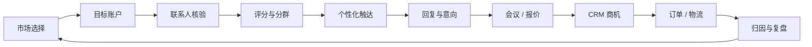

# B-agent 外贸业务链路与 API 实施蓝图

> 日期：2026-08-09  
> 状态：Phase 1 AI control plane implemented; business connectors planned  
> 范围：单组织部署。浏览器只调用 B-agent API，所有第三方凭据、OAuth token、Webhook secret 和 OmniRoute key 都由后端保管。

## 1. 产品目标

B-agent 不应只是“找数据 + 生成文案”的工具，而应形成可审计的外贸营收闭环：

每个模块统一采用：

`业务输入 → 官方/获授权数据 API → B-agent Connector → Skill/Workflow → 人工门禁 → 持久化业务结果 → KPI`

AI 只负责理解、生成和辅助决策。抓取、发送、报价、承诺、CRM 写入等外部副作用必须走确定性 API、幂等键、审计和权限控制。

## 2. 模块逐项实现链路

### M1 市场与品类机会

- 业务问题：目标产品优先进入哪个国家，需求规模、增长、竞争和季节性如何。
- 输入：HS code、产品关键词、目标价格带、交付能力、认证能力。
- 数据 API：
  - [UN Comtrade API](https://uncomtrade.org/docs/un-comtrade-api/)：按 reporter、partner、flow、period、HS code 获取进出口额和趋势。
  - Google Trends 不提供稳定公开业务 API，不作为生产依赖；可用企业采购的市场数据源补充。
- 内部接口：
  - `POST /api/v1/market-research/jobs`
  - `GET /api/v1/market-research/jobs/{id}`
  - `GET /api/v1/market-research/opportunities?hs_code=&period=`
- Agent 链：参数规范化 → Comtrade 拉取 → 汇率/单位归一 → 市场评分 → AI 解释 → 人工确认目标市场。
- 输出：市场机会卡、证据链接、数据日期、推荐理由、风险和下一步 ICP。
- KPI：进入市场后有效线索率、回复率、商机率；不能只用模型主观评分。
- 优先级：P1。

### M2 目标公司发现

- 业务问题：在目标国家找到符合 ICP 的进口商、经销商、零售商和品牌方。
- 输入：国家、行业、公司类型、规模、关键词、地理范围。
- 数据 API：
  - [Google Places Text Search](https://developers.google.com/maps/documentation/places/web-service/reference/rest/v1/places/searchText)：企业名称、地址、网站、类型和地理筛选。
  - Apollo/Hunter Discover 可作为已签约商业数据源；保存来源、许可范围和删除状态。
  - LinkedIn 仅允许审批用例。其[受限用例政策](https://learn.microsoft.com/en-us/linkedin/marketing/restricted-use-cases?view=li-lms-2026-03)禁止把 Marketing API 会员数据用于销售线索创建、CRM 增强或批量消息，因此不建设 LinkedIn 抓取器。
- 内部接口：
  - `POST /api/v1/prospecting/searches`
  - `GET /api/v1/prospecting/searches/{id}/companies`
  - `POST /api/v1/customers/imports`
- Agent 链：查询扩写 → API 搜索 → 域名归一 → 公司去重 → ICP 初筛 → 人工抽样。
- 输出：公司主档、网站、地址、来源和置信度，不直接生成“已核验联系人”。
- KPI：公司去重率、ICP 合格率、来源覆盖率、付费数据单条有效成本。
- 优先级：P0。

### M3 联系人补全与邮箱核验

- 业务问题：找到合适岗位，减少无效邮箱和退信。
- 数据 API：
  - [Hunter API](https://hunter.io/api-documentation)：Domain Search、Email Finder、Verifier、公司/人员 enrichment。
  - Apollo People Search/Enrichment：仅在合同和数据处理范围允许时启用。
- 内部接口：
  - `POST /api/v1/enrichment/jobs`
  - `GET /api/v1/enrichment/jobs/{id}`
  - `POST /api/v1/contacts/{id}/verify`
- Agent 链：岗位优先级 → 联系人候选 → 邮箱查找 → deliverability 核验 → 合法利益/退订状态检查 → 合并到客户主档。
- 输出：姓名、岗位、邮箱、验证结果、数据来源、获取时间、可联系状态。
- 门禁：`invalid`、`accept_all` 或已退订联系人禁止进入自动触达；451/删除响应必须传播到本地主档。
- KPI：有效邮箱率、硬退信率、数据过期率。
- 优先级：P0。

### M4 线索评分与行动优先级

- 业务问题：销售今天先跟进谁，以及为什么。
- 数据来源：M1-M3、网站行为、历史触达、CRM 阶段、回复事件。
- AI：OmniRoute 固定别名 `lead_classification`，结构化 JSON 输出。
- 内部接口：
  - `POST /api/v1/leads/{id}/score`
  - `GET /api/v1/leads/priority-queue`
  - `POST /api/v1/leads/{id}/score-overrides`
- Agent 链：确定性特征 → 规则基线 → AI 解释非结构化信号 → 可解释分数 → 销售覆盖/反馈。
- 输出：分数、主要证据、缺失信息、下一最佳动作。
- 门禁：模型不能凭空补充营收、采购量或职位；人工覆盖必须保留理由。
- KPI：Top-N 商机命中率、覆盖后转化率、评分校准度。
- 优先级：P0。

### M5 产品知识与外贸 RAG

- 业务问题：让 AI 基于真实目录、规格、MOQ、认证、交期和条款回答。
- 数据来源：企业上传的 PDF/Excel/网站、ERP/PIM、历史 FAQ。
- OmniRoute 接口：
  - `POST /v1/files` 和 batch 能力只作为网关能力；B-agent 仍是业务知识主数据源。
  - 推理统一走 `POST /v1/chat/completions`。
- 内部接口：
  - `POST /api/v1/knowledge/documents`
  - `GET /api/v1/knowledge/documents`
  - `POST /api/v1/knowledge/search`
  - `POST /api/v1/knowledge/reindex`
- Agent 链：解析 → 分块 → 元数据/版本 → 向量索引 → 权限过滤检索 → `rag_query_rewrite` → 带证据回答。
- 输出：答案、引用片段、文档版本和有效日期。
- 门禁：价格、库存、交期必须来自最新权威系统；无证据时明确“不知道”。
- KPI：引用覆盖率、事实准确率、人工纠正率。
- 优先级：P0。

### M6 多语言内容与本地化

- 业务问题：按国家、角色和渠道生成自然且合规的开发内容。
- 数据 API：
  - OmniRoute `message_draft` 固定别名负责初稿。
  - [DeepL POST /v2/translate](https://developers.deepl.com/api-reference/translate/request-translation)用于确定性翻译、术语表和语言变体；key 只能放 Authorization header。
- 内部接口：
  - `POST /api/v1/content/drafts`
  - `POST /api/v1/content/translations`
  - `POST /api/v1/content/{id}/approve`
- Agent 链：客户/产品证据 → 价值主张 → 渠道约束 → 草稿 → 翻译/术语检查 → 禁止承诺检查 → 人工批准。
- 输出：多版本主题、正文、变量、语言、证据和审批状态。
- KPI：回复率、正向回复率、退订/投诉率、人工改写率。
- 优先级：P0。

### M7 邮件与 WhatsApp 触达

- 业务问题：可靠发送、接收回复并准确记录投递结果。
- 官方 API：
  - [Gmail `messages.send` / `drafts.send`](https://developers.google.com/workspace/gmail/api/guides/sending)。
  - [Microsoft Graph `sendMail`](https://learn.microsoft.com/en-us/graph/api/user-sendmail?view=graph-rest-1.0) 和 [Outlook change notifications](https://learn.microsoft.com/en-us/graph/outlook-change-notifications-overview)。
  - Meta WhatsApp Cloud API：`POST /{phone-number-id}/messages`，Webhook 接收消息和状态；使用 Meta 官方 [WhatsApp Business Platform Postman collection](https://www.postman.com/meta/whatsapp-business-platform/folder/13382743-ba8d099d-007e-4b52-b9f2-3cf3c60e4fbc)做合同参考。
- 内部接口：
  - `POST /api/v1/outreach/drafts`
  - `POST /api/v1/outreach/messages/{id}/approve`
  - `POST /api/v1/outreach/messages/{id}/schedule`
  - `POST /api/v1/webhooks/gmail`
  - `POST /api/v1/webhooks/microsoft`
  - `GET|POST /api/v1/webhooks/whatsapp`
- Agent 链：审批内容 → 账号/配额选择 → transactional outbox → provider API → webhook 对账 → 会话归档。
- 门禁：外发使用独立业务幂等键；Webhook 验签、去重、乱序处理；未知结果禁止盲目重发。
- KPI：送达率、硬退信率、回复率、发送到回复时长、重复发送数必须为 0。
- 优先级：P0。

### M8 回复理解与销售副驾

- 业务问题：识别询价、样品、代理意向、异议和拒绝，给出下一步。
- 输入：邮件/WhatsApp Webhook、客户和产品上下文、RAG 证据。
- AI：OmniRoute `live_reply`、`summarization` 固定别名。
- 内部接口：
  - `POST /api/v1/conversations/{id}/analyze`
  - `POST /api/v1/conversations/{id}/reply-drafts`
  - `POST /api/v1/conversations/{id}/takeover`
- Agent 链：线程归并 → 语言/意图 → 实体提取 → RAG → 建议回复 → 风险等级 → 人工或受控自动回复。
- 门禁：价格、合同、独家、付款、索赔等必须人工批准。
- KPI：意图准确率、首次回复时间、人工接管率、草稿采用率、商机推进率。
- 优先级：P0。

### M9 会议与任务

- 业务问题：把高意向回复变成会议和明确跟进。
- 官方 API：
  - Google Calendar Events API。
  - [Microsoft Graph Calendar create event](https://learn.microsoft.com/en-us/graph/api/calendar-post-events?view=graph-rest-1.0)。
- 内部接口：
  - `GET /api/v1/calendar/availability`
  - `POST /api/v1/calendar/events`
  - `POST /api/v1/tasks`
- Agent 链：识别时间/时区 → 查询可用时段 → 销售确认 → 创建会议 → CRM 任务。
- 输出：会议、参会人、时区、议程、提醒和会前简报。
- KPI：正向回复到会议率、爽约率、首次会议时长。
- 优先级：P1。

### M10 CRM 商机同步

- 业务问题：避免 B-agent 成为孤岛，统一联系人、公司、Deal 和活动。
- 官方 API：
  - [HubSpot Contacts](https://developers.hubspot.com/docs/api-reference/latest/crm/objects/contacts/guide)、[Deals](https://developers.hubspot.com/docs/api-reference/latest/crm/objects/deals/guide)、[Webhooks](https://developers.hubspot.com/docs/api-reference/latest/webhooks/guide)。
  - [Salesforce REST/Composite API](https://developer.salesforce.com/docs/atlas.en-us.api_rest.meta/api_rest/resources_composite_composite_post.htm)；大于 2,000 条的任务使用 Bulk API 2.0。
- 内部接口：
  - `POST /api/v1/crm/connections`
  - `POST /api/v1/crm/sync-jobs`
  - `GET /api/v1/crm/sync-jobs/{id}`
  - `POST /api/v1/webhooks/hubspot`
  - `POST /api/v1/webhooks/salesforce`
- Agent 链：字段映射 → external ID upsert → association → 阶段映射 → 冲突策略 → 双向变更事件。
- 门禁：CRM 是商机/销售活动权威源时，B-agent 不静默覆盖人工字段；冲突进入队列。
- KPI：同步延迟、失败率、重复记录率、阶段一致率。
- 优先级：P1。

### M11 报价、订单与物流

- 业务问题：从询价形成可审核报价，并追踪订单和异常。
- 数据 API：企业 ERP/PIM/库存 API 为权威；物流先接 [DHL Global Forwarding Shipment Tracking v2](https://developer.dhl.com/api-reference/shipment-tracking-v2-dhl-global-forwarding?language_content_entity=en)，后续按客户承运商接 FedEx/UPS。
- 内部接口：
  - `POST /api/v1/quotes`
  - `POST /api/v1/quotes/{id}/approve`
  - `POST /api/v1/orders/sync`
  - `GET /api/v1/shipments/{id}`
  - `POST /api/v1/webhooks/logistics/{provider}`
- Agent 链：询价实体 → SKU/MOQ/库存/价格 → 运费和条款 → 报价草稿 → 财务/销售审批 → CRM/ERP → 物流事件和异常。
- 门禁：模型不计算最终价格；所有金额、税费、Incoterm 和有效期由规则/权威 API 生成并审批。
- KPI：询价到报价时长、报价接受率、毛利偏差、物流异常响应时间。
- 优先级：P2。

### M12 营收归因、质量与合规

- 业务问题：知道哪类市场、数据源、话术、模型和渠道真正带来商机。
- 内部接口：
  - `GET /api/v1/analytics/funnel`
  - `GET /api/v1/analytics/attribution`
  - `GET /api/v1/analytics/ai-costs`
  - `POST /api/v1/privacy/suppression`
  - `POST /api/v1/privacy/export`
  - `DELETE /api/v1/privacy/subjects/{id}`
- 数据链：source → lead → contact → outreach → reply → meeting → deal → order；技术使用量来自 OmniRoute，业务归因来自 B-agent，不能把两边金额重复相加。
- 门禁：最小化 PII、保留期限、退订/suppression 优先于工作流、区域法规和客户合同评审。
- KPI：每个有效回复/商机/订单成本、模型质量漂移、投诉率、删除 SLA。
- 优先级：P0 基础审计，P1 完整归因。

## 3. 已实现的 AI 与 OmniRoute 接口

### 3.1 B-agent 浏览器接口

| 方法 | 路径 | 权限 | 作用 |
| --- | --- | --- | --- |
| GET | `/api/v1/ai/config` | 管理员 | 获取脱敏后的当前有效配置、来源和版本 |
| PUT | `/api/v1/ai/config` | 管理员 | 热更新 backend、base URL、供应商白名单、业务别名、timeout 和 write-only key |
| POST | `/api/v1/ai/config/test` | 管理员 | 探测 Gateway、固定别名和模型可见性 |
| GET | `/api/v1/ai/models` | 管理员 | 通过后端代理发现 B-agent key 可见的模型/组合 |
| GET | `/api/v1/ai/chat/sessions` | 登录用户 | 列出自己的 AI 对话 |
| POST | `/api/v1/ai/chat/sessions` | 登录用户 | 创建对话 |
| GET | `/api/v1/ai/chat/sessions/{id}` | 所有者 | 获取完整对话 |
| DELETE | `/api/v1/ai/chat/sessions/{id}` | 所有者 | 删除对话 |
| POST | `/api/v1/ai/chat/sessions/{id}/messages` | 所有者 | 非流式回复 |
| POST | `/api/v1/ai/chat/sessions/{id}/messages/stream` | 所有者 | B-agent 自有 SSE：`delta`、`done`、`error` |

配置热加载语义：

1. 环境变量是版本 `0` 的 fallback。
2. 管理员 `PUT` 后写入单例配置记录并递增版本。
3. 下一次 AI 请求重新读取数据库快照并构造后端，不依赖进程内缓存或服务重启。
4. Key 是 write-only；写入后端 `0600` 文件，API 只返回 `api_key_configured: true|false`。
5. OmniRoute 模式下空 provider allowlist、缺少 `message_draft`/`live_reply` 或 `auto/*` 一律拒绝。

### 3.2 B-agent 到 OmniRoute

| OmniRoute 接口 | B-agent 用途 |
| --- | --- |
| `GET /v1/models` | 管理员模型发现和 readiness |
| `POST /v1/chat/completions` | 所有文本推理和 SSE 流式回复 |
| `POST /v1/files`、`GET /v1/files` | 后续受控批处理，不取代 B-agent 知识主库 |
| `POST /v1/batches`、`GET /v1/batches/{id}` | 后续批量离线分类/生成 |
| `GET /api/providers`、`POST /api/providers/{id}/test` | 只供后端管理 Client，禁止浏览器直连 |
| `GET /api/models/catalog`、`POST /api/models/alias` | 只供管理员 provisioning，生产别名变更需审计 |
| `/api/combos*` | 创建固定候选组合；生产禁用动态 `auto/*` |
| `/api/keys*` | 创建最小权限 B-agent key；不向前端暴露 |
| `/api/pricing` | 后续成本对账 |

请求统一传播 `X-Request-Id`；流式响应在首包时校验 `X-OmniRoute-Provider` 必须位于允许列表。响应缺失或越界时 fail-closed。

## 4. Connector 配置接口规范

第三方 Connector 统一采用后端控制面，不为每个平台发明不同的前端 secret 逻辑：

| 方法 | 路径 | 说明 |
| --- | --- | --- |
| GET | `/api/v1/connectors/catalog` | 可用 connector、能力、OAuth/secret 类型 |
| GET | `/api/v1/connectors` | 返回脱敏实例和健康状态 |
| POST | `/api/v1/connectors` | 创建 connector，secret 字段 write-only |
| PUT | `/api/v1/connectors/{id}` | 热更新非敏感配置或轮换 secret |
| POST | `/api/v1/connectors/{id}/test` | 最小只读探测 |
| POST | `/api/v1/connectors/{id}/oauth/start` | 返回 OAuth 授权 URL 和带时效 state |
| GET | `/api/v1/connectors/oauth/callback/{provider}` | 服务端交换 token |
| POST | `/api/v1/connectors/{id}/enable` | 通过测试后启用 |
| POST | `/api/v1/connectors/{id}/disable` | 停止新任务，不删除历史证据 |
| GET | `/api/v1/connectors/{id}/usage` | 配额、速率、成本和最近错误 |

前端热加载只代表“配置提交后下一项新任务使用新版本”。正在执行的任务绑定启动时的 connector/config version，避免半途中切换账号或字段映射。

## 5. 交付顺序

### Sprint A：可用的销售副驾，已进入实现

- AI 对话、会话持久化、SSE。
- OmniRoute 热配置、模型发现、路由探测、固定 provider/alias 策略。
- 设置页 write-only key 和版本显示。
- 完成定义：销售可登录创建对话；管理员可不重启切换新请求路由；浏览器无 Gateway key。

### Sprint B：最短营收闭环

- Hunter/商业数据源 connector。
- Gmail + Microsoft 发送/回复 Webhook。
- 外发审批、outbox、退订和邮箱核验。
- 客户时间线、回复意图、AI 草稿。
- 完成定义：`公司 → 核验联系人 → 批准开发信 → 投递 → 回复 → 人工接管` 可端到端追踪。

### Sprint C：市场与 CRM

- UN Comtrade、Google Places。
- HubSpot 首发，Salesforce 第二。
- 线索评分、下一最佳动作、会议。
- 完成定义：来源到 Deal 阶段可归因，CRM 不产生重复联系人。

### Sprint D：知识、报价和履约

- 产品知识版本化 RAG。
- ERP/PIM 报价数据。
- DHL 物流和异常。
- 完成定义：AI 回复和报价引用有效产品数据；任何价格/承诺有审批证据。

## 6. 安全与验收红线

- 浏览器、localStorage、日志和业务数据库不得出现 provider/Gateway 明文 secret。
- 不使用 LinkedIn 抓取或受限 Marketing 数据建销售线索。
- 不用 `auto/*`、免费/keyless 或未知 provider 处理客户 PII。
- AI 不能直接触发外发、CRM 覆盖、报价、订单或删除；必须调用有权限、幂等和审计的业务命令。
- 每个 Webhook 必须验签、去重、容忍乱序并可重放。
- 每项建议都应显示证据来源、数据时间和不确定性。
- 单组织部署是当前边界；多租户 SaaS 必须先补 `org_id`、行级授权、租户 secret 和每信任域 Gateway。
