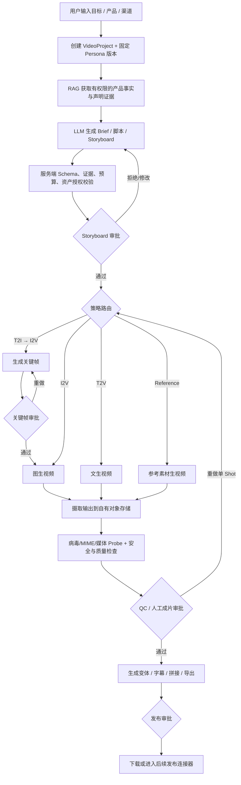
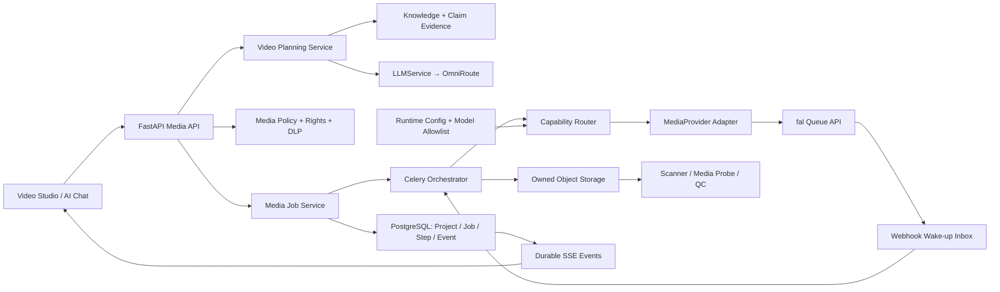
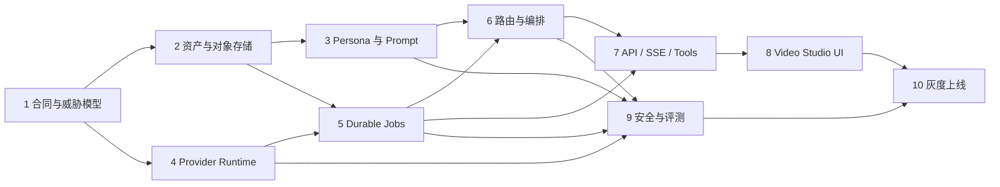

# B-agent 视频生成 Persona 与媒体生产链路蓝图

> 状态：Reviewed — 3 Critical + 6 High + 1 Medium findings incorporated  
> 日期：2026-08-11  
> 范围：视频 Persona、文生图、图生视频、文生视频、参考素材生成、媒体资产、异步任务、成本与并发、安全合规、前端视频工坊  
> 实施原则：业务核心 provider-neutral；模型能力动态发现并固定快照；先建资产与安全边界，再开放生成；每一步可独立发布、灰度和回滚。

## 0. 实施进度

- **Step 1 已完成（2026-08-11）**：新增 provider-neutral Persona、Storyboard、GenerationIntent、Asset Policy Snapshot 与签名 `MediaPolicyDecision` 合同。
- 上传、规划、外部提交三个开关默认关闭；提交开启时强制依赖上传、规划和独立签名密钥。
- 当前部署只能声明 `single_organization`；错误的多租户配置在 Settings 校验阶段失败。
- Worker 验证策略决策时再次检查实时提交开关，管理员 kill switch 会让已签发但尚未执行的决策立即失效。
- **Step 2 进行中（2026-08-11）**：已新增 `MediaAsset`、`MediaUploadIntent`、`MediaAssetRelation`、`MediaConsentRecord`、`MediaScanReport`、`MediaRightsRecord`，以及 `0022_media_assets`、`0023_media_review_evidence` 迁移。
- 已完成 S3-compatible 预签名上传、独立 quarantine/asset bucket、服务端 key、精确大小/MIME/hash/SSE 约束、生产配置 fail-closed、provider result URL SSRF/DNS-rebinding 防护，以及认证上传/完成 API。
- 资产晋级改为证据 ID 驱动：扫描绑定资产哈希，版权和同意记录绑定组织、范围与有效期；对象先复制到 asset bucket 并复核 hash/size/MIME，再删除隔离副本和提交数据库，失败时保持 quarantine。
- 已完成真实 ClamAV + FFprobe 自动检查链路：S3 隔离对象流式暂存到 0600 随机临时文件并重新计算 SHA-256；命令无 shell、限制超时和输出量；只持久化白名单技术元数据。扫描和 probe 任一 unavailable/rejected 都不能晋级。
- 客户端提交扫描结论的 API 已移除，替换为只接收空请求体的 202 排队接口；Celery Worker 从数据库重新派生组织、对象 key、哈希、MIME 和大小。生产上传/提交未启用 inspection 时拒绝启动。
- Worker 容器使用非 root、只读根文件系统、`cap_drop: ALL`、`no-new-privileges` 和 noexec/nosuid/nodev 临时目录；ClamAV 1.4 LTS 病毒库通过持久卷更新并只读挂入 Worker。
- 当前验证证据：检查链路专项 17 passed、86% coverage；全量后端 409 passed、1 skipped；`docker compose config --quiet` 通过；SQLite 可从空库升级到 `0023_media_review_evidence`，并通过 `0023 → 0022 → 0023` 往返。
- **Step 2 剩余**：受控下载/缩略图、软删保留与对象生命周期清理任务。

## 1. 执行摘要

B-agent 已有统一 Agent Runtime、三层记忆、RAG、OmniRoute LLM 路由、持久化 Tool Execution、Celery Worker、幂等/租约/围栏和可回放 SSE。这些能力足以承接视频生产的“规划、审批、异步执行和恢复”，但仓库目前没有以下媒体领域基础设施：

- 视频 Persona、品牌视觉规范和结构化 Storyboard；
- 图片/视频/音频资产事实源、对象存储和生成血缘；
- 文生图、图生视频、文生视频的 provider-neutral 能力目录；
- 长耗时媒体任务、供应商 request ID、回调收件箱、成本预留和并发配额；
- 输出质量评测、版权/肖像/声音授权、商业声明和发布审批；
- 面向业务人员的视频项目工作台。

因此，本计划不会把视频生成实现成一个直接调用第三方 API 的聊天按钮，而是新增一个 **Media Production Plane**。LLM 继续通过现有 `LLMService → OmniRoute` 负责需求理解、脚本、分镜和 Prompt 编译；真正的图片/视频推理通过独立的 `MediaProvider` 适配器执行，密钥仅保存在后端。第一期以 fal 作为媒体供应商适配器，但数据库、API、任务和前端不依赖具体模型名。

当前仓库的正式部署边界仍是单组织。第一期只能在这一信任边界内上线；数据表可以保留服务端派生的 `org_id`，但在完成租户隔离审计前不得把视频工坊开放成任意组织自助注册的多租户 SaaS。

### 1.1 产品目标

面向外贸企业，目标架构支持四条可解释的生成路径；第一期只开放前三条的单 Shot 闭环：

1. **文生图 → 图生视频**：先锁定产品、人物、包装和画面风格，再生成动作；默认用于品牌广告、产品展示和形象一致性要求高的场景。
2. **图生视频**：用户已有产品图、模特图或首/尾帧时，直接生成短视频；默认用于电商素材动效化。
3. **文生视频**：快速创意探索、氛围片和不依赖固定商品外观的场景；默认先生成短草稿。
4. **参考素材生视频**：用多张图片、参考视频或音频保持人物、产品、镜头运动或节奏；进入 V1.1，不作为第一期交付依赖。

“自动模式”由代码策略选择路径并向用户解释原因；用户也可以显式指定路径。任何自动降级或换模型都必须展示模型、成本和一致性影响，禁止静默切换。

### 1.2 完成定义

任意一次视频生成都能回答：

- 谁、在哪个组织、基于哪个项目和 Persona 版本发起？
- 使用了哪些产品事实、声明证据、参考素材和授权记录？
- 为什么选择 T2I→I2V、I2V、T2V 或 Reference-to-Video？
- 使用了哪个供应商、模型能力版本、输入参数、seed 和 Prompt 快照？
- 预计与实际成本是多少，消耗了哪个预算，为什么重试或停止？
- 任务在供应商队列中的 request ID、当前状态、恢复和取消结果是什么？
- 每个输出文件从哪里来、是否已存入自有存储、经过哪些扫描和质量检查？
- 哪个人审批了 Storyboard、关键帧和最终发布版本？

## 2. 当前仓库审计与复用边界

### 2.1 可复用能力

| 现有资产 | 复用方式 |
| --- | --- |
| `services/agent_runtime/*` | 生成 Brief、脚本、Storyboard、Prompt 和业务说明；媒体二进制不进入 LLM 上下文 |
| `services/llm/*`、OmniRoute | 处理文本规划、结构化输出和多语言文案；不把 OmniRoute 强行扩展成媒体网关 |
| `AgentToolExecution`、`ToolSpec` | 把 `media.generate` 定义为 `EXPENSIVE` 工具，复用身份、来源、审批和审计语义 |
| `AgentRun`、`AgentRunEvent` | 复用 run/event 合同和 SSE 回放模式；媒体项目拥有独立 Job/Step 事实表 |
| Celery、租约、围栏和恢复任务 | 处理队列提交、状态核对、文件摄取、质量检查和扫尾恢复 |
| `AIRuntimeConfiguration` 热配置模式 | 参考其“DB 版本 + secret-safe + probe”设计，实现独立的媒体运行时配置 |
| PostgreSQL + Redis | PostgreSQL 存事实；Redis 只做短时协调、限流和缓存，不存唯一任务状态 |
| 前端 AI Chat/Agent Center | 从对话中创建视频项目；完整生产流程进入独立视频工坊 |

### 2.2 明确不复用或不混用

- 不把大文件写入 PostgreSQL、Redis、Agent Memory 或聊天消息 JSON；数据库只存 metadata、hash、storage key 和 lineage。
- 不让浏览器直连媒体供应商或持有 `FAL_KEY`；供应商调用必须经过 B-agent 后端。
- 不把供应商临时 URL 当作长期资产；结果完成后必须摄取到企业自有对象存储。
- 不用普通 LLM 的 token/route 目录表达视频模型；媒体模型具有时长、分辨率、比例、音频和参考素材等独立能力合同。
- 不把长视频设计为“一次超长 Prompt”。第一期按 4–15 秒的 shot 生成，后续由可替换的后期编排器组装。
- 第一版只交付单 Shot；多 Shot 上线前必须先有确定性的 normalize/stitch 导出闭环，不能出现多个片段都成功但无法交付成片的状态。

## 3. 领域模型：Persona 不是 Prompt

### 3.1 `VideoPersona`

Persona 是组织级、可版本化、可审批的品牌视频生产合同。修改后创建新版本，已经启动的项目继续固定旧版本，禁止运行中漂移。

```text
VideoPersona
├── identity: 名称、品牌、业务单元、适用市场、默认语言
├── audience: 买家角色、国家/地区、行业、认知阶段
├── narrative: 叙事视角、语气、价值主张、CTA、禁用表达
├── visual_bible: 风格、色板、构图、镜头、灯光、运动、节奏、禁用视觉
├── product_truth: 产品/知识库引用、允许声明、声明证据、禁止承诺
├── references: 产品、包装、角色、Logo、场景、声音的 Asset ID
├── audio_policy: 音乐氛围、旁白语言、声音身份、字幕与静音默认值
├── channel_defaults: TikTok/Reels/YouTube/独立站/展会屏的规格
├── generation_policy: 默认模式、草稿/成片档位、时长、比例、预算上限
├── compliance: 授权要求、敏感级别、地区限制、保留期限、人工审批点
└── versioning: version、status、content_hash、approved_by、effective_at
```

必须区分三类内容：

- **事实**：产品规格、认证、价格条件等，只能来自有权限且有证据的知识源；
- **创意偏好**：视觉、镜头、叙事和情绪，可以由 Persona 定义；
- **安全规则**：版权、肖像、隐私、敏感类别和供应商限制，由服务端策略控制，Persona 不能覆盖。

### 3.2 `VideoProject`、`Storyboard` 与 `Shot`

`VideoProject` 固定 `persona_version_id`、`brief_snapshot`、渠道、语言、预算、敏感等级和输出规格。一次 Project 可有多个 `VideoVariant`，用于不同市场或渠道。

Storyboard 是结构化 JSON，不保存为难以验证的自由文本：

```json
{
  "title": "Factory reliability — 9:16",
  "total_duration_seconds": 15,
  "shots": [
    {
      "sequence": 1,
      "duration_seconds": 5,
      "purpose": "hook",
      "generation_mode": "text_to_image_then_image_to_video",
      "visual_prompt": "...",
      "motion_prompt": "...",
      "spoken_copy": "...",
      "on_screen_copy": "...",
      "reference_asset_ids": ["..."],
      "claim_evidence_ids": ["..."],
      "constraints": ["logo unchanged", "no unsupported claim"]
    }
  ]
}
```

LLM 只能产出符合 schema 的 Storyboard 草稿；服务端重新校验时长总和、渠道规格、证据白名单、资产权限和能力匹配。

### 3.3 `MediaAsset` 与生成血缘

`MediaAsset` 是不可变文件版本，至少包含：

- `org_id`、`owner_user_id`、`kind=image|video|audio|subtitle|project_file`；
- `storage_backend`、`storage_key`、`sha256`、`mime_type`、`size_bytes`；
- 图片宽高、视频时长/帧率/编码、音频时长等 probe metadata；
- `source=user_upload|generated|imported|derived`、父 Asset/Generation ID；
- `rights_basis`、`license_scope`、`consent_record_id`、`sensitivity`、`retention_until`；
- `scan_status`、`moderation_status`、`qc_status`；
- 供应商、模型、Prompt/参数 snapshot hash、seed、request ID 和创建时间。

所有变换产生新 Asset，不原地覆盖。删除使用 tombstone + 延迟对象清理；删除项目不自动删除被其他项目引用的资产。

供应商条款页面上的 “commercial use” 标签只进入能力 metadata，不能替代企业自己的法务判断。上线某个模型前必须记录当时的服务条款/模型许可版本、允许地区和用途，并提供撤销 capability 的 kill switch。

`ConsentRecord` 不是一个布尔字段，必须记录主体、授权用途、地区、媒介、有效期、证据文件和撤销状态。撤销后立即阻止新的生成/派生；已有资产按法务保留与删除策略进入冻结、下架或删除流程。

## 4. 模式选择与完整业务链路

### 4.1 自动路由决策表

| 条件 | 默认路径 | 原因 |
| --- | --- | --- |
| 有用户首帧/产品图 | I2V | 保留真实商品与构图 |
| 需要品牌、包装、人物高度一致，但没有批准首帧 | T2I → 关键帧审批 → I2V | 将“长时间等待后才发现外观错误”前移到便宜步骤 |
| 有多模态参考，且允许模型能力支持 | Reference-to-Video | 用参考图/视频/音频约束一致性或节奏 |
| 快速探索、氛围内容、无固定主体 | T2V 草稿 | 交互最短、适合发散 |
| 多镜头或总时长超单次能力 | 分 Shot 生成 → 组装 | 单独重做失败镜头，降低成本与一致性风险 |
| T2V 主体一致性 QC 失败 | 建议改走 T2I→I2V | 必须用户确认额外成本，不自动烧预算 |

路由输入只接受业务约束和 `ProviderCapability`，禁止写死某个模型 ID。路由输出包含 `selected_mode`、`reason_codes`、`estimated_cost_range`、`quality_tradeoffs` 和 `required_approvals`。

### 4.2 端到端链路



### 4.3 Prompt 编译链

Prompt 不由前端拼接。`VideoPromptCompiler` 使用版本化模板将以下数据编译为 provider-neutral `GenerationIntent`：

1. Persona 创意偏好；
2. Project Brief 和 Shot 目的；
3. 已批准事实与证据引用；
4. 参考 Asset 的受控标签；
5. 渠道规格、镜头语言、音频和字幕策略；
6. 服务端安全约束和禁用项。

供应商 Adapter 再把 `GenerationIntent` 映射到具体 schema。RAG 文本、上传文件 metadata 和用户 Prompt 均是不可信输入，放入明确的数据边界，不允许覆盖系统安全规则。编译结果保存 snapshot/hash，日志默认不记录原文，只记录版本、hash、长度和敏感等级。

## 5. 目标技术架构



### 5.1 `MediaProvider` 合同

```python
class MediaProvider(Protocol):
    async def probe(self) -> ProviderProbe: ...
    async def list_capabilities(self) -> list[ProviderCapability]: ...
    async def estimate(self, intent: GenerationIntent) -> CostEstimate: ...
    async def submit(self, intent: GenerationIntent) -> ProviderSubmission: ...
    async def status(self, provider_request_id: str) -> ProviderStatus: ...
    async def result(self, provider_request_id: str) -> ProviderResult: ...
    async def cancel(self, provider_request_id: str) -> CancelResult: ...
```

`ProviderCapability` 版本化保存：任务类型、输入模态、支持的比例/分辨率/时长、音频、首尾帧、参考数量、文件限制、商业使用标签、供应地区、价格表达式、取消/回调能力和 `effective_at`。每个 Generation 在提交时固定能力快照；管理员更新目录不会改变运行中的任务。

若供应商要求 B2B `end_user_id`，Adapter 使用服务端 HMAC 派生的稳定、不透明标识，不发送邮箱、姓名或数据库主键；映射密钥轮换必须版本化，且该标识不得出现在浏览器和普通日志中。

动态发现只负责发现，不能自动启用。媒体 Runtime 使用不可变 revision，固定 `adapter_contract_version`、规范化输入/输出 schema hash、价格生效窗口、法务/安全审核状态和 `secret_reference_version`。Job 固定非 secret revision；凭据由 Vault/Secret Manager 按 reference/version 读取并提供轮换宽限，紧急吊销可覆盖历史 pin。供应商即使复用同一 model ID，也必须经过 contract test 才能更新 capability。

### 5.2 媒体运行时热配置

新增独立 `MediaRuntimeConfiguration`，沿用现有 AI 热配置的安全模式：

- 后端可配置 provider、base URL、模型 allowlist、任务→模型候选、超时、轮询频率、并发和预算；
- API key 只写不读，存 secret backend，响应仅返回 `configured: true/false`；
- 更新创建不可变 revision，新 Job 固定 revision；旧 Job 在凭据未被紧急吊销时用原 adapter/schema/secret reference 排空；
- `probe` 验证连通性与配置模型是否可用；探测失败不覆盖最后一个已知可用快照；
- `probe` 不授予商业使用或安全资格；新发现模型默认 disabled；
- 前端只显示模型能力和健康状态，不返回 secret 或供应商原始错误体。

### 5.3 对象存储

- 定义 `MediaObjectStore`，提供 local-dev 和 S3-compatible 两个实现；生产环境启动时若仍为 local 必须 fail-closed。quarantine 与正式资产使用独立 bucket/prefix 和最小权限身份，禁止 public ACL；生产使用 KMS encryption context。
- 上传意图绑定服务端派生的组织/用户、随机 storage key、预期 MIME/大小/checksum、过期时间和单次 complete；客户端不能自行声明 key。后端重新校验 size、MIME magic、hash、所有权和授权，再标记 `ready`；去重不得跨信任边界暴露文件存在性。
- 供应商输入使用短期签名读 URL；输出 URL 立即由 Worker 下载到隔离区。下载仅允许已审核 provider 域名，逐跳验证重定向和 DNS/IP，阻止私网、环回、metadata endpoint 与 DNS rebinding，并对字节、时间、像素、帧数和解码资源设硬上限。
- probe/病毒扫描在沙箱进程运行并限制 CPU、内存、临时磁盘和超时；检查 unavailable 时资产保持 quarantine，不得沿用旧 pass。
- 大媒体禁止 Base64 穿过 FastAPI/Celery/Redis；事件只传 Asset ID 和小型 metadata。

## 6. 持久化状态机、幂等与恢复

### 6.1 项目状态

```text
draft
→ planning
→ awaiting_storyboard_approval
→ ready
→ generating
→ quality_check
→ awaiting_final_approval
→ completed

任意非终态 → cancelled | failed | expired
部分 Shot 成功 → partial（保留成功资产，可重做失败 Shot）
```

### 6.2 Generation Step 状态

```text
pending
→ budget_reserved
→ submitting
→ submitted
→ provider_queued
→ provider_running
→ fetching_result
→ ingesting
→ scanning
→ quality_check
→ succeeded

可恢复分支：retry_wait | submission_unknown | provider_unknown | ingest_failed
终态：succeeded | failed | cancelled | rejected | expired
```

关键语义：

- API 创建使用客户端 `Idempotency-Key` + canonical input hash；同键不同输入返回 409。
- DB 先创建 Job/Step 并预留预算，再由 Worker 提交供应商。
- 每次外部提交都有独立 `GenerationAttempt` 和 `effect_state=none|started|confirmed|unknown`。发送 HTTP 前在独立事务将 `effect_state` 写成 `started`；一旦跨过该点，Celery 禁止自动 retry。
- 供应商支持幂等键时，使用服务端派生的 `client_submission_key`，并建立 `(provider_runtime_revision_id, client_submission_key)` 唯一约束。一旦获得 `provider_request_id` 立即持久化并改为 `confirmed`；后续重启只查询同一 request ID。
- 提交连接断开、Worker 崩溃或租约过期且无法确认是否受理时进入 `effect_state=unknown/submission_unknown`，绝不自动重发。供应商无客户端幂等/查询能力时必须人工核对；只有明确的 `retryable_before_send` 才能创建新 Attempt。
- Webhook 若不能验证稳定签名，只作为唤醒信号；Worker 使用已存 request ID 向供应商二次查询权威状态和结果。
- Worker 使用 lease + fencing token；旧 Worker 的完成写入被拒绝。
- 取消是 best-effort。供应商已经开始计费时，UI 显示“已请求取消/可能仍计费”，不能谎报取消成功。
- 原始输出成功但摄取失败时，保留 request ID 并只重试摄取，禁止重新生成。

所有 webhook、poll、cancel、sweeper 和 ingest 结果必须调用同一个数据库状态迁移器：`transition(expected_states, row_version/fencing_token)`。终态单调不可逆；状态、事件、资产晋级和预算账本事件在同一事务中提交。Webhook Inbox 以 provider account/config + provider event ID 去重；供应商没有 event ID 时使用 account/config + request ID + event type。未验证回调只能写入有大小/频率限制的 `wake_up_pending`，不能携带权威状态。

### 6.3 成本与并发

- 使用 append-only `BudgetLedger`；reservation、capture、release、adjustment 都有唯一业务键。组织/项目预算通过行锁、SERIALIZABLE 或 advisory lock 原子更新，Webhook/poll 重复到达不能重复结算。
- 生成前按 capability 快照和用户允许的最坏参数展示 estimate 并创建 reservation；完成后结算 actual，失败/取消按供应商计费事实结算。费用未知时冻结项目后续提交并进入对账，而不是猜测为零。
- 配额至少覆盖组织日/月预算、项目预算、用户并发、组织并发、供应商并发和 GPU/模型候选并发。
- 为 Job、Shot、Attempt 和重试分别设置硬上限；reservation 到期回收，capture 唯一键绑定 provider account/request ID/attempt。
- 草稿档优先低分辨率/短时长/快速模型；关键帧和最终镜头审批后才升级成片档。
- 同 Project 可并行生成独立 Shot，但同一 Shot 的 revision 串行；拼接必须等待依赖 Shot 完成。
- 重试策略区分 `retryable_transport`、`provider_rate_limit`、`provider_capacity`、`invalid_input`、`safety_rejected`、`unknown_outcome`，并尊重 Retry-After。
- 告警指标：queue wait、generation latency、success rate、unknown outcome、ingest failure、QC pass rate、cost/second、cost/approved asset、预算拒绝率和取消成功率。

## 7. 安全、版权与外贸业务正确性

### 7.1 生成前门禁

1. 身份、组织和 Asset ACL；跨组织引用 fail-closed。
2. 上传文件 MIME/大小/病毒扫描与媒体 probe。
3. `rights_basis`：用户自有、获得许可、公共领域或允许的生成资产；未知版权不能进入生成。
4. 人脸/真实人物、声音克隆、未成年人和敏感行业需要显式 consent/policy 记录。
5. PII、合同、客户名单和未发布产品按 Data Policy 判断能否发送给外部 provider；不允许时拒绝或人工选择安全素材，而不是自动弱脱敏后继续。
6. 产品参数、认证、交期、价格和效果声明必须绑定证据；生成创意不能创造商业事实。
7. 商标、竞品 Logo、名人、受保护角色和监管行业进入增强审批。

上述门禁不是 Step 9 才补的测试项，而是提交供应商前的强制运行时依赖。每次提交必须携带由服务端签发、绑定 `job/attempt/input_hash/policy_version/expiry` 的 `PolicyDecision`；Worker 在发送前重新验证。上传、规划、外部提交分别由默认关闭的 `MEDIA_UPLOAD_ENABLED`、`MEDIA_PLANNING_ENABLED`、`MEDIA_SUBMIT_ENABLED` 控制，不能只依赖 UI 开关。

数据治理必须形成 `provider × model × region × sensitivity` 可执行矩阵，记录允许的数据级别、供应商保留期、训练使用、数据驻留、删除能力和法务条款版本。`brief_snapshot`、Storyboard、Prompt、OCR 和未发布产品信息按字段分类；需要留存的敏感正文使用应用层加密和独立访问审计，设置短保留期。HMAC `end_user_id` 只隐藏身份标识，不能替代 payload DLP。供应商政策不满足时 fail-closed。

### 7.2 生成后门禁

- 输出检查拆分成 `technical_qc`、`safety_moderation`、`rights_and_consent`、`business_claim_review` 四个独立状态；任一必需检查 unavailable 时继续 quarantine。
- 技术 QC 检查首尾帧、黑帧/静帧、时长/比例/编码和音频响度；安全检测与 OCR 只能说明覆盖范围，不能输出“版权已清除”。版权/consent 由证据记录证明，品牌正确性和商业承诺由人审批。
- 审批界面必须展示参考素材、授权、声明证据、完整音频和每个检查的范围/局限，不允许用一个绿色综合分掩盖未检查项。
- 发布/外发是 `WRITE/IRREVERSIBLE` 工具，必须二次审批；“生成完成”不等于“允许发布”。
- 审计日志不存媒体正文、原始敏感 Prompt 或供应商密钥；使用 Asset ID、hash、策略版本和 reason code。
- 数据删除覆盖 DB tombstone、对象存储、派生资产、临时签名 URL 和供应商保留策略记录；无法承诺供应商立即删除时在 UI 和策略中明确。

## 8. API 与前端视频工坊

### 8.1 API 草案

| API | 用途 |
| --- | --- |
| `POST/GET/PATCH /api/v1/video/personas` | Persona 草稿与列表；PATCH 产生新 revision |
| `POST /api/v1/video/personas/{id}/approve` | 审批并发布 Persona 版本 |
| `POST/GET /api/v1/video/projects` | 创建/查看视频项目 |
| `POST /api/v1/video/projects/{id}/plan` | 生成结构化 Brief/Storyboard 草稿 |
| `POST /api/v1/video/projects/{id}/approve-storyboard` | 固定 Storyboard revision |
| `POST /api/v1/video/assets/uploads` | 创建预签名上传意图 |
| `POST /api/v1/video/assets/uploads/{id}/complete` | 校验并登记资产 |
| `POST /api/v1/video/shots/{id}/generations` | 创建 T2I/I2V/T2V generation；Reference 能力在 V1.1 才开放 |
| `GET /api/v1/video/jobs/{id}` | 获取持久任务快照 |
| `GET /api/v1/video/jobs/{id}/events` | SSE 回放，支持 `Last-Event-ID` |
| `POST /api/v1/video/jobs/{id}/cancel` | 请求取消，返回实际取消语义 |
| `POST /api/v1/video/outputs/{id}/approve` | 最终成片审批 |
| `GET/PUT /api/v1/admin/media/runtime` | 管理员热配置，secret-safe |
| `GET /api/v1/admin/media/capabilities` | 能力目录、健康和 effective time |
| `POST /api/v1/admin/media/probe` | 连通性与模型可用性探测 |
| `POST /api/v1/webhooks/media/{provider}` | 回调收件箱；不直接信任完成状态 |

所有创建/审批/取消 API 需要幂等键；身份、组织、敏感等级、模型 allowlist 和预算均由服务端派生。

### 8.2 Video Studio 信息架构

新增一级导航“视频工坊”，保持当前 ChatGPT 风格视觉系统：

1. **项目列表**：状态、渠道、Persona、预算、进度、负责人、最近输出；
2. **Persona 库**：品牌视觉、受众、事实源、参考资产、合规和版本历史；
3. **Brief**：目标、市场、产品、语言、渠道、比例、时长、CTA 和预算；
4. **Storyboard**：按 Shot 编辑脚本、画面、动作、旁白、字幕、证据和参考素材；
5. **生成设置**：第一版提供 Auto/T2I→I2V/I2V/T2V，展示路由理由、模型能力、预估成本和审批点；Reference 在 V1.1 才显示；
6. **生成队列**：可恢复进度、供应商状态、等待/运行时间、成本、取消与重试；
7. **Review**：关键帧/视频 A-B 对比、逐 Shot 反馈、QC 报告和审批；
8. **资产库**：来源、版权、敏感级别、血缘、使用项目、下载/删除状态；
9. **管理员配置**：provider、模型 allowlist、探测、预算、并发和策略版本；密钥只写不回显。

AI Chat 增加“创建视频项目”Tool：对话负责收集目标和生成 Brief，创建项目后跳转视频工坊。Chat 不承载二进制生成状态和复杂审批，避免把完整业务流程塞进消息气泡。

## 9. 分阶段实施计划

每一步对应一个可独立审查的 PR；分支名不含 `codex`。

### Step 1 — 媒体领域合同、ADR 与威胁模型

- **分支**：`feature/media-domain-foundation`
- **目标**：冻结 Persona、Project、Storyboard、Asset、Provider、Job/Event 合同和信任边界。
- **主要文件**：
  - `docs/adr/0003-media-production-plane.md`
  - `backend/app/services/media/contracts.py`
  - `backend/app/services/media/policy.py`
  - `backend/tests/test_media_contracts.py`
  - `backend/tests/test_media_policy.py`
- **工作**：定义枚举、Pydantic schema、状态迁移表、reason code、最大输入和 threat matrix；明确 OmniRoute 只处理文本规划。
- **工作补充**：把单组织声明实现成启动时可验证的不变量；未完成 Organization/Membership/RBAC 前禁止开放多租户注册。幂等唯一范围按 `(org_id, action, idempotency_key)` 设计，不照搬全局 key。
- **验收**：非法状态、越权对象 ID、客户端伪造 provider/sensitivity、无证据商业声明均被 schema/policy 拒绝；部署配置不能将当前身份模型误开成多租户。
- **回滚**：仅新增合同与文档，无运行时接线。

### Step 2 — 媒体资产与对象存储

- **分支**：`feature/media-asset-vault`
- **依赖**：Step 1
- **主要文件**：
  - `backend/app/models/database.py`
  - `backend/alembic/versions/0022_media_assets.py`
  - `backend/alembic/versions/0023_media_review_evidence.py`
  - `backend/app/services/media/assets.py`
  - `backend/app/services/media/review.py`
  - `backend/app/services/media/inspection.py`
  - `backend/app/services/media/inspection_service.py`
  - `backend/app/integrations/object_store.py`
  - `backend/app/api/v1/video.py`
  - `backend/app/tasks/media_tasks.py`
  - `backend/tests/test_media_assets.py`
- **工作**：实现 `MediaAsset/AssetRelation/UploadIntent/ConsentRecord`；local-dev/S3-compatible Adapter；quarantine、预签名上传、complete 校验、hash、ACL、软删和清理任务；同时实现提交前必需的 rights/consent/扫描最小门禁。
- **验收**：越权资产不可读；大文件不进入 DB/Celery；客户端 key 篡改、伪 MIME、超限、未完成上传、重复 hash、媒体炸弹、SSRF result URL 和被引用删除均有明确行为；检查不可用不能晋级；生产 local storage 启动失败。
- **回滚**：设置 `MEDIA_UPLOAD_ENABLED=false`，停止新上传；表和对象保留，避免数据丢失。

### Step 3 — Persona、证据绑定与 Prompt 编译器

- **分支**：`feature/video-persona-compiler`
- **依赖**：Step 2；可与 Step 4 并行开发，但迁移按序合并
- **主要文件**：
  - `backend/app/models/database.py`
  - `backend/alembic/versions/0024_video_personas.py`
  - `backend/app/services/media/personas.py`
  - `backend/app/services/media/planning.py`
  - `backend/app/services/media/prompts.py`
  - `backend/tests/test_video_personas.py`
  - `backend/tests/test_video_prompt_compiler.py`
- **工作**：Persona revision/approval；Project Brief/Storyboard schema；RAG 证据白名单；渠道模板；字段级数据分类/加密保留；provider-neutral `GenerationIntent`。
- **验收**：修改 Persona 不影响运行项目；无证据声明不能进入 Shot；Prompt injection 不能覆盖安全约束；snapshot/hash 可复现。
- **回滚**：关闭 Planning API；历史 revision 只读保留。

### Step 4 — 媒体能力目录、热配置与 fal Adapter

- **分支**：`feature/media-provider-runtime`
- **依赖**：Step 1；可与 Step 2 并行开发，Step 3 在 Step 2 后开始
- **主要文件**：
  - `backend/app/models/database.py`
  - `backend/alembic/versions/0025_media_runtime.py`
  - `backend/app/integrations/media/base.py`
  - `backend/app/integrations/media/fal.py`
  - `backend/app/services/media/runtime_config.py`
  - `backend/app/api/v1/admin.py`
  - `backend/tests/test_fal_media_provider.py`
  - `backend/tests/test_media_runtime_config.py`
- **工作**：实现不可变 runtime revision、adapter/schema hash、secret reference、能力 snapshot、价格表达式、allowlist、secret-safe update/probe；第一版映射 T2I/I2V/T2V，Reference capability 可被发现但保持 disabled；使用 queue submit/status/result，不在请求线程阻塞等待。
- **验收**：密钥不回显/不进日志；未知模型 fail-closed；配置更新仅影响新 Job；fixture 覆盖 schema 漂移、429、5xx、超时和未知结果。
- **回滚**：禁用 provider/runtime version；保留旧配置和能力快照。

### Step 5 — 持久化媒体 Job、成本与恢复

- **分支**：`feature/durable-media-jobs`
- **依赖**：Step 2 + Step 4
- **主要文件**：
  - `backend/app/models/database.py`
  - `backend/alembic/versions/0026_media_jobs.py`
  - `backend/app/services/media/jobs.py`
  - `backend/app/services/media/events.py`
  - `backend/app/services/media/budgets.py`
  - `backend/app/tasks/media_tasks.py`
  - `backend/tests/test_media_job_recovery.py`
- **工作**：Job/Step/Attempt/Event、effect state、状态迁移仲裁器、幂等、append-only BudgetLedger、原子 reservation、lease/fencing、queue submit、状态核对、回调 wake-up、poll fallback、结果隔离摄取、取消和 sweeper；提交前强制验证 `PolicyDecision`。
- **验收**：在 submit 各崩溃点 kill Worker 均不自动重复生成；`submission_unknown` 进入人工核对；回调/poll/cancel 重复、乱序、伪造和竞态不产生重复 Asset/结算或终态倒退；摄取失败只重试摄取；旧 fencing token 无法完成任务。
- **回滚**：停止消费媒体队列；已 submitted Job 由只读 reconciler 跟踪并摄取，禁止直接丢弃。

### Step 6 — 单 Shot 策略路由与生成编排

- **分支**：`feature/video-generation-router`
- **依赖**：Step 3 + Step 5
- **主要文件**：
  - `backend/app/services/media/router.py`
  - `backend/app/services/media/orchestrator.py`
  - `backend/app/services/media/quality.py`
  - `backend/tests/test_video_generation_router.py`
  - `backend/tests/test_video_orchestrator.py`
- **工作**：第一版实现单 Shot 的 Auto/T2I→I2V/I2V/T2V 决策；关键帧审批；Shot revision；能力/预算约束；失败 fallback 建议；四类独立检查状态。Reference 和多 Shot DAG 暂不开放。
- **验收**：路由表全部覆盖；无批准关键帧不能进入 I2V 成片；换模式/模型必须用户确认；任何必需检查 unavailable 时输出保持 quarantine。
- **回滚**：关闭 Auto，仅保留管理员允许的显式模式；已生成资产不删除。

### Step 7 — Video API、SSE 与工具接线

- **分支**：`feature/video-studio-api`
- **依赖**：Step 5 + Step 6
- **主要文件**：
  - `backend/app/api/v1/video.py`
  - `backend/app/main.py`
  - `backend/app/services/tool_runtime.py`
  - `backend/app/services/tool_execution.py`
  - `backend/tests/test_video_api.py`
  - `backend/tests/test_video_events.py`
- **工作**：完整 REST/SSE；审批、取消和 Last-Event-ID；`video.project.create`、`media.generate` ToolSpec；Agent Chat 跳转项目；RBAC 和错误合同。
- **验收**：鉴权、越权对象访问、幂等冲突、断线重放、事件有序、批准者资格和 budget approval 测试通过；生成工具标记 `EXPENSIVE`，发布工具另行 `IRREVERSIBLE`。
- **回滚**：设置 `MEDIA_PLANNING_ENABLED=false`、`MEDIA_SUBMIT_ENABLED=false`；后台只读 reconciler 继续完成已有 Job。

### Step 8 — 前端视频工坊与管理员热配置

- **分支**：`feature/video-studio-ui`
- **依赖**：Step 7
- **主要文件**：
  - `frontend/src/views/VideoStudio.vue`
  - `frontend/src/views/VideoProject.vue`
  - `frontend/src/views/VideoPersonas.vue`
  - `frontend/src/components/VideoStudio/*`
  - `frontend/src/api/video.ts`
  - `frontend/src/types/video.ts`
  - `frontend/src/router/index.ts`
  - `frontend/src/layouts/MainLayout.vue`
  - `frontend/src/i18n/index.ts`
  - `frontend/tests/video-studio.test.mjs`
- **工作**：项目向导、Storyboard、模式解释、成本确认、关键帧审批、SSE 队列、Review/QC、资产库、中文/英文和管理员媒体配置。
- **验收**：刷新/断网后恢复 Job；不展示/存储 provider key；键盘操作、对比度、焦点、Reduced Motion 和移动布局通过；所有状态有 loading/empty/error/retry。
- **回滚**：隐藏导航和入口；API/任务不受影响。

### Step 9 — 安全红队、质量阈值与成本回归门禁

- **分支**：`quality/video-safety-evals`
- **依赖**：Step 3–8，可提前并行建立 fixture，最终作为发布门禁
- **主要文件**：
  - `backend/app/services/media/evals.py`
  - `backend/tests/media_fixtures/*`
  - `backend/tests/test_media_security.py`
  - `backend/tests/test_media_cost_controls.py`
  - `docs/runbooks/video-generation.md`
- **工作**：对 Step 1/2/3/5 已落地的版权/consent/PII/声明运行时策略做红队与回归；Prompt injection 与越权对象测试；按语言/渠道/人物/产品场景建立假阴性数据集；视觉一致性、OCR、时长/比例、损坏文件 QC；预算、并发、chaos/recovery 和供应商 schema contract tests。
- **验收**：安全红队集、恢复矩阵、预算上限、p95 API 延迟和成本偏差阈值通过；媒体生成延迟单独统计，不混入 API latency SLO。
- **回滚**：评测门禁失败保持 feature flag off；不得通过放宽 safety/QC 静默上线。

### Step 10 — 灰度上线、运维与文档

- **分支**：`release/video-studio-launch`
- **依赖**：Step 8 + Step 9
- **主要文件**：
  - `README.md`
  - `docs/runbooks/video-generation.md`
  - `docs/architecture/video-production.md`
  - `docker-compose.yml` / 部署配置
- **工作**：内部单组织 → 试点用户 → 配额灰度；仪表盘/告警；对象生命周期；供应商降级开关；截图、架构图和管理员手册。Celery payload、task 和 adapter 都要版本化；部署保持 N/N-1 Worker/Adapter 排空旧 Job，再迁移或删除旧合同。
- **验收**：试点期间无越权对象泄露、预算超扣、自动重复生成或孤儿文件；回滚演练、provider outage、Worker kill 和对象存储不可用演练通过。
- **回滚**：停止新建 Job，允许已提交任务完成并摄取；UI 只读；资产和审计记录保留。

### 9.1 依赖与并行度



核心实现最大建议并行度为 2：Step 1 完成后 Step 2 与 Step 4 并行；二者完成后 Step 3 与 Step 5 可并行。若计入独立的 Step 9 fixture/评测建设，团队峰值并行度为 3，但发布门禁必须等待 Step 8。Step 2/3/4 都修改模型与 migration，分支可并行开发但必须按 `0022 assets → 0023 evidence → 0024 personas → 0025 runtime → 0026 jobs` 顺序 rebase/合并。

## 10. 测试矩阵与非功能指标

### 10.1 必测故障

- API 重复提交、同幂等键不同 body；
- Worker 在 submit 前、submit 后未落 request ID、落 ID 后、下载中和 DB commit 前崩溃；
- Webhook 重复、乱序、延迟、伪造、丢失；
- Provider 429/5xx/超时/schema drift/结果 URL 失效；
- 对象存储上传失败、下载重定向、超大文件、Content-Type 欺骗和 hash 不匹配；
- 预算并发竞争、取消与完成竞态、旧 lease 写回；
- Persona 更新、模型目录更新、管理员撤销模型时仍有旧 Job 运行；
- 越权 Asset/Project/Job/Event 枚举；
- Prompt injection、错误商业声明、未授权人脸/声音和被删除素材继续引用。

### 10.2 初始 SLO/Guardrail

- 创建 Project/Job API p95 < 500 ms，不等待媒体推理；
- SSE 事件落库到前端可见 p95 < 2 s；
- 重启后 submitted Job 100% 可由 request ID 恢复或进入明确人工队列；
- 自动 duplicate provider submission = 0；未知提交结果 100% 隔离到人工核对，不自动重发；
- 越权资产访问 = 0；
- actual cost 超 reservation 容差时自动停止项目后续 Generation/Attempt；阈值由管理员配置；
- 供应商 schema contract 测试每日运行，失败自动冻结受影响 capability 的新任务；
- 自动 QC 不得将“事实正确”误当成视觉质量问题；声明正确性以证据和人工审批为准。

## 11. 第一版范围与延期项

### 第一版必须有

- 单组织、单供应商、单 Shot；
- T2I→关键帧审批→I2V、用户直接 I2V、直接 T2V；
- Persona/Storyboard/关键帧/最终成片审批；
- fal Adapter、能力快照、热配置和预算；
- S3-compatible 对象存储、生成血缘、任务恢复和 SSE；
- 基础 QC、版权/consent/敏感信息门禁；
- 中文/英文 Video Studio。

### 延期到第二版

- 多供应商自动择优和跨供应商 fallback；
- Reference-to-Video、多 Shot DAG 与自动跨镜头一致性；
- 自动剪辑、转场、配乐混音、字幕烧录和多语言配音的完整 FFmpeg/渲染集群；
- 自定义 LoRA/角色训练；
- C2PA 内容凭证、水印策略和自动平台发布；
- 高级 A/B 生成、广告投放数据回流和基于转化率的自动优化；
- 长视频时间线编辑器。

延期项仍应通过 `MediaAsset`、`GenerationIntent`、`ProviderCapability` 和 Job DAG 扩展，不另建旁路。

## 12. 动态供应商事实与参考资料

以下信息仅用于第一期 Adapter 设计，均为动态事实，实施时必须重新 probe/验证，禁止把价格、模型 ID 或输入限制硬编码进业务层：

- fal 官方模型文档展示了 Queue submit/status/result、Webhook URL 和文件 URL/上传模式，并明确要求浏览器不要暴露 API key：<https://fal.ai/models/fal-ai/flux/dev/image-to-image/api>
- 当前可用的文生图示例与 schema：<https://fal.ai/models/fal-ai/flux-2/api>
- 当前 Seedance 2.0 文生视频、图生视频和参考素材端点及能力：<https://fal.ai/models/bytedance/seedance-2.0/text-to-video>、<https://fal.ai/models/bytedance/seedance-2.0/image-to-video>、<https://fal.ai/models/bytedance/seedance-2.0/reference-to-video>
- 当前 Kling v3 图生视频队列/API 示例，可作为未来第二供应商/模型候选验证：<https://fal.ai/models/fal-ai/kling-video/v3/standard/image-to-video/api>

## 13. 对抗式审查结论

独立审查提出 3 个 Critical、6 个 High 和 1 个 Medium 问题，均已转化为正文中的强制设计或实施门禁：

| 等级 | 发现 | 已纳入的修正 |
| --- | --- | --- |
| Critical | request ID 落库前存在重复提交/重复计费窗口 | Attempt effect state、发送前事务、供应商幂等键、`submission_unknown` 人工核对、禁止 Celery 盲重试 |
| Critical | 安全实现原排在可调用 API 之后 | 最小 rights/consent/扫描前移到 Step 2，提交强制 `PolicyDecision`，上传/规划/提交三开关默认关闭 |
| Critical（多租户时） | 当前固定组织 ID 不构成多租户身份边界 | 第一版强制单组织启动不变量；Organization/Membership/RBAC、复合外键或 RLS 完成前禁止 SaaS 化 |
| High | PII/商业机密/授权缺少可执行治理合同 | provider/model/region/sensitivity 矩阵、字段级 DLP、敏感正文加密短保留、完整 ConsentRecord |
| High | 对象摄取可遭 key 篡改、SSRF 和媒体炸弹 | 服务端 key、隔离 bucket、逐跳 URL/DNS 校验、资源硬限制和沙箱扫描 |
| High | webhook/poll/cancel/ingest 可并发重复晋级 | 单一 DB transition 仲裁器、终态单调、事务化状态/事件/资产/账本、Inbox 去重 |
| High | 并发预留与重复回调可造成预算超支/重复结算 | append-only BudgetLedger、原子 reservation、唯一业务键、费用未知冻结后续提交 |
| High | 配置 pin 与密钥轮换、同 ID 模型漂移冲突 | 不可变 runtime revision、adapter/schema hash、secret reference、N/N-1 排空与紧急吊销 |
| High | 自动 QC 容易伪装成版权/事实安全 | 四类独立状态、检查 unavailable 保持 quarantine、审批展示证据与检查边界 |
| Medium | V1 范围过大且多 Shot 无导出闭环 | 第一版收缩为单供应商/单 Shot 三路径；Reference、多 Shot 与完整后期延后 |

残余风险：多数外部媒体供应商无法提供严格 exactly-once；本方案能做到“已知结果不重复、未知结果不盲重发”，不能虚构外部系统的绝对 exactly-once。供应商对生成内容的版权、数据删除和模型一致性承诺仍取决于当期合同，必须由 capability kill switch、人工审批和法务流程共同控制。
